# 22.3 数据的整理与描述(一)

# 知识点拨

1. 为了得到有用的信息，一般利用统计表对数据进行分类整理。统计表的设计样式可以不同，但要简单清楚，记录数据要认真、细心。 

2. 扇形统计图常用来表示各部分占总体的百分比大小，画扇形统计图的关键是确定各扇形圆心角的度数。条形统计图常用来表示各部分的数量及其差异的大小。 

# 夯实基础

# 1. 选择题.

(1)如图是某校操场上学生进行体育运动情况的统计图。若该校操场上跳绳的学生有45人，则踢足球的学生有（） 

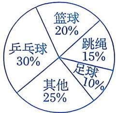

第1(1)题

A. 90人 B. 75人 C. 60人 D. 30人 

(2)如图是小刚家前年和去年的家庭支出情况统计图。已知小刚家去年的总支出比前年的总支出增加了 $20\%$ 。下列说法中，正确的是 （） 

| 前年支出情况 | 去年支出情况 |
|:---:|:---:|
| 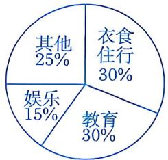 | 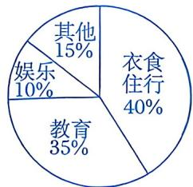 |

第1(2)题

A. 小刚家去年的教育支出是前年教育支出的 1.4 倍 

B. 小刚家去年的衣食住行支出比前年的衣食住行支出增加了 $10\%$ 

C. 小刚家去年的娱乐支出比前年的娱乐支出增加了 $20\%$ 

D. 小刚家去年的其他支出与前年的娱乐支出相同 

(3)某校为了解八年级学生开展“综合与实践”活动的情况，随机调查了部分八年级学生上学期参加“综合与实践”活动的天数，根据调查所得的数据绘制了如图所示的条形统计图。这次参与调查的学生总数为（） 

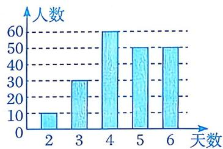

第1(3)题

A. 180 

B. 190 

C. 200 

D. 210 

(4)为了解学生课外阅读的喜好, 某校从八年级随机抽取部分学生进行问卷调查. 调查要求每人选择一种自己喜欢的书籍类型, 若没有喜欢的书籍类型, 则选择 “其他”. 下图是根据调查数据绘制的两幅不完整的统计图. 下列说法中, 不正确的是 ( ) 

|  |  |
|:---:|:---:|
| 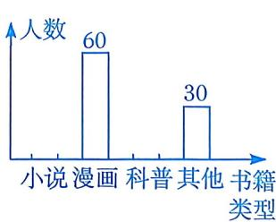 | 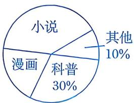 |

第 1(4) 题

A. 由这两个统计图可知喜欢“科普”类书籍的学生有90人 

B. 若八年级共有 1200 名学生, 则由这两个统计图可估计喜欢 “科普” 类书籍的学生约有 360 人 

C. 在扇形统计图中，“漫画”所在扇形的圆心角为 $72^{\circ}$ 

D. 由这两个统计图，不能确定喜欢“小说”类书籍的人数 

(5)一个圆中有甲、乙、丙三个扇形，其中甲、乙占总面积的百分比如图所示，那么扇形丙的圆心角的度数为 （） 

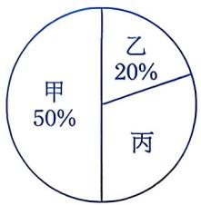

第1(5)题

A. $30^{\circ}$ B. $108^{\circ}$ C. $110^{\circ}$ D. $120^{\circ}$ 

(6)如图，甲、乙两个学校统计在校生中男、女生的人数，并分别绘制了如下扇形统计图．下列说法中，正确的是（） 

|  |  |
|:---:|:---:|
| 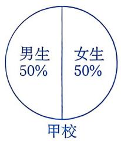 | 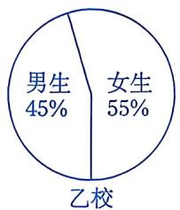 |

第1(6)题

A. 甲校的男生人数比乙校的男生人数多 

B. 甲、乙两个学校的人数一样多 

C. 乙校的女生人数比甲校的女生人数多 

D. 甲校的男、女生人数一样多 

2. 填空题. 

(1)空气是地球大气层中的混合气体,为了简明扼要地介绍空气的组成成分,较好地描述数据,最适合使用的统计图是_. 

(2)如图是关于某中学八年级(3)班学生外出方式(乘车、步行、骑车)的条形统计图(不完整)和扇形统计图, 那么扇形统计图中骑车的学生对应扇形圆心角的度数为 

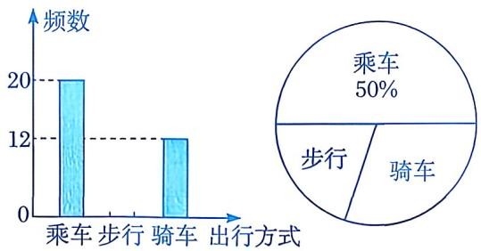

第2(2)题

(3)如图是某校参加各兴趣小组的学生人数分布情况的扇形统计图。已知参加科技兴趣小组的人数为100人，则这次调查的样本容量为____。 

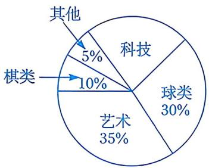

第2(3)题

(4)小惠同学调查了本班每名同学最喜欢的颜色(每人只能选择一种颜色), 并绘制了如下条形统计图(其中, 部分小长方形被污染了)和扇形统计图. 已知条形统计图中小长方形的高度按照从高到低的顺序排列. 若甲、乙、丙、丁分别代表扇形统计图中的某种颜色, 则丙代表的颜色是 

|  |  |
|:---:|:---:|
| 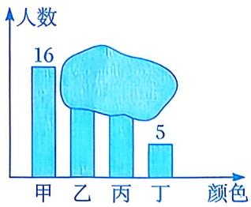 | 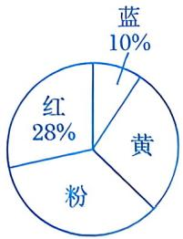 |

第2(4)题

# 数学思考

3. 某校就学生完成课后作业的时间进行了问卷调查，根据收集到的信息将完成课后作业的时间分成 A, B, C, D 四个层级（A: 90 min 以上；B: 60～90 min；C: 30～60 min；D: 30 min 以下），并将统计结果绘制成如下两幅不完整的统计图. 

(1)接受问卷调查的学生共有多少人? 

(2)求扇形统计图中 D 层级对应扇形圆心角的度数及 B 层级的人数. 

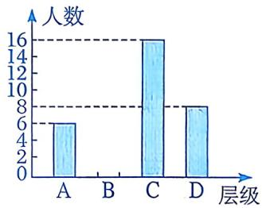

第3题

|  |  |
|:---:|:---:|
| 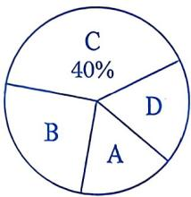 |  |

# 解决问题

4. 某校为了解八年级学生在暑假期间的阅读情况，随机调查了部分学生，并将他们的阅读情况分为 A, B, C, D 四类. 

| 阅读情况 | 描述 |
|:---|:---|
| A | 阅读超过5本书 |
| B | 阅读3~5本书 |
| C | 阅读1~2本书 |
| D | 未进行阅读 |

根据收集到的数据，绘制了如下两幅不完整的统计图： 

|  |  |
|:---:|:---:|
| 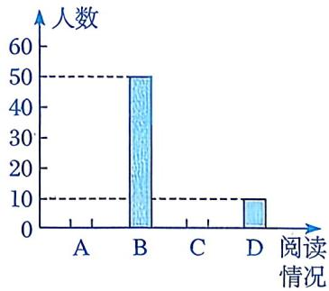 | 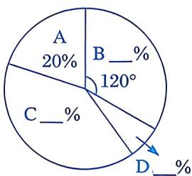 |

第4题

(1)学校调查了多少名八年级学生？ 

(2)通过计算，补全条形统计图和扇形统计图. 
