# 22.3 数据的整理与描述(二)

# 知识点拨

1. 折线统计图主要反映数据的变化趋势. 

2. 统计表的优点是便于阅读和检查，便于计算和分析；统计图的优点是形象直观。 

# 夯实基础

1. 选择题. 

(1)在一次演讲比赛中, 工作人员将所有参赛学生的成绩绘制成如图所示的折线统计图. 下列说法中, 不正确的是 ( ) 

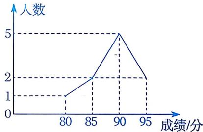

第1(1)题

A. 90 分的人数最多 

B. 最高分与最低分相差 15 分 

C. 参赛的学生共有 8 人 

D. 最高分为 95 分 

(2)鹏鹏记录了自己一周的睡眠时间,并将统计结果绘制成如图所示的折线统计图,则鹏鹏这一周睡眠时间不低于 $9 \mathrm{~h}$ 的天数为 ( ) 

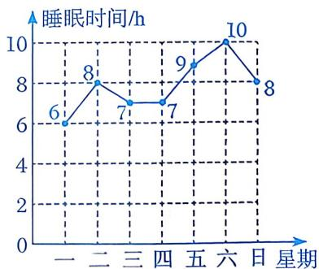

第 1(2) 题

A. 1 

B. 2 

C. 3 

D. 4 

(3)如图是某地区某日从10时至16时气温随时间变化的折线统计图。由折线统计图可知， $19.5^{\circ}\mathrm{C}$ 所在的时间范围大致为 

( ) 

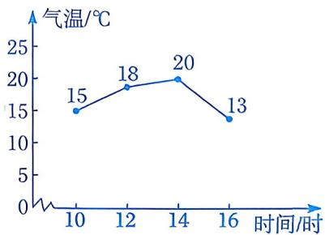

第 1(3)题

A. 10~12时 

B. $12 \sim 14$ 时 

C. 12~16时 

D. $14 \sim 16$ 时 

(4)某市近一个月来遭遇强降雨，江水水位不断上涨。小明以警戒水位为 0 m，用折线统计图记录了某一天的江水水位情况。下列说法中，不正确的是 ( ) 

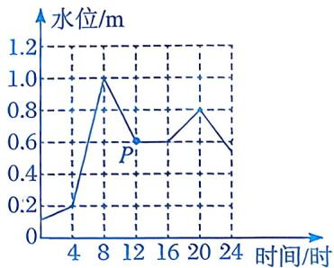

第 1(4) 题

A. 8时江水的水位最高 

B. 这一天江水的水位均高于警戒水位 

C. 8时至16时江水的水位在下降 

D. 点 $P$ 表示 12 时江水的水位高于警戒水位 $0.6 \mathrm{~m}$ 

(5)如图是某种新能源汽车去年1～4月份销量情况的折线统计图．下列说法中，不正确的是() 

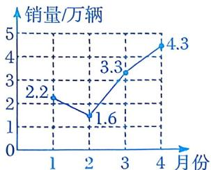

第1(5)题

A. 1月份的销量为2.2万辆 

B. 从2月份至3月份的月销量增长最快 

C. 4月份的销量比3月份的销量增加了1万辆 

D. 1~4 月份销量逐月增加 

(6)某商品四天内的进价与售价信息如图所示，则售出这种商品获得利润最大的是 

( ) 

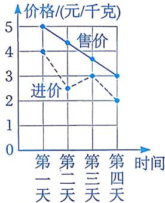

第1(6)题

A. 第一天 

B. 第二天 

C. 第三天 

D. 第四天 

(7)某地区 2016 年至 2025 年的人口出生率及人口死亡率如图所示，已知人口自然增长率=人口出生率-人口死亡率。下列说法中，不正确的是（） 

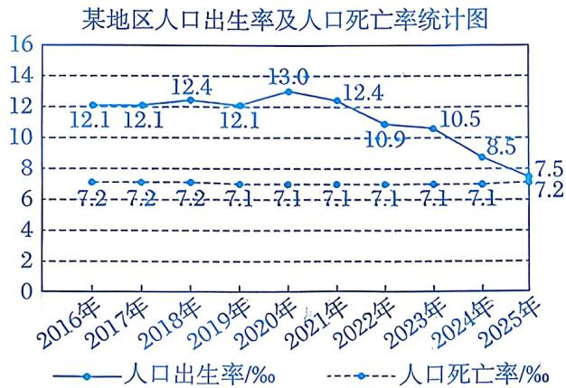

第 1(7)题

A. 与2016年相比，2025年的人口出生率下降了 $4.6 \text{‰}$ 

B. 这十年的人口死亡率基本稳定 

C. 2021 年至 2025 年的人口总数持续下降 

D. 2021 年至 2025 年的人口自然增长率持续下降 

(8)某校连续四个月开展学科知识模拟测试，并根据测试成绩绘制了如图所示的统计图(参加四次模拟考试的学生人数不变).下列说法中，不正确的是() 

第1月全体学生测试成绩统计图

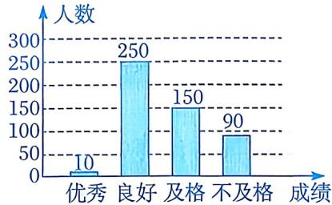

第1~4月测试成绩为“优秀”的学生人数占比统计图

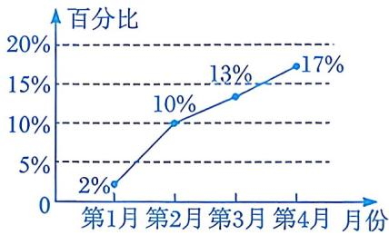

第 1(8)题

A. 共有 500 名学生参加模拟测试 

B. 从第 1 月到第 4 月，测试成绩为 “优秀” 的学生人数在总人数中的占比逐渐增长 

C. 第4月增长的测试成绩为“优秀”的学生人数比第3月增长得多 

D. 第 4 月测试成绩为 “优秀” 的学生人数达到 100 人 

# 2. 填空题.

(1)医院里护士统计某病人的体温，应选择____统计图；一学生统计某一天中自己睡觉、学习、活动、吃饭的时间及其在一天中所占的百分比，应选择____统计图. 

(2)如图是某同学6次数学测验成绩的折线统计图, 则该同学这6次测验成绩中的最高分是____分. 

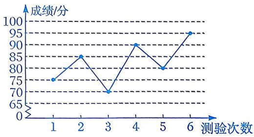

第2(2)题

(3)如图是一组数据的折线统计图，这组数据中最大值与最小值的差是____。 

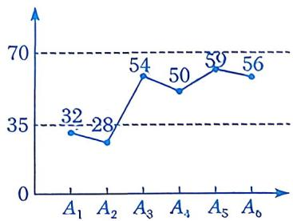

第2(3)题

(4) 甲、乙两家公司经营同一种产品, 2022 年至 2025 年的销售情况如图所示, 则销售量增长较快的是____公司. 

|  |  |
|:---:|:---:|
| 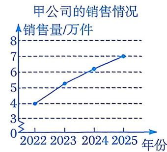 | 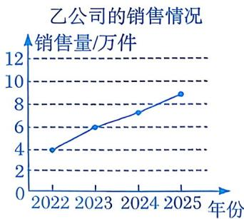 |

第 2(4) 题

# 数学思考

3. 如图是 M 品牌电脑和 N 品牌电脑 2022 年至 2025 年销售额增长率的折线统计图. 

(1)M 品牌电脑的销售额比 N 品牌电脑的销售额多吗? 

(2)根据图中信息，说明 M 品牌电脑在什么方面领先 N 品牌电脑？ 

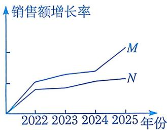

第3题

4. 某运动品牌店就第一季度 A, B 两款运动鞋的销售情况进行了统计，并绘制了如下两款运动鞋的销售量及总销售额的统计图： 

A, B两款运动鞋销售量统计图

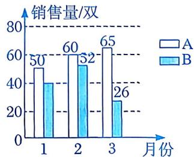

A、B两款运动鞋总销售额统计图

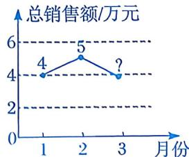

第4题

(1)若 1 月份 B 款运动鞋的销售量是 A 款运动鞋销售量的 $\frac{4}{5}$ , 则 1 月份销售了 B 款运动鞋多少双? 

(2)若第一季度这两款运动鞋的销售单价保持不变，求3月份的总销售额。（销售额 $=$ 销售单价 $\times$ 销售量） 

(3)结合第一季度的销售情况，请你对这两款运动鞋的进货、销售等方面提出一条建议. 

# 解决问题

第5题

5. 某校举办艺术节活动, 鼓励学生踊跃参加各项比赛, 参加的学生可以从 “歌曲” “舞蹈” “小品” “主持” “乐器” 五项比赛中选择一项。根据学生的选择情况, 绘制成了如下条形统计图和不完整的扇形统计图, 其中条形统计图的一部分不小心被污染了。 

| ① | ② |
|:---:|:---:|
| 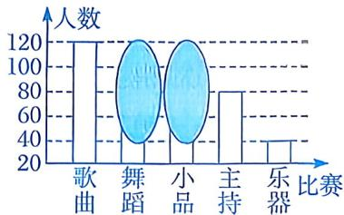 | 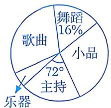 |

(1)根据图①中的信息, 可知参加主持比赛的人数是参加乐器比赛人数的____倍, 而统计图中代表二者的长方形的高度则反映出参加主持比赛的人数是参加乐器比赛人数的 3 倍. 这两个结果为什么不一样? 

(2)全校一共有多少名学生参加舞蹈比赛? 

(3)在图②中，“小品”部分所对应的扇形圆心角的度数为____。 

(4)参加比赛的学生有 $50 \%$ 获奖，其中，获二等奖与三等奖的人数之比为 $3: 5$ ，获二等奖的人数是获一等奖人数的1.5倍。获一等奖的学生有多少名？ 

