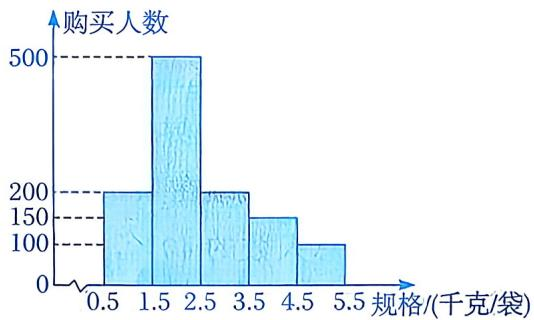
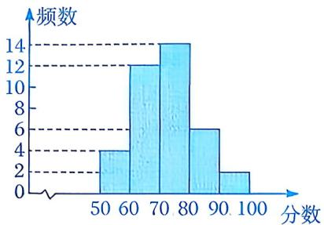
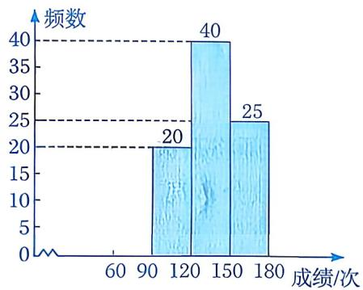
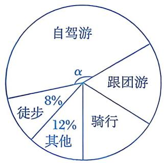
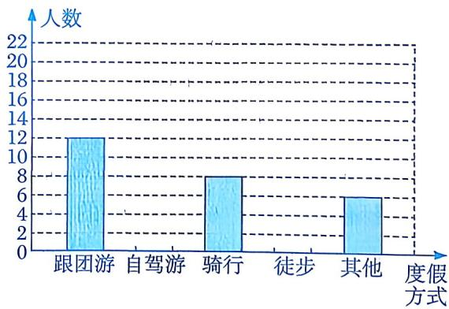
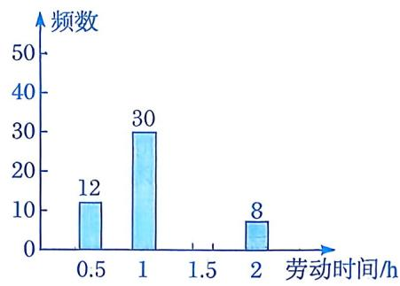

# 22.4 频数分布与直方图

# 知识点拨

1. 频数是指各组中数据的个数。频数与数据总个数的比值叫作频率。 

2. 列频数分布表的步骤：先在表格中用画“正”字的方式统计各组的频数，再计算相应的频率. 

3. 频数分布直方图的特点：一是能够显示各组频数分布的情况，二是易于显示各组之间的频数差别. 

# 夯实基础

# 1. 选择题.

(1)在数“20.222 203”中，数字“2”出现的频率是 （） 

A. 0.625 

B. 0.5 

C. 0.25 

D. 0.125 

(2) 一只不透明的袋子中装有大小、质地均相同的红球、黄球、白球共 50 个。通过多次摸球试验后，发现摸到红球、黄球的频率分别是 0.3, 0.5，则可估计袋子中白球的个数是 ( ) 

A. 10 

B. 15 

C. 20 

D. 25 

(3)一组数据共100个，分为6组，第1～4组的频数分别为10，14，16，20，第5组的频率为0.2，则第6组的频数为（） 

A. 20 

B. 22 

C. 24 

D. 30 

(4)为了解某校八年级女生的身高情况,从八年级随机抽查了63名女生的身高(单位:cm),其中最大值是172,最小值是143,取组距为4,则可以分成() 

A. 9组 

B. 8组 

C. 7 组 

D. 6组 

(5)期末数学测试后, 从甲、乙两校各选取一些学生的测试成绩进行调查, 发现甲校学生成绩为优秀的频率为 0.2, 乙校学生成绩为优秀的频率为 0.25, 由此可以得到两校成绩为优秀的学生人数 ( ) 

A. 甲校多 

B. 乙校多 

C. 一样多 

D. 无法确定 

(6)质检员从某服装厂即将出售的一批休闲装中抽检了200件，其中有15件休闲装不合格。在此抽检的样本中，样本容量和不合格的频率分别是（） 

A. 15,0.75 

B. 15,0.075 

C. 200, 0.75 

D. 200, 0.075 

(7)某面粉厂为确定面粉包装袋的规格,随机调查了三家超市,根据三家超市一周的面粉销售数据绘制出如下统计图,则该面粉厂应选择的面粉包装袋规格为 ( ) 

第 1(7)题

A. 1千克/袋 

B. 2千克/袋 

C. 3千克/袋 

D. 4千克/袋 

(8)数学老师将某次测试的成绩整理后绘制出如下频数分布直方图. 下列说法中, 正确的是 ( ) 

第1(8)题

A. 得分在 $60 \sim 70$ 分的人数最多 

B. 人数最少的分数段的频数为 4 

C. 成绩及格 $(\geqslant 60$ 分) 的学生有12人 

D. 该图数据分组的组距为 10 

# 2. 填空题.

(1)某班 50 名学生在期末考试中, 数学成绩在 $100 \sim 110$ 分这个分数段的频率为 0.2, 则该班在这个分数段的学生有 ____ 人. 

(2)已知一个容量为 80 的样本的最大值是 172，最小值是 149。在画频数分布直方图时，若取组距为 3，则这个样本的数据可以分成____组。 

(3)已知一个样本的容量为60，在其频数分布直方图中，各小长方形高度的比为2:4:1:3，则第二组的频数是____。 

(4)某校抽查了部分八年级学生1分钟跳绳测试的成绩(单位: 次), 并将测试成绩分为4组, 绘制出如下不完整的频数分布直方图(每一组均含前一个边界值, 不含后一个边界值). 已知测试成绩在 $120 \sim 150$ 次这组的人数占抽查总人数的 $40\%$ , 则1分钟跳绳成绩少于90次的有____人. 

第2(4)题

# 数学思考

3. 某中学为了解本校女生的生长发育情况，对八年级同龄的 32 名女同学的身 

高(单位: cm)进行了测量, 结果如下: 

| 154 | 157 | 159 | 166 | 169 | 159 | 156 |
|:---|:---|:---|:---|:---|:---|:---|
| 162 | 158 | 159 | 155 | 164 | 159 | 160 |
| 162 | 157 | 162 | 159 | 165 | 157 | 151 |
| 146 | 151 | 160 | 157 | 161 | 158 | 153 |
| 158 | 164 | 158 | 163 |  |  |  |

设组距为 $5 \mathrm{~cm}$ , 列出频数分布表, 并画出频数分布直方图. 

4. 某校对某班学生“五一”小长假期间的度假情况进行了调查，并根据收集到的数据绘制了如下两幅不完整的统计图。 

|  |  |
|:---:|:---:|
|  |  |

第4题

(1)求该班学生的总人数. 

(2)请将频数分布直方图补充完整. 

(3)求扇形统计图中 $\angle\alpha$ 的度数. 

# 解决问题

第5题

(1)求 $x, y$ 和 $m$ 的值. 

(2)请将频数分布直方图补充完整. 

5. 某校倡议八年级学生利用双休日在各自的社区参加义务劳动。为了解学生的劳动情况，学校随机调查了部分学生的劳动时间，并根据得到的数据绘制出如下不完整的统计图表： 

| 劳动时间/h | 频数 | 频率 |
|:---|:---|:---|
| 0.5 | 12 | 0.12 |
| 1 | 30 | 0.3 |
| 1.5 | x | 0.5 |
| 2 | 8 | y |
| 合计 | m | 1 |
