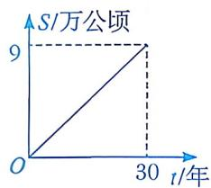

# 22.5 数据变化趋势的刻画

# 知识点拨

能根据已知信息(图象、数值表、实际问题等)，利用待定系数法确定一次函数的表达式，并以此来预测变化趋势. 

# 夯实基础

# 1. 选择题.

(1)一位母亲记录了儿子 $3 \sim 9$ 岁的身高，由此建立身高 $y(\mathrm{cm})$ 与年龄 $x$ (岁)之间关系的模型为 $y = 7.19x + 73.93$ 。若用此模型来推测这个孩子10岁时的身高，则下列说法中正确的是 （） 

A. 一定是 $145.83 \mathrm{~cm}$ 

B. 在 $145.83 \mathrm{~cm}$ 以上 

C. 在 $145.83 \mathrm{~cm}$ 左右 

D. 在 $145.83 \mathrm{~cm}$ 以下 

(2)某地现有沙漠的面积为9万公顷,当地为治理土地沙化,通过植树造林,每年可减少沙漠面积0.3万公顷.设t年后该地剩余的沙漠面积为S万公顷.下列图象中,能正确反映S与t之间函数关系的是() 

|                              A                               |                              B                               |
| :----------------------------------------------------------: | :----------------------------------------------------------: |
|  |  |
|                              C                               |                              D                               |
|  |  |

(3)某地夏季持续干旱, 为了解居民的用水情况, 相关部门记录了该地人均日用水量的变化情况. 如图, 已知该地 10 日和 15 日的人均日用水量分别为 $18 \mathrm{~kg}$ 和 $15 \mathrm{~kg}$ , 并会按此趋势持续直线下降. 当人均日用水量少于 $10 \mathrm{~kg}$ 时, 政府将启动送水预案, 预计政府开始送水的日期为 ( ) 

第1(3)题

A. 23 日 

B. 24 日 

C. 25 日 

D. 26 日 

(4)如图, 拇指与小指尽量张开时, 两指尖的距离称为指距. 人体构造学的研究成果表明, 一般情况下人的指距 $d(\mathrm{cm})$ 越大, 身高 $h(\mathrm{cm})$ 就越高, 且身高随指距变化的趋势可以用直线来刻画. 现测得指距和身高的一组对应数据如下表: 

第1(4)题

| d/cm | 17   | 18   | 19   | 20   |
| :--- | :--- | :--- | :--- | :--- |
| h/cm | 160  | 169  | 178  | 187  |

若甲的指距为 $21\mathrm{cm}$ ，则可推测他的身高为 （） 

A. $188 \mathrm{~cm}$ 

B. $190 \mathrm{~cm}$ 

C. $196 \mathrm{~cm}$ 

D. $198 \mathrm{~cm}$ 

(5)某航空公司规定，旅客乘机所携带行李的质量 $x(\mathrm{kg})$ 与运费 y(元)之间的函数 关系如图所示，那么旅客可携带的免费行李的最大质量为 （） 

第1(5)题

A. $20 \mathrm{~kg}$ 

B. 25 kg 

C. $28 \mathrm{~kg}$ 

D. $30 \mathrm{~kg}$ 

(6)如图，某公司销售人员的月收入与其月销售量成一次函数关系。当月销售量为4件时，销售人员的月收入为（） 

第1(6)题

A. 2000元 

B. 2500元 

C. 3000元 

D. 3500元 

(7)一个装有进、出水管的 $30 \mathrm{~L}$ 容器, 水管单位时间内进、出的水量是一定的, 设从某时刻开始的 $4 \mathrm{~min}$ 内只进水不出水, 在随后的 $8 \mathrm{~min}$ 内既进水又出水, 且容器内的水量 $y(\mathrm{L})$ 与时间 $x(\mathrm{min})$ 之间的函数关系如图所示. 下列说法中, 不正确的是 ( ) 

第 1(7)题

A. 每分钟进水 $5 \mathrm{~L}$ 

B. 每分钟出水 $1.25 \mathrm{~L}$ 

C. 若 $12 \mathrm{~min}$ 后只出水不进水, 则把容器中的水放完需要 $8 \mathrm{~min}$ 

D. 若从一开始进、出水管就同时打开, 则把容器注满需要 $24 \mathrm{~min}$ 

# 2. 填空题.

(1)为让学生读到更多优秀书籍, 某书店在出售图书的同时, 推出一项借阅业务. 规定每借阅 1 本书, 若借期不超过 3 天, 则共收取借阅费 1.50 元; 若借期超过 3 天, 则从第 4 天开始每天另外收取 0.40 元借阅费. 小明借阅了 1 本书, 在第 7 天归还, 则他应付的借阅费为 ____ 元. 

(2)如图是“龟兔赛跑”时龟、兔所行路程 $s(\mathrm{km})$ 与时间 $t(\mathrm{h})$ 之间关系的图象. 已知乌龟和兔子上午8:00从同一地点出发, 则乌龟在 ____ 时追上兔子. 

第 2(2) 题

(3)生物学家研究表明, 某种蛇的长度 $y(\mathrm{cm})$ 是其尾长 $x(\mathrm{cm})$ 的一次函数. 当蛇的尾长为 $6 \mathrm{~cm}$ 时, 蛇长为 $45.5 \mathrm{~cm}$ ; 当蛇的尾长为 $14 \mathrm{~cm}$ 时, 蛇长为 $105.5 \mathrm{~cm}$ . 当蛇的尾长为 $10 \mathrm{~cm}$ 时, 蛇长为 ____ cm. 

(4)已知某品牌鞋子的尺码 x(码)与鞋长 y(cm)之间的对应关系如下表所示： 

| x/码 | 34   | 35   | 36   | 37   | 38   |
| :--- | :--- | :--- | :--- | :--- | :--- |
| y/cm | 22   | 22.5 | 23   | 23.5 | 24   |

若 $y$ 是 $x$ 的一次函数，则 $y$ 与 $x$ 之间的函数关系式是 

# 数学思考

3. 一根蜡烛长 $15 \mathrm{~cm}$ , 点燃后每小时缩短 $5 \mathrm{~cm}$ . 

(1)请写出点燃后蜡烛的长度 $y(\mathrm{cm})$ 与蜡烛燃烧时间 $t(\mathrm{h})$ 之间的函数关系式. 

(2)该蜡烛可燃烧多长时间? 

4. 张师傅驾车运送货物到某地出售，汽车出发前油箱中有油 $50 \mathrm{~L}$ ，行驶若干小时后，途中在加油站加油若干升，油箱中剩余油量 $y(\mathrm{L})$ 与行驶时间 $t(\mathrm{h})$ 之间的函数关系如图所示。 

(1)汽车行驶多长时间后加油？加了多少升油？ 

(2)已知加油前后汽车都以 $70 \, km/h$ 的速度匀速行驶。如果加油站到目的地的路程为 $210 \, km$ ，请推测油箱中的油是否够汽车行驶到目的地，并说明理由。 

第4题

5. 运动时人的心率通常与年龄有关, 若用 $a$ (岁) 表示一个人的年龄, 用 $b$ (次/分) 表示正常情况下这个人在运动时每分钟所能承受心跳的最大次数, 则 $b = 0.8(220 - a)$ . 

(1) 正常情况下，一个 15 岁的青少年运动时每分钟所能承受心跳的最大次数是多少？ 

(2)当一个人的年龄增加10岁时，他运动时每分钟所能承受心跳的最大次数有何变化？变化次数是多少？ 

(3)若一个45岁的人运动时，10 s心跳次数为22次，他有危险吗？为什么？ 

6. 下表是 2016 年至 2022 年我国地下水供水量 y(亿立方米)的数据. 

| 年份       | 2016  | 2017  | 2018 | 2019 | 2020 | 2021 | 2022 |
| :--------- | :---- | :---- | :--- | :--- | :--- | :--- | :--- |
| 对应的t值  | 0     | 1     | 2    | 3    | 4    | 5    | 6    |
| y/亿立方米 | 1 057 | 1 017 | 976  | 934  | 893  | 854  | 828  |

(1)请用统计图直观表示我国地下水供水量随年份增加的变化趋势. 

(2)请确定一个一次函数，近似表示 y 随 t 的增大而减小的趋势. 

(3)推测 2024 年我国地下水的供水量. 
