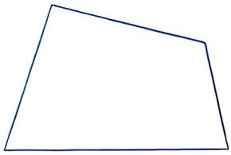

# 项目学习

# 主题探究(一)

# 滴水的秘密

# ——探究水龙头漏水量与漏水时间的关系

# 一、问题背景

地球表面上 70% 是水，但大部分是海水，我们赖以生存的淡水资源仅占水资源的 2.5%。这有限的淡水资源，维系着农业的命脉，支撑着工业的运转，更是每个人日常生活中不可或缺的生存基础。在重视可持续发展的今天，越来越多的人意识到节约用水、珍惜水资源的重要性，也发现看似微小的不良生活习惯，如未关紧水龙头导致其持续滴水，会造成水资源的大量浪费。那么，水龙头漏水量与漏水时间之间有什么样的关系呢？ 

# 二、活动任务与建议

1. 独立思考，完成下列任务： 

(1)通过实验，收集一个水龙头在一定时间内漏水量的数据. 

(2)建立平面直角坐标系，描出以实验数据为坐标的点，表示漏水量与漏水时间之间的关系. 

(3)运用一次函数来描述漏水量与漏水时间之间的关系. 

2. 在小组内交流各自的探究成果，通过共同讨论、比较和归纳，提出切实可行的节约用水措施和方案。 

# 三、完成探究报告，分享交流

1. 成果展示与交流. 

各小组依次进行成果展示，其他同学可以提问、补充或评价. 

2. 个人反思与评价. 

填写个人反思日志，总结在项目学习中的收获、遇到的困难及解决方法、合作中的体会、对节水的新认识等. 

3. 拓展讨论与行动. 

讨论：如何减少或避免水龙头漏水？我们可以做些什么来节约用水？ 

# 主题探究(二)

# 中点四边形的探索

# 一、问题背景

华罗庚说过：“宇宙之大，粒子之微，火箭之速，化工之巧，地球之变，生物之谜，日月之繁，无处不用到数学。”这句话生动地描述了数学与生活的紧密联系。数学源于生活，又服务于生活，二者密不可分。四边形是我们生活中常见的形状之一，如在几何学中学习的正方形、矩形、菱形等都是四边形。 

小张大学毕业后开了一家装潢公司，现需要从一张四边形纸片上裁取一个平行四边形用作装饰材料，并且使这个平行四边形的四个顶点分别落在原纸片的四条边上。请帮他想一想该如何裁取。 

# 二、活动任务与建议

1. 独立思考，完成下列任务： 

(1)如图是一个不规则的四边形, 请从中裁取一个最大的平行四边形. 

(2) 观察裁取的平行四边形四个顶点在原四边形纸片中的位置，你发现了什么？ 

(3)如果改变问题背景中四边形纸片的形状, 再按照(2)中发现的方法进行裁取, 那么裁取的四边形的形状会不会发生改变? 

(4)根据前面三问的探索过程及结果,你是否能够提出新的问题或猜想并证明? 

2. 在小组内交流各自的探究成果，通过共同讨论、比较和归纳，结合在探究过程 

中发现的规律，总结原四边形和中点四边形之间的联系. 

# 三、完成探究报告，分享交流

1. 成果展示与交流. 

各小组依次进行成果展示，其他同学可以提问、补充或评价. 

2. 个人反思与评价. 

填写个人反思日志，总结在项目学习中的收获、遇到的困难及解决方法、合作感悟等. 

3. 知识拓展与应用. 

讨论：生活中哪些地方可以看到中点四边形的应用？ 

# 主题探究(三)

# 小屏幕里的大世界

# ——初中生最喜爱的电视节目调查与分析

# 一、问题背景

电视是传播信息的重要媒介之一，优秀的电视节目能吸引并打动成千上万的青少年，陪伴他们成长，帮助他们增长见识，开阔视野，丰富精神文化生活。在繁忙学习的闲暇，适度观看电视节目有助于缓解压力、调节心情。 

了解青少年最喜爱的电视节目类型、偏好原因以及这些节目对他们可能带来的影响，不仅能帮助我们更好地理解当代青少年，也能为教育者、创作者和家长提供有价值的参考。 

为此，需要对初中生观看电视的情况展开调查，具体内容包括观看时长、最喜欢的节目类型、经常看的电视频道等. 

# 二、活动任务与建议

1. 独立思考，完成下列任务： 

(1)请围绕这一问题，搜集相关资料，确定研究主题. 

(2)独立设计一个解决问题的初步方案. 

2. 在小组内交流各自的初步方案，研讨探究活动步骤：设计问卷、收集数据、整理数据、描述数据、分析数据、作出决策。通过实践发现初中生在观看电视节目方面可能存在的普遍现象，分析电视台在节目编排方面需要改进的地方和可以优化的方向，并提出合理的改进建议。 

# 三、完成探究报告，分享交流

1. 成果展示与交流. 

各小组依次进行成果展示，其他同学可 

以提问、补充或评价. 

2. 个人反思. 

填写个人反思日志，总结在项目学习中的收获、遇到的困难及解决方法、学到的知识技能、获得的启发等. 

3. 经验分享与拓展. 

讨论：基于调查结果，可以对初中生科学、健康地观看电视节目提出哪些建议？学校和社会又可以采取哪些措施来保障青少年的健康成长？ 