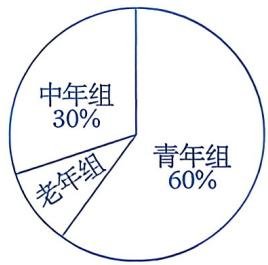
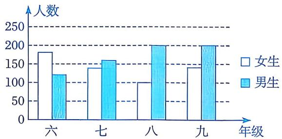
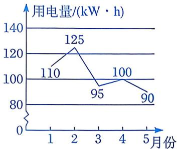
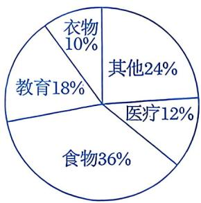
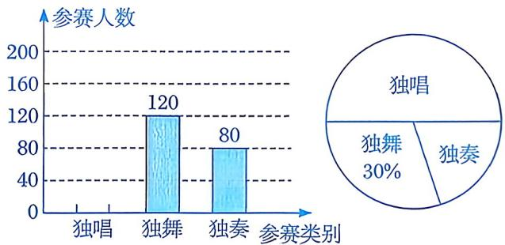
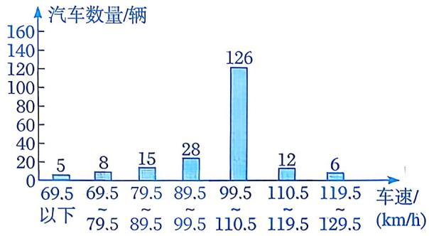
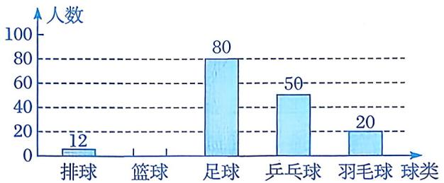
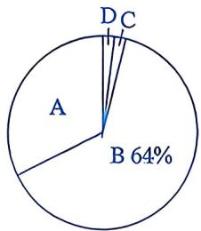

# 回顾与反思

# 知识点拨

经历数据的收集、整理、描述与分析的模拟过程，了解抽样调查、样本、个体与总体等统计概念；初步感受抽样调查的必要性，初步体会用样本估计总体的思想；会画频数分布直方图；能用学到的统计知识解决生活中的一些实际问题. 

# 夯实基础

# 1. 选择题.

(1)某试验基地种植了 10 公顷新品种葡萄, 为了解这些新品种葡萄的单株产量, 从中随机抽查了 4 株葡萄. 在这个调查中, 4 株葡萄的产量是 ( ) 

A. 总体 

B. 总体的一个样本 

C. 样本容量 

D. 个体 

(2)为了解某市去年6000名参加初中毕业升学考试考生的数学成绩，从中随机抽取了200名考生的数学成绩进行调查。下列说法中，正确的有() 

①6 000 名考生的数学成绩是总体； 

②每名考生是个体； 

③200 名考生是总体的一个样本； 

④每名考生的数学成绩是个体. 

A. 4 个 

B. 3 个 

C. 2 个 

D. 1 个 

(3)下列调查中，适合采用普查的是（） 

A. 对全国中学生心理健康现状的调查 

B. 对冷饮市场上冰激凌质量情况的调查 

C. 对某市市民实施低碳生活情况的调查 

D. 对某架大型民用客机各零部件的检查 

(4)下列调查中，选取的样本具有代表性的是 （） 

A. 为了解某地区居民的防火意识，对该地区的初中生进行调查 

B. 为了解某校 1200 名学生的视力情况,随机抽取该校 120 名学生进行调查 

C. 为了解某商场的平均日营业额，选在周末进行调查 

D. 为了解全校学生课外小组的活动情况，对该校的男生进行调查 

(5)某市总工会组织该市各单位参加“迎新春长跑活动”，将报名的男运动员分成青年组、中年组和老年组，各组人数所占例如如图所示。已知青年组有120人，则中年组和老年组的人数分别是（） 

第1(5)题

A. 30, 10 

B. 60, 20 

C. 50, 20 

D. 60, 10 

(6)根据图中提供的信息，判断下列说法中正确的是 （） 

第 1(6) 题

A. 六年级学生的人数最少 

B. 八年级学生中男生的人数是女生人数的两倍 

C. 九年级学生中女生人数比男生人数多  
D. 七年级和九年级的学生人数一样多 

(7)小林家某年1～5月份的用电量情况如图所示。根据图中提供的信息可知，相邻两个月中用电量变化最大的是（） 

第 1(7) 题

A. 1月至2月 

B. 2月至3月 

C. 3月至4月 

D. 4月至5月 

2. 填空题. 

(1)调查家长们喜欢看什么电视节目, 调查的对象应该是____, 只调查自己的父母____（填“足以”或“不足以”）得出准确结论. 

(2)已知小明家5月份总支出共计4800元,各项支出所占百分比如图所示,那么其中用于教育的支出为____元. 

第2(3)题

(3)一组数据共50个，分别落在5个小组内，第一、二、三、四组的频数分别为2, 8, 15, 20，则第五组的频数和频率分别为____、____。 

(4)某地去年的粮食产量为 1000 万吨, 预计之后每年的产量会比上一年增加 50 万 

吨. 设 $n$ 年后的粮食产量为 $y$ 万吨, 则 $y$ 与 $n$ 之间的函数关系式为 $\underline{\quad}$ , 这是一个 $\underline{\quad}$ 函数 (填 “一次” 或 “正比例”)，表示粮食产量呈 $\underline{\quad}$ 趋势. 

3. 某市每年都要举办中小学才艺比赛，包括独唱、独舞和独奏三个类别。下面是该市某年参加比赛的不完整的参赛人数统计图： 

第3题

(1)该市当年参加中小学才艺比赛的总人数为____，图中独唱所在扇形圆心角的度数为____。 

(2)把上面的条形统计图补充完整. 

(3)从这次参赛选手中随机抽取20人进行调查，其中有9人获奖。请你估算当年全市获奖的人数。 

# 数学思考

4. 某高速公路检测点抽测了200辆汽车的车速(车速均为整数)，并将检测结果绘制成如下频数分布直方图. 

第4题

(1) 按规定，车速在 70～110 km/h 范围内为正常行驶，请计算正常行驶的车辆所占的百分比. 

(2) 按规定，车速在 $110 \mathrm{~km} / \mathrm{h}$ 以上时为超速行驶。如果该路段每天的平均车流量约为 1 万辆，请估计每天超速行驶的汽车数量。 

5. 某小学开展了“你最喜欢观看的五项球类比赛”（只选一项）的抽样调查。根据调查数据，小红计算出喜欢观看排球比赛的人数占抽样人数的 $6\%$ ，小明绘制出了如下不完整的条形统计图。请根据这两名同学提供的信息，解答下列问题： 

第5题

(1)请把条形统计图补充完整. 

(2)根据以上调查，请估计该校1800名学生中，喜欢观看羽毛球比赛的人数. 

# 解决问题

6. 某市中考体育测试中，1 分钟跳绳为自选项目。某中学九年级共有 50 名女同学选考 1 分钟跳绳。根据测试评分标准，将她们的成绩进行统计后分为 A, B, C, D 四个等级，并绘制成如下频数分布表和扇形统计图。 

| 等级 | 分数 | 跳绳数/(次/分钟) | 频数 |
|:---|:---|:---|:---|
| A | 9~10 | 150以上 | 4 |
| 8~9 | 140~150 | 12 |  |
| B | 7~8 | 130~140 | 17 |
| 6~7 | 120~130 | m |  |
| C | 5~6 | 110~120 | 0 |
| 4~5 | 90~110 | n |  |
| D | 3~4 | 70~90 | 1 |
| 0~3 | 0~70 | 0 |  |

（注：“6～7”的意义为大于或等于6分且小于7分，其余类同） 

第6题

(1)成绩为 A 等级的学生人数占所有选考跳绳学生人数的百分比为 ____. 

(2)求 $m, n$ 的值. 

(3)在抽取的这个样本中，请说明哪个分数段的学生最多. 

(4) 计算这次 1 分钟跳绳测试的及格率. (6 分及以上为及格) 
