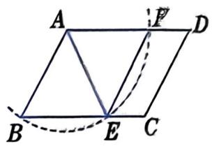
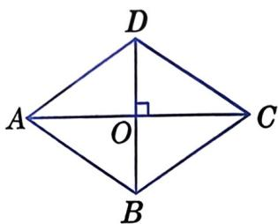
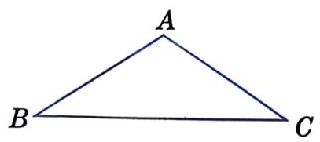

## 第1页：封面

# 21.6 菱形

### 第2课时 · 菱形的判定 · 当逆向成立

第21章 四边形 | 冀教版八年级下册

---

**研究路径**：性质 → 逆命题 → 验证 → 判定定理

（与矩形判定类比）

## 第2页：学习目标

| 目标 | 内容 |
|:---|:---|
| ① | 能准确复述菱形的两个判定定理 |
| ② | 能独立完成两个判定定理的证明 |
| ③ | 能运用判定定理完成简单证明，体会"条件决定方法" |
| ④ | 能识别"先证平行四边形，再证菱形"的分析路径 |

## 第3页：回顾 · 提出逆命题

菱形的性质：

| | 性质 |
|:---|:---|
| ① | 四条边相等 |
| ② | 对角线互相垂直 |

---

**第一条**：四条边相等的四边形，一定是菱形吗？

**第二条**：对角线互相垂直的四边形，一定是菱形吗？

## 第4页：一起探究 · 尺规作图

**画两条等长的线段AB、AD**

分别以B、D为圆心、AB长为半径画弧，两弧交于点C

连接BC、CD

**（请动笔完成作图）**

---

1. 四边形ABCD四条边有什么关系？
2. 它是菱形吗？怎么证明？

（教材·一起探究）

## 第5页：证明 · 判定定理1

**已知**：四边形ABCD中，AB = BC = CD = DA

**求证**：四边形ABCD是菱形

---

**请独立思考证明思路**

**提示**：
- 菱形 = 平行四边形 + 一组邻边相等
- 四边相等能推出平行四边形吗？

**（请动笔书写完整证明过程）**

## 第6页：练习 · 识图

▱ABCD中，∠D=60°，以A为圆心、AB长为半径画弧，交BC于E，交AD于F。

**请指出图中的等腰三角形、平行四边形和菱形，并说明理由。**

（教材·练习第2题 · 口答）

## 第7页：大家谈谈 · 探究判定定理2

▱ABCD的两条对角线AC、BD互相垂直，O为交点。

（先独立2分钟，再同桌交流）

---

(1) Rt△ABO、Rt△CBO、Rt△CDO、Rt△ADO 都全等吗？

(2) ▱ABCD的四条边都相等吗？

(3) 请证明你的猜想。

**（请动笔将推理过程书写在草稿纸上）**

（教材·大家谈谈）

## 第8页：思考 · 还有其他证法吗？

不用判定定理1，还有别的证明思路吗？

---

**提示**：AC和BD互相垂直平分，由此你能得到什么数量关系？

（口述讨论）

---

**判定定理2**：两条对角线互相垂直的平行四边形是菱形。

⚠️ **注意**：前提必须是平行四边形！

## 第9页：练习 · 判定定理2应用

▱ABCD中，O为对角线AC的中点，过O作AC的垂线，交AD于E、交BC于F。

求证：四边形AFCE是菱形。

**（口述思路 · 课后动笔写出完整证明过程）**

（教材·A组第2题）

## 第10页：例题 · 综合运用

△ABC中，AD是∠BAC的平分线，DE∥AC交AB于E，DF∥AB交AC于F。

求证：四边形AEDF是菱形。

---

**分析路径**（口述）：
- 第一步：四边形AEDF是什么四边形？为什么？
- 第二步：还需要什么条件？怎么证？

**（请动笔跟写条件链和完整证明过程）**

（教材·例2）

## 第11页：变式思考

**如果条件改为**：AD是角平分线不变，增加 EF⊥AD

四边形AEDF还是菱形吗？用哪个判定定理？

---

技巧总结：**角平分线 + 平行线 → 等腰三角形**

（口答）

## 第12页：练习 · 两种方法

AB = AC，画出点A关于BC的对称点A′。

**请用两种不同的方法证明四边形ABA′C是菱形。**

**（请动笔独立完成 · 两种方法都写）**

---

**练后思考**：两种方法哪种更直接？为什么？

（教材·练习第1题）

## 第13页：选择标准

| 已知条件 | 优先选用的判定 |
|:---|:---:|
| 有边的关系 | **判定定理1**（四边相等） |
| 有对角线的条件 | **判定定理2**（▱+垂直） |

**条件决定方法。** 拿到题目先看条件，再选路径。

## 第14页：课堂小结

今天学了什么？

---

| 方法 | 内容 | ⚠️ |
|:---|:---|:---:|
| **定义法** | 一组邻边相等的平行四边形 | 必须先证▱ |
| **判定定理1** | 四条边相等的四边形是菱形 | 四边相等自动蕴含▱ |
| **判定定理2** | 对角线互相垂直的平行四边形是菱形 | **不能丢掉"平行四边形"前提** |

与矩形判定类比：性质 → 逆命题 → 验证 → 判定定理

**闭眼默述两个判定定理**

## 第15页：课后作业

| 类型 | 内容 | 来源 |
|:---|:---|:---:|
| **必做** | 完善A组第2题的完整证明 | 教材A组第2题 |
| **选做** | A组第1题、第3题 | 教材A组 |
| **挑战** | B组第4题（将军饮马）、B组第5题（绿丝带） | 教材B组 |
