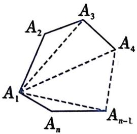
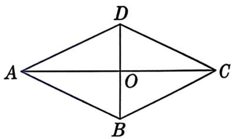

## 第1页：封面

# 21.6 菱形

### 第1课时 · 菱形的性质 · 当边变得特殊

第21章 四边形 | 冀教版八年级下册

## 第2页：回顾 · 从矩形说起

| | 边 | 角 | 对角线 | 对称性 |
|:---|:---|:---|:---|:---|
| 平行四边形 | 对边平行且相等 | 对角相等 | 互相平分 | 中心对称 |
| 矩形（+"直角"） | 对边相等 | **四个直角** | **相等** | + 2条对称轴 |

研究方法：观察 → 折叠 → 猜想 → 证明 → 应用

**如果换一个"加料"——不碰角，让边变得特殊——会得到什么图形？**

## 第3页：这是什么图形？

 

 

---

**它和平行四边形到底差在哪？用一句话说清楚。**

**"一组邻边相等"就够了吗？为什么？**

## 第4页：折叠发现 · 对称性

 

教师演示折叠，你观察——

| 折叠动作 | 你发现了什么？ |
|:---|:---|
| 沿AC对折 | ？ |
| 沿BD对折 | ？ |
| 绕交点O旋转180° | ？ |

**对比矩形**：矩形对称轴在哪？菱形呢？为什么不一样？

## 第5页：这个重合说明了什么？

 

B和D沿AC对折后重合了。

**B和D现在是什么关系？**

---

回忆轴对称性质：**对称轴 = 对应点连线的 ________**

（垂直且平分 —— 即：**垂直平分线**）

## 第6页：逻辑证明

 

**已知**：菱形ABCD，对角线AC、BD交于点O

**求证**：
1. AB = BC = CD = DA
2. AC ⟂ BD

---

证(1)：已经知道哪些边相等？还差什么？（口述即可）

证(2)：证AC⟂BD → 先转化成证 ____ = 90°

找哪对三角形全等？条件？为什么选SSS？

证(3)：补充——对角线平分一组对角

△ADO≌△CDO → ∠ADO = ∠CDO（一对对角被平分）
同理 → 每条对角线平分一组对角

## 第7页：随堂口答

 

菱形ABCD中，AC、BD为对角线，∠BAC = 50°。

**求各内角的度数。**（口答即可）

（教材·A组第1题）

## 第8页：性质定理总结

| 研究对象 | 性质内容 | 来源 |
|:---|:---|:---|
| **边** | 四条边都相等 | 定义 + 平行四边形对边相等 |
| **角** | 对角相等 | 继承平行四边形 |
| **对角线** | 互相**垂直**且平分 | 轴对称性质推出 |
| **对角线与角** | 每条对角线**平分一组对角** | 折叠 + 全等证明 |
| **对称性** | 中心对称 + 轴对称（2条） | 折叠发现 + 证明确认 |

三件武器：四边相等 · 对角线垂直 · 对角线平分对角

## 第9页：例题

 

菱形ABCD的周长为16cm，∠ABC = 120°。

**求对角线BD和AC的长。**

（教材·例1）

---

**先想**：两个条件，哪个先用？为什么？

## 第10页：课堂练习

**练习1**：菱形ABCD中，AC = 8，BD = 6。求周长。

（教材·A组第2题）&emsp;**练后思考**：和例1有什么相同的数学结构？

---

**练习2**：菱形ABCD边长为2cm，E为AB中点，DE⊥AB。求面积。

 

（教材·A组第3题）

## 第11页：拓展

 

菱形ABCD中，AC = 6cm，BD = 8cm，AE⊥BC于E。

**求AE的长。**

（教材·B组第4题）

---

不给边长，只给对角线 → 换个思路：面积有几种算法？

## 第12页：课堂小结

今天学了什么？

- **定义**：有一组邻边相等的平行四边形
- **性质**：四边相等 · 对角线互相垂直 · 对角线平分一组对角

怎么学的？&emsp;平行四边形加条件 → 折叠发现 → 逻辑证明 → 应用

与矩形对比：

- 矩形：+"直角"（角特殊）→ 证对角线相等用SAS
- 菱形：+"邻边相等"（边特殊）→ 证对角线垂直用SSS

**同一条研究路径，用在两种图形上。**

## 第13页：课后作业

课本习题 B组

第5题：已知菱形ABCD中，E、F分别是BC、CD上的点，且∠B = ∠EAF = 60°，∠BAE = 18°。求∠CEF的度数。

第6题：菱形OABC在平面直角坐标系中，顶点O为坐标原点，A、C在第一象限，且∠AOC = 45°，OC = √2。求点B的坐标。

（教材·B组第5题、第6题）
