# 21.6 菱形 第1课时

---

## 情境引入

菱形也是一类特殊的平行四边形。它会有什么样的特殊性质，又该如何进行判定呢？

---

## 观察与思考

从下列图片中抽象出如图21.6-1所示的图形。观察这些图形，它们有什么共同特征呢？

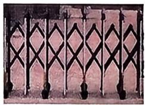

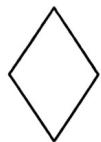

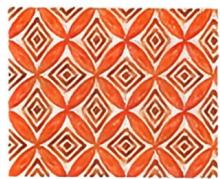

 

图21.6-1

通过观察和验证，图21.6-1(1)、(2)、(3)皆为平行四边形，而且有一组邻边相等。我们把**有一组邻边相等的平行四边形叫作菱形(rhombus)**。

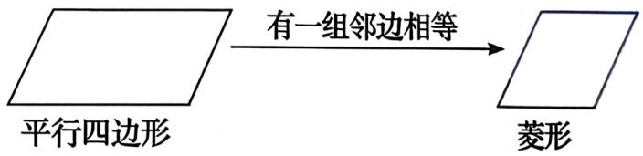

菱形作为特殊的平行四边形，除具有平行四边形的所有性质外，还有哪些特殊的性质呢？

---

## 一起探究

**探究一**：如图21.6-2，将一张菱形纸片ABCD按图示方法折叠后，再展开。

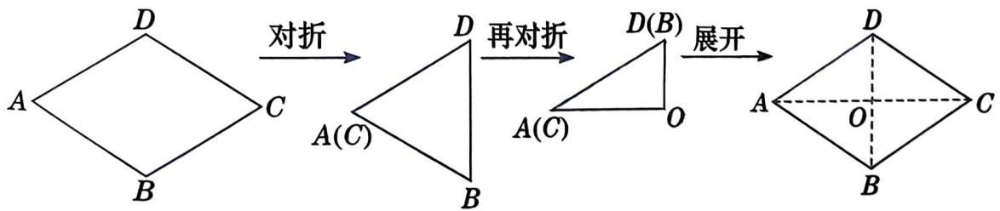

图21.6-2

(1) 说明两条折痕的交点O恰为菱形的对称中心。

(2) 菱形ABCD是轴对称图形吗？如果它是轴对称图形，那么它有几条对称轴，分别是哪些直线？

**探究二**：如图21.6-3，四边形ABCD是菱形。

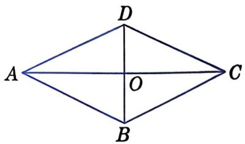

图21.6-3

(1) 菱形ABCD的四条边有怎样的数量关系？

(2) 菱形ABCD的两条对角线有怎样的位置关系？

**通过探究发现**：

- **菱形既是中心对称图形，也是轴对称图形。**
- **菱形的四条边相等；菱形的两条对角线互相垂直，且每条对角线平分一组对角。**

---

## 性质定理的证明

**已知**：如图21.6-4，四边形ABCD是菱形，AB=AD。

**求证**：(1) AB=BC=CD=DA；(2) AC⊥DB；(3) ∠ADB=∠CDB，∠ABD=∠CBD，∠DAC=∠BAC，∠DCA=∠BCA。

图21.6-4

**证明**：

(1) ∵ 四边形ABCD是菱形，
∴ AB=CD，AD=CB。
又∵ AB=AD，
∴ AB=BC=CD=DA。

(2) 在△ADO和△CDO中，
∵ DA=DC，DO=DO，AO=CO，
∴ △ADO≌△CDO。
∴ ∠AOD=∠COD。
又∵ ∠AOD+∠COD=180°，
∴ ∠AOD=∠COD=90°。
∴ AC⊥DB。

(3) ∵ △ADO≌△CDO，
∴ ∠ADB=∠CDB，∠DAC=∠DCA。
∵ AB∥CD，AD∥CB，
∴ ∠ADB=∠CBD，∠CDB=∠ABD，
∠DAC=∠BCA，∠DCA=∠BAC。
∴ ∠ADB=∠CDB，∠ABD=∠CBD，∠DAC=∠BAC，∠DCA=∠BCA。

---

## 菱形的性质定理

**菱形的四条边相等。**

**菱形的两条对角线互相垂直，且每条对角线平分一组对角。**

---

## 例1

**例1**：如图21.6-5，菱形ABCD的周长为16cm，∠ABC=120°。求对角线BD和AC的长。

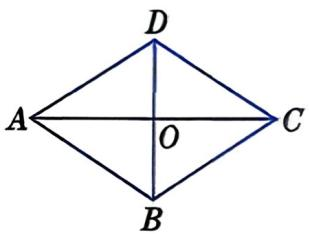

图21.6-5

**解**：∵ 四边形ABCD是菱形，
∴ AB=BC=CD=DA，BD平分∠ABC，AC⊥BD，AO=CO，BO=DO。
∵ AB+BC+CD+DA=16cm，
∴ AB=BC=CD=DA=¼×16=4(cm)。
∵ BD平分∠ABC，∠ABC=120°，
∴ ∠ABD=60°。
∴ △ABD是等边三角形。
∴ BD=AB=4cm。
在Rt△AOB中，OB=2cm，
$AO=\sqrt{AB^2-OB^2}=\sqrt{4^2-2^2}=\sqrt{12}=2\sqrt{3}$(cm)。
∴ AC=2AO=4√3cm。

---

## 练习

**练习1**：已知菱形的边长和一条对角线的长均为2cm，求这个菱形的面积。

**练习2**：菱形OABC在平面直角坐标系中的位置如图所示，∠AOC=45°，OC=√2，求点B的坐标。

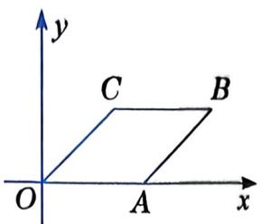

（第2题）

---

## 习题

### A组

**A组第1题**：如图，在菱形ABCD中，AC，BD为对角线，∠BAC=50°。求菱形ABCD各内角的度数。

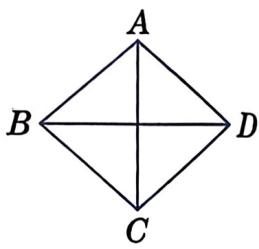

（第1题）

**A组第2题**：在菱形ABCD中，对角线AC=8，BD=6。求菱形ABCD的周长。

**A组第3题**：如图，菱形ABCD的边长为2cm，E为AB的中点，且DE⊥AB。求菱形ABCD的面积。

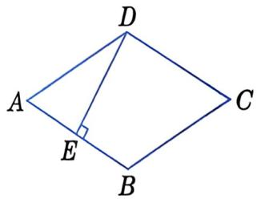

（第3题）

### B组

**B组第4题**：如图，菱形ABCD的对角线AC，BD相交于点O，且AC=6cm，BD=8cm，AE⊥BC，垂足为E。求AE的长。

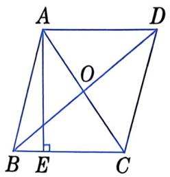

（第4题）

**B组第5题**：如图，菱形ABCD的对角线相交于点O，延长AB至点E，使BE=BC，连接EC。

(1) 求证：BD=EC。

(2) 求证：S菱形ABCD=S△AEC。

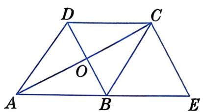

（第5题）

**B组第6题**：如图，四边形ABCD是菱形，A，B两点的坐标分别为(0,4)，(-3,0)，点D在y轴上。求点C，D的坐标。

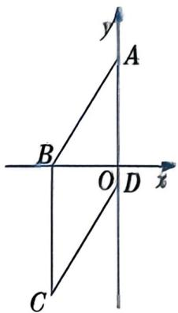

（第6题）

---

## 思考与拓展

我们已经知道，菱形的四条边都相等，两条对角线互相垂直。反过来，如果一个四边形的四条边都相等，那么能判定这个四边形是菱形吗？如果一个平行四边形的对角线互相垂直，那么能判定这个平行四边形是菱形吗？

---

**第1课时结束**
