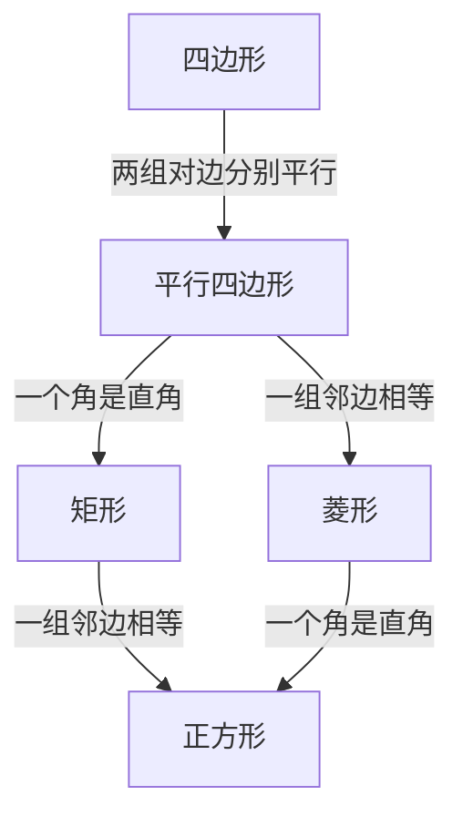

## 第1页：封面

# 21.7 正方形

### 第2课时 · 正方形的判定 · 两条路，一条心

第21章 四边形 | 冀教版八年级下册

---

**研究路径**：矩形与菱形的结合 → 两条判定路径

（与矩形、菱形判定类比）

## 第2页：学习目标

| 目标 | 内容 |
|:---|:---|
| ① | 能准确复述正方形的两条判定路径 |
| ② | 能独立完成正方形判定的简单证明 |
| ③ | 能根据已知条件选择合适的判定路径 |
| ④ | 能理解特殊四边形之间的关系框架 |

## 第3页：回顾 · 正方形的定义

正方形的定义：

| 定义方式 | 内容 |
|:---|:---|
| ① | 有一组邻边相等的矩形 |
| ② | 有一个角是直角的菱形 |

---

**逆向思考**：
- 给矩形加什么条件，能变成正方形？
- 给菱形加什么条件，能变成正方形？

## 第4页：一起探究 · 矩形→正方形

矩形ABCD，你能添加什么条件，使它成为正方形？

（先独立思考，再小组交流）

---

**你的猜想**：
- 条件1：______
- 条件2：______

（教材·一起探究）

## 第5页：证明 · 判定1：矩形→正方形

**已知**：矩形ABCD中，AB=BC

**求证**：四边形ABCD是正方形

---

**证明**（请动笔）：
1. ∵ 四边形ABCD是矩形
2. ∴ ∠A=∠B=∠C=∠D=90°（矩形的四个角都是直角）
3. 又∵ AB=BC
4. ∴ 矩形ABCD是正方形（有一组邻边相等的矩形是正方形）

---

**判定1**：**有一组邻边相等的矩形是正方形**

## 第6页：一起探究 · 菱形→正方形

菱形ABCD，你能添加什么条件，使它成为正方形？

（先独立思考，再小组交流）

---

**你的猜想**：
- 条件1：______
- 条件2：______

（教材·一起探究）

## 第7页：证明 · 判定2：菱形→正方形

**已知**：菱形ABCD中，∠A=90°

**求证**：四边形ABCD是正方形

---

**证明**（请动笔）：
1. ∵ 四边形ABCD是菱形
2. ∴ AB=BC=CD=DA（菱形的四条边相等）
3. 又∵ ∠A=90°
4. ∴ 菱形ABCD是正方形（有一个角是直角的菱形是正方形）

---

**判定2**：**有一个角是直角的菱形是正方形**

## 第8页：特殊四边形关系框架

---

**从任意四边形到正方形**：两条路，任选一条

## 第9页：练习 · 路径选择

| 已知四边形 | 选择路径 | 添加条件 |
|:---|:---|:---|
| 平行四边形 | 矩形→正方形 | ______ |
| 平行四边形 | 菱形→正方形 | ______ |
| 矩形 | 直接判定 | ______ |
| 菱形 | 直接判定 | ______ |

---

**（请独立填写 · 口答）**

（教材·练习第1题改编）

## 第10页：例题 · 矩形→正方形

**例3** 矩形ABCD中，BE平分∠ABC，CE平分∠DCB，BF∥CE，CF∥BE。

求证：四边形BECF是正方形。

---

**分析**：
- 第一步：四边形BECF是什么四边形？
- 第二步：添加什么条件变成正方形？

**（请动笔书写完整证明过程）**

（教材·例3）

## 第11页：例题 · 菱形→正方形

**例4** 菱形ABCD中，∠ABC=90°，M是AB中点，AD=2AB，BN∥CM，CN∥BM。

求证：四边形BNCM是正方形。

---

**分析**：
- 第一步：四边形BNCM是什么四边形？
- 第二步：添加什么条件变成正方形？

**（请动笔书写完整证明过程）**

（教材·例4）

## 第12页：做一做 · 四条边相等

正方形ABCD中，E、F、M、N分别在四条边上，且AE=BF=CM=DN。

求证：四边形EFMN是正方形。

---

**分析**：
- 已知：四条边相等的四边形？
- 路径：先证______，再证______。

**（请动笔书写完整证明过程）**

（教材·做一做）

## 第13页：选择标准 · 条件决定方法

| 已知条件 | 优先选用的判定路径 |
|:---|:---|
| 有矩形条件（直角） | **矩形→正方形**（加邻边相等） |
| 有菱形条件（四边相等） | **菱形→正方形**（加直角） |
| 有对角线条件 | 先看是矩形还是菱形，再加对应条件 |

---

**技巧**：拿到题目，先看它"像"矩形还是"像"菱形，再选路径。

## 第14页：课堂小结

今天学了什么？

---

| 方法 | 内容 | ⚠️ |
|:---|:---|:---:|
| **路径1** | 矩形 + 邻边相等 → 正方形 | 先证矩形 |
| **路径2** | 菱形 + 直角 → 正方形 | 先证菱形 |
| **关系框架** | 四边形→平行四边形→矩形/菱形→正方形 | 任选一条路 |

---

**闭眼默述两条判定路径**

## 第15页：课后作业

| 类型 | 内容 | 来源 |
|:---|:---|:---:|
| **必做** | 完善例3、例4的完整证明 | 教材例3、例4 |
| **选做** | 教材练习第1、2题 | 教材练习 |
| **挑战** | 教材A组第2题、B组第2题 | 教材A/B组 |
