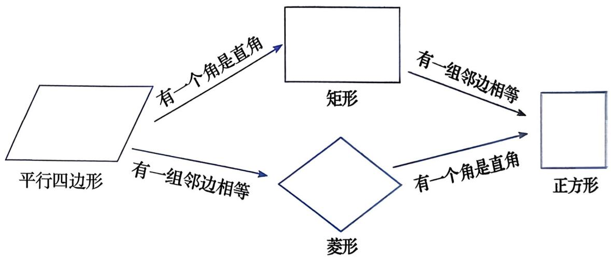
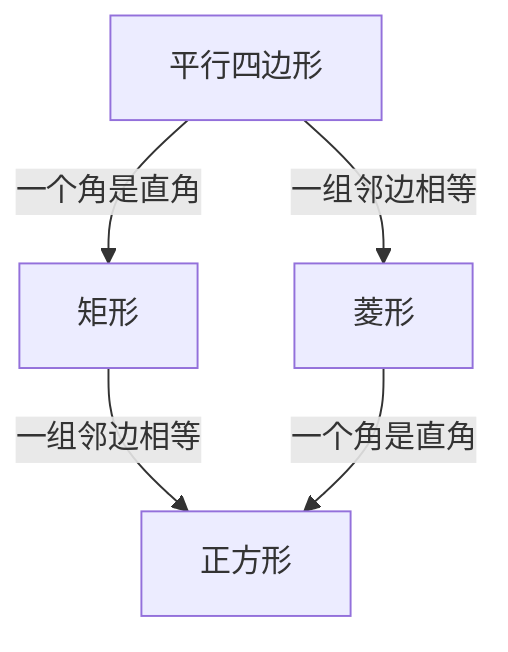
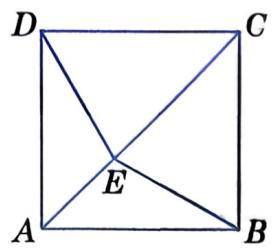
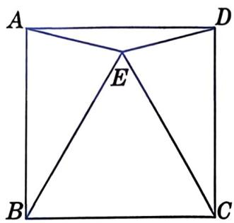
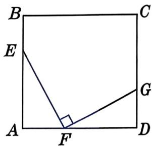
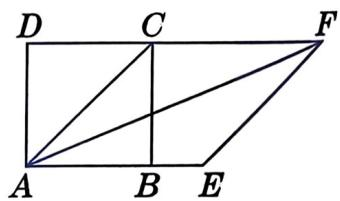

## 第1页：封面

# 21.7 正方形

### 第1课时 · 正方形的性质 · 集矩形与菱形于一身

第21章 四边形 | 冀教版八年级下册

---

**研究路径**：矩形加一组邻边 → 正方形；菱形加一个直角 → 正方形

（从已学的矩形和菱形出发，类比引出正方形）

## 第2页：学习目标

| 目标 | 内容 |
|:---|:---|
| ① | 能准确复述正方形的定义（一组邻边相等 + 一个角是直角的平行四边形） |
| ② | 能从边、角、对角线、对称性四个维度说出正方形的所有性质 |
| ③ | 能运用正方形性质与全等三角形完成线段相等的证明（例1） |
| ④ | 能综合运用正方形、等边三角形、等腰三角形的性质完成角度计算（例2） |

## 第3页：课前回顾 · 矩形和菱形

| 图形 | 定义 | 特殊性质 |
|:---|:---|:---|
| 平行四边形 | 两组对边分别平行的四边形 | 对边平行且相等；对角相等；对角线互相平分 |
| **矩形** | 有一个角是直角的平行四边形 | 四个角都是直角、对角线相等、2条对称轴 |
| **菱形** | 有一组邻边相等的平行四边形 | 四条边相等、对角线互相垂直、平分对角、2条对称轴 |

---

**想一想**：

矩形和菱形都是特殊的平行四边形，但它们"特殊"的方向不同——

- 矩形：让 **角** 变得特殊（直角）
- 菱形：让 **边** 变得特殊（邻边相等）

**如果既要角特殊、又要边特殊——把这个"加料"同时加上去，能得到什么图形？**

## 第4页：什么是正方形？

从两个方向出发：

| 方向 | 起点 | 添加条件 | 得到 |
|:---:|:---|:---|:---:|
| ① | 矩形（四个直角） | + **一组邻边相等** | 正方形 |
| ② | 菱形（四边相等） | + **一个角是直角** | 正方形 |

---

---

**正方形的定义**：

> **有一组邻边相等且有一个角是直角的平行四边形叫作正方形。**

两个条件**缺一不可**：
- ❌ 只有一组邻边相等（没有直角）：是菱形，不是正方形
- ❌ 只有一个角是直角（没有邻边相等）：是矩形，不是正方形
- ✅ 两个条件**同时满足**才是正方形

## 第5页：大家谈谈 · 正方形有什么性质？

**问题1**：正方形是中心对称图形吗？对称中心在哪里？是轴对称图形吗？有几条对称轴？

（先独立思考，再小组交流）

---

**问题2**：谈谈正方形与平行四边形、矩形和菱形的关系。

---

**问题3**：正方形有哪些性质？

（四人一组，从**边、角、对角线、对称性**四个维度整理，说清楚哪些来自矩形、哪些来自菱形）

## 第6页：正方形的性质清单

**正方形具有平行四边形、矩形和菱形的一切性质**：

| 维度 | 性质 | 继承自 |
|:---|:---|:---:|
| **边** | 四条边都相等 | 菱形 |
| | 对边平行 | 平行四边形 |
| **角** | 四个角都是直角（$90^{\circ}$） | 矩形 |
| **对角线** | 相等 | 矩形 |
| | 互相垂直 | 菱形 |
| | 互相平分 | 平行四边形 |
| | 平分每一组对角 | 菱形 |
| **对称性** | 中心对称图形（对称中心：对角线交点） | 平行四边形 |
| | 轴对称图形（**4条**对称轴：两条对角线 + 两组对边中点连线） | ★ 独有 |

---

**正方形 = 矩形的全部 + 菱形的全部**

## 第7页：四类图形的关系

---

**归纳**：正方形是特殊的矩形，也是特殊的菱形，更是特殊的平行四边形。

**它是唯一同时拥有"边相等、角相等、对角线相等且垂直"的四边形。**

## 第8页：例1 · 性质直接用

图21.7-1

---

**例1** 在正方形 $ABCD$ 中，点 $E$ 在对角线 $AC$ 上。求证：$BE = DE$。

---

**分析**：
- 要证 $BE = DE$ → 证 $\triangle AEB \cong \triangle AED$
- 三个条件：
  1. $AB = AD$（正方形四条边相等）
  2. $\angle BAC = \angle DAC$（正方形对角线平分对角）
  3. $AE = AE$（公共边）

**（请动笔书写完整证明过程，限时2分钟）**

## 第9页：例1 · 标准证明

**证明**：

$\because$ 四边形 $ABCD$ 是正方形，

$\therefore AB = AD$，$\angle BAC = \angle DAC$。

又 $\because AE = AE$，

$\therefore \triangle AEB \cong \triangle AED$（SAS）。

$\therefore BE = DE$。

---

**关键**：正方形对角线平分对角（$\angle BAC = \angle DAC = 45^{\circ}$）——这是从**菱形**继承来的性质。

**变式追问**：如果 $E$ 在 $AC$ 延长线上，$BE$ 还等于 $DE$ 吗？为什么？

## 第10页：例2 · 当正方形遇上等边三角形

图21.7-2

---

**例2** 在正方形 $ABCD$ 中，$\triangle BCE$ 是等边三角形。求证：$\angle EAD = \angle EDA = 15^{\circ}$。

---

**分步引导**：

| 步骤 | 问题 | 依据 |
|:---:|:---|:---|
| ① | $\triangle BCE$ 是等边三角形 → $BC = BE$，$\angle EBC = 60^{\circ}$ | 等边三角形性质 |
| ② | $ABCD$ 是正方形 → $AB = BC$，$\angle ABC = 90^{\circ}$ | 正方形性质 |
| ③ | $AB = BE$（由①+②等量代换），$\angle ABE = 90^{\circ} - 60^{\circ} = 30^{\circ}$ | 等量代换、角度差 |
| ④ | $\triangle ABE$ 中，$\angle BAE = \frac{1}{2}(180^{\circ} - 30^{\circ}) = 75^{\circ}$ | 等腰三角形底角公式 |
| ⑤ | $\angle EAD = 90^{\circ} - 75^{\circ} = 15^{\circ}$，同理 $\angle EDA = 15^{\circ}$ | 角度差、对称性 |

**（请跟随教师分步书写证明过程）**

## 第11页：例2 · 完整证明

**证明**：

$\because$ 四边形 $ABCD$ 是正方形，

$\therefore AB = BC$，$\angle ABC = \angle BAD = 90^{\circ}$。

$\because \triangle BCE$ 是等边三角形，

$\therefore BC = BE$，$\angle EBC = 60^{\circ}$。

$\therefore AB = BE$，$\angle ABE = 90^{\circ} - 60^{\circ} = 30^{\circ}$。

$\therefore \angle BAE = \angle BEA = \frac{1}{2} \times (180^{\circ} - 30^{\circ}) = 75^{\circ}$。

$\therefore \angle EAD = \angle BAD - \angle BAE = 90^{\circ} - 75^{\circ} = 15^{\circ}$。

同理 $\angle EDA = 15^{\circ}$。

$\therefore \angle EAD = \angle EDA = 15^{\circ}$。

---

**回顾推理链**：等边 $\xrightarrow{BC}$ 正方形 $\xrightarrow{AB=BE}$ 等腰 $\xrightarrow{30^{\circ}}$ 底角 $75^{\circ}$ $\xrightarrow{90^{\circ}-75^{\circ}}$ $15^{\circ}$

**追问**：证完 $\angle EAD = \angle EDA = 15^{\circ}$ 后，你还能求出哪些角？

## 第12页：做一做 · 开放探究

图21.7-3

---

**做一做** 点 $E$、$F$、$G$ 分别在正方形 $ABCD$ 的边 $AB$、$AD$ 和 $CD$ 上，且 $EF \perp FG$，$AF = DG$。求证：$EF = FG$。

---

**（先独立思考2分钟，再小组交流）**

**一线三垂直模型**：

A、F、D三点共线（F在AD上），产生三个直角：
- $\angle EAF = 90^{\circ}$（正方形角A）
- $\angle EFG = 90^{\circ}$（已知，$EF \perp FG$）
- $\angle FDG = 90^{\circ}$（正方形角D）

**证明思路**：

$\because$ A、F、D三点共线，

$\therefore \angle AFE + \angle EFG + \angle GFD = 180^{\circ}$（平角），

即 $\angle AFE + 90^{\circ} + \angle GFD = 180^{\circ}$，得 $\angle AFE = 90^{\circ} - \angle GFD$。

在 $\text{Rt}\triangle DGF$ 中，$\angle DGF = 90^{\circ} - \angle GFD$。

$\therefore \angle AFE = \angle DGF$。

在 $\triangle AEF$ 和 $\triangle DGF$ 中：

$\begin{cases}
\angle EAF = \angle FDG = 90^{\circ} \\
AF = DG \quad (\text{已知}) \\
\angle AFE = \angle DGF \quad (\text{已证})
\end{cases}$

$\therefore \triangle AEF \cong \triangle DGF$（ASA），$\therefore EF = FG$。

## 第13页：练习 · 当堂检测

**练习** 如图，正方形 $ABCD$ 的对角线 $AC$ 为菱形 $AEFC$ 的一边，求 $\angle FAB$ 的度数。

---

**（独立完成，限时3分钟）**

---

**提示**：
1. 正方形对角线 $AC$ 平分 $\angle BAD$ → $\angle DAC = 45^{\circ}$
2. 菱形 $AEFC$ 中，$AC$ 平分 $\angle EAF$
3. $\angle EAF = \angle DAC = 45^{\circ}$（内错角或同位角关系）

**评分标准**：
- 写出第一步得2分
- 正确写出 $\angle DAC = 45^{\circ}$ 得2分
- 正确得出 $\angle FAB = 22.5^{\circ}$ 得6分

## 第14页：课堂小结

### 三个问题串起全课

| 问题 | 答案要点 |
|:---|:---|
| **①正方形的定义是什么？两个条件缺一不可——哪两个？** | 一组邻边相等 + 一个角是直角的平行四边形 |
| **②正方形从平行四边形、矩形、菱形各继承了什么？** | 平行四边形：对边平行、对角线平分；矩形：四个直角、对角线相等；菱形：四边相等、对角线垂直、平分对角 |
| **③你能画一张图说清楚这四类图形的关系吗？** | 平行四边形→矩形（+直角）→正方形（+邻边相等）；平行四边形→菱形（+邻边相等）→正方形（+直角） |

---

**（请在笔记本上画出四类图形的关系图）**

## 第15页：课后作业

| 类型 | 内容 | 来源 |
|:---|:---|:---:|
| **必做** | 整理例1、例2的规范证明过程 | 教材 |
| **必做** | A组第1题（旋转对称中心）、A组第2题（$AE = CG$） | 教材 |
| **选做** | A组第3题（探究$DM$与$CN$的数量关系） | 教材 |
| **挑战** | B组第4题（$\angle AFC$的度数） | 教材 |