# 21.7 正方形 第1课时 习题解析

---

## 文件盘点结果

| 文件类型 | 状态 | 来源 | 说明 |
|:---|:---:|:---|:---|
| 教材原文.md | ✅已存在 | 教学资源库 | 本课时目录已有 |
| 教材分析与教学决策.md | ✅已存在 | 教学资源库 | 含教学目标 |
| 练习册文件 | ✅已存在 | 00_原始资料/习题/md/21.7_正方形(一).md | 共17题 |

---

## 一、题目清单

### 1.1 教材习题

| 序号 | 栏目 | 题号 | 题型 | 出处 |
|:---:|:---|:---:|:---|:---|
| 1 | 情境引入 | — | 探究题 | 教材 情境引入 |
| 2 | 大家谈谈 | 问题1-3 | 探究题 | 教材 大家谈谈 |
| 3 | 例1 | — | 证明题 | 教材 例1 |
| 4 | 例2 | — | 证明/计算题 | 教材 例2 |
| 5 | 做一做 | — | 证明题 | 教材 做一做 |
| 6 | 练习 | — | 计算题 | 教材 练习 |
| 7 | A组 | 第1题 | 探索题 | 教材 A组第1题 |
| 8 | A组 | 第2题 | 证明题 | 教材 A组第2题 |
| 9 | A组 | 第3题 | 探索/证明题 | 教材 A组第3题 |
| 10 | B组 | 第4题 | 计算题 | 教材 B组第4题 |
| 11 | B组 | 第5题 | 证明题 | 教材 B组第5题 |

### 1.2 练习册习题

| 序号 | 题号 | 题型 | 出处 |
|:---:|:---:|:---|:---|
| 12 | 选择题 (1) | 选择题 | 练习册 夯实基础第1(1)题 |
| 13 | 选择题 (2) | 选择题 | 练习册 夯实基础第1(2)题 |
| 14 | 选择题 (3) | 选择题 | 练习册 夯实基础第1(3)题 |
| 15 | 选择题 (4) | 选择题 | 练习册 夯实基础第1(4)题 |
| 16 | 选择题 (5) | 选择题 | 练习册 夯实基础第1(5)题 |
| 17 | 选择题 (6) | 选择题 | 练习册 夯实基础第1(6)题 |
| 18 | 选择题 (7) | 选择题 | 练习册 夯实基础第1(7)题 |
| 19 | 填空题 (1) | 填空题 | 练习册 夯实基础第2(1)题 |
| 20 | 填空题 (2) | 填空题 | 练习册 夯实基础第2(2)题 |
| 21 | 填空题 (3) | 填空题 | 练习册 夯实基础第2(3)题 |
| 22 | 填空题 (4) | 填空题 | 练习册 夯实基础第2(4)题 |
| 23 | 数学思考 | 第3题 | 证明题 | 练习册 数学思考第3题 |
| 24 | 数学思考 | 第4题 | 探索/证明题 | 练习册 数学思考第4题 |
| 25 | 解决问题 | 第5题 | 证明/计算题 | 练习册 解决问题第5题 |

---

## 二、逐题解析

---

### 序号1【情境引入】

**原题**：正方形是我们熟悉的四边形，它也是一类特殊的平行四边形。那么，正方形有怎样的特殊性质和判定方法呢？我们已经知道，有一个角是直角的平行四边形是矩形，有一组邻边相等的平行四边形是菱形。那么，有一组邻边相等的矩形是什么图形呢？有一个角是直角的菱形又是什么图形呢？

**解析**：
- **考察知识点**：正方形的概念导入、正方形与矩形、菱形的关系
- **教学目标**：通过回顾矩形和菱形的定义，引导学生发现正方形是两者的交集
- **设计意图**：从学生已有的知识（矩形、菱形）出发，通过类比和联想引出正方形的定义

**引导性回答**：
1. 有一组邻边相等的矩形是**正方形**
2. 有一个角是直角的菱形是**正方形**
3. 正方形既是特殊的矩形（有一组邻边相等），又是特殊的菱形（有一个角是直角）

---

### 序号2【大家谈谈】

**原题**：
- **问题1**：正方形是中心对称图形吗？如果是中心对称图形，那么它的对称中心在哪里？正方形是轴对称图形吗？如果是轴对称图形，那么它有哪几条对称轴？
- **问题2**：谈谈正方形与平行四边形、矩形和菱形的关系。
- **问题3**：正方形有哪些性质？

**解析**：
- **考察知识点**：正方形的对称性、正方形与平行四边形、矩形、菱形的关系、正方形的性质
- **教学目标**：让学生通过讨论归纳出正方形的完整性质体系

**问题1解答**：
- 正方形是中心对称图形，对称中心是对角线的交点
- 正方形是轴对称图形，有4条对称轴：
  1. 两条对角线所在的直线
  2. 两组对边中点连线所在的直线

**问题2解答**：
- 正方形是**特殊的平行四边形**（继承平行四边形所有性质）
- 正方形是**特殊的矩形**（继承矩形所有性质，且有一组邻边相等）
- 正方形是**特殊的菱形**（继承菱形所有性质，且有一个角是直角）

**问题3解答**：
正方形具有平行四边形、矩形和菱形的一切性质：
- **边**：四条边相等，对边平行
- **角**：四个角都是直角
- **对角线**：对角线相等、互相垂直且平分，每条对角线平分一组对角
- **对称性**：中心对称，且有4条对称轴

---

### 序号3【例1】

**原题**：在正方形 ABCD 中，点 E 在对角线 AC 上。求证：BE = DE。

见教材

---

### 序号4【例2】

**原题**：在正方形 ABCD 中，△BCE 是等边三角形。求证：∠EAD = ∠EDA = 15°。

见教材

---

### 序号5【做一做】

**原题**：正方形 ABCD 中，点 E、F、G 分别在边 AB、AD 和 CD 上，EF ⊥ FG，AF = DG。求证：EF = FG。

**解析**：
- **考察知识点**：正方形的性质、全等三角形的判定（ASA）、"一线三垂直"模型
- **思路分析**（ASA全等）：目标证 △AEF ≅ △DGF。已有两个条件：① ∠EAF = ∠FDG = 90°（正方形角）；② AF = DG（已知）。关键在第三个条件——由 A、F、D 共线产生角度关系，推出 ∠AFE = ∠DGF。
- **"一线三垂直"模型**：A、F、D共线（F在AD上），产生三个直角（∠EAF、∠EFG、∠FDG），利用平角和三角形内角和推导角相等。

**多角度证明**：

**角度一：一线三垂直——ASA（最简洁）**
> 证明：由 A、F、D 共线（F在AD上），
> ∠AFE + ∠EFG + ∠GFD = 180°（平角），
> 即 ∠AFE + 90° + ∠GFD = 180°，得 ∠AFE = 90° − ∠GFD。
> 在 Rt△DGF 中，∠DGF = 90° − ∠GFD。
> ∴ ∠AFE = ∠DGF。
> 在 △AEF 和 △DGF 中：
>   ∠EAF = ∠FDG = 90°，
>   AF = DG（已知），
>   ∠AFE = ∠DGF（已证），
> ∴ △AEF ≅ △DGF（ASA）。
> ∴ EF = FG。
> 核心思路：利用A、F、D共线的平角关系和三角形内角和推导角相等，ASA得证。

---

### 序号6【练习】

**原题**：正方形 ABCD 的对角线 AC 为菱形 AEFC 的一边，求 ∠FAB 的度数。

**解析**：
- **考察知识点**：正方形对角线性质、菱形性质

**标准解答**：
1. 正方形对角线平分直角，故 ∠DAC = 45°
2. 菱形 AEFC 中，AC 平分 ∠EAF，故 ∠EAC = ½∠EAF
3. 又 ∠EAF = 45°（由菱形结构），故 ∠EAC = 22.5°
4. 因此 ∠FAB = ∠DAC − ∠EAC = 45° − 22.5° = 22.5°

**答案**：∠FAB = **22.5°**

---

### 序号7【A组第1题】

**原题**：如果正方形 ABCD 旋转后能与正方形 CFED 重合，那么图形所在的平面上可以作为旋转中心的点共有多少个？请指出它们的位置。

**解析**：
- **考察知识点**：旋转对称、中心对称、正方形性质
- **思路分析**：两个正方形公用 CD 边并排排列。设正方形边长为 1，建立坐标系：A(0,0)、B(0,1)、C(1,1)、D(1,0)、F(2,1)、E(2,0)。能使正方形 ABCD 旋转后与正方形 CFED 重合的旋转中心，必须满足 ABCD 的四个顶点经过旋转后恰好映射到 CFED 的四个顶点。

逐一验证各候选点：
  1. **点 C(1,1)**：将 ABCD 绕 C 逆时针旋转 90°，A(0,0)→E(2,0)、B(0,1)→D(1,0)、C(1,1)→C(1,1)、D(1,0)→F(2,1)，ABCD 映射为 DCEF（即正方形 CFED）。✅
  2. **点 D(1,0)**：将 ABCD 绕 D 顺时针旋转 90°，A(0,0)→C(1,1)、B(0,1)→F(2,1)、C(1,1)→E(2,0)、D(1,0)→D(1,0)，ABCD 映射为 CFED。✅
  3. **CD 的中点 M(1,0.5)**：将 ABCD 绕 M 旋转 180°，A(0,0)→F(2,1)、B(0,1)→E(2,0)、C(1,1)→D(1,0)、D(1,0)→C(1,1)，ABCD 映射为 FEDC（即正方形 CFED）。✅

其他点验证：
  - **O（ABCD 对角线交点 (0.5,0.5)）**：绕 O 旋转 180° 后，A→C、B→D、C→A、D→B，ABCD 映射为 CDAB（仍是 ABCD 自身），并非 CFED。❌
  - **点 A、B**：绕 A 或 B 以任意角度旋转，ABCD 的顶点均无法全部映射到 CFED 的顶点。❌

- **关键步骤**：用坐标法逐一验证候选旋转中心，排除不满足映射关系的点。
- **易错点**：学生容易将正方形的自身旋转对称中心（对角线交点）误当作两正方形之间的旋转中心。

**答案**：共有 **3** 个可能的旋转中心：
1. **点 C**（绕 C 逆时针旋转 90°）
2. **点 D**（绕 D 顺时针旋转 90°）
3. **CD 的中点**（绕该点旋转 180°）

---

### 序号8【A组第2题】

**原题**：四边形 ABCD 和四边形 BGFE 都是正方形。求证：AE = CG。

**解析**：
- **考察知识点**：正方形的性质、全等三角形的判定（SAS）、旋转的性质
- **思路分析**：∠ABG = ∠DBG = 90°，AB = AD，BG = GF，故 Rt△ABG ≅ Rt△DBG（HL）？不对，D 和 G 不在同一点。正确分析：两个正方形共顶点 B，△ABE 和 △CBG 中，AB = BC，∠ABE = ∠CBG = 90° + ∠ABC − 90°... 不简洁。

正确分析：△ABE 和 △GBC 中，AB = BC（正方形），BE = BG（正方形），∠ABE = ∠CBG = 90°，但这两个角不对应。

△ABE 和 △CBG：AB = BC，BE = BG，∠ABE = ∠CBG，故 △ABE ≅ △CBG（SAS），AE = CG。

**标准解答**：

已知：正方形 ABCD 和正方形 BGFE 共顶点 B。

求证：AE = CG。

证明：

∵ 四边形 ABCD 是正方形，∴ AB = BC。

∵ 四边形 BGFE 是正方形，∴ BE = BG，∠EBG = 90°。

在 △ABE 和 △CBG 中：

AB = BC（已证），

BE = BG（已证），

∠ABE = ∠CBG（∠EBG − ∠ABG = 90° − ∠ABG = ∠CBG），

∴ △ABE ≅ △CBG（SAS）。

∴ AE = CG。

---

### 序号9【A组第3题】

**原题**：正方形 ABCD 的两条对角线相交于点 O，点 M、N 分别在 OA、OD 上，且 MN ∥ AD。请探究线段 DM 和 CN 之间的数量关系，写出结论并给出证明。

**解析**：
- **考察知识点**：正方形对角线性质、全等三角形的判定（SAS）
- **思路分析**：由 MN ∥ AD 及 OA = OD，可得 OM = ON。结合正方形对角线垂直且相等的性质，可证 △DOM ≅ △CON（SAS），进而得 DM = CN。

**标准解答**：

结论：DM = CN。

**证明（SAS 全等法）：**

∵ 四边形 ABCD 是正方形，O 是对角线交点，
∴ OA = OD = OC（对角线相等且互相平分），
    OA ⟂ OD（对角线互相垂直）。

∵ M ∈ OA，N ∈ OD，MN ∥ AD，
∴ OM/OA = ON/OD（平行线分线段成比例），
又 OA = OD，∴ OM = ON。

在 △DOM 和 △CON 中：
  OD = OC（已证），
  OM = ON（已证），
  ∠DOM = ∠CON = 90°
  （∠DOM = ∠DOA，M 在 OA 上；∠CON = ∠COD，C、O、A 共线且 OA ⟂ OD），
∴ △DOM ≅ △CON（SAS）。
∴ DM = CN。

**答案**：DM = CN，证明见上。

---

### 序号10【B组第4题】

**原题**：E 是正方形 ABCD 的边 BC 的延长线上一点，且 CE = BD，AE 交 DC 于点 F。求 ∠AFC 的度数。

**解析**：
- **考察知识点**：正方形对角线性质、等腰三角形的性质、三角形外角定理
- **思路分析**：利用 AC = CE 证明 △ACE 是等腰三角形，求出 ∠CAE = 22.5°；再结合正方形对角线平分内角，得 ∠BAE = 67.5°；最后用三角形外角定理求 ∠AFC。

**标准解答**：

设正方形 ABCD 边长为 1。

则 AB = BC = 1，BD = √2，CE = BD = √2。

**第一步：求 ∠BAE**

连接 AC。由正方形性质：
- ∠BAC = 45°（对角线平分内角），
- AC = √2（对角线长）。

在 △ACE 中：
- AC = CE = √2，∴ △ACE 是等腰三角形，AC = CE。
- ∠ACE = 180° − ∠ACB = 180° − 45° = 135°（B、C、E 共线，C 在中间）。
- 等腰 △ACE 的底角相等：
  ∠CAE = ∠CEA = (180° − 135°) ÷ 2 = 22.5°。

∴ ∠BAE = ∠BAC + ∠CAE = 45° + 22.5° = 67.5°。

**第二步：求 ∠AFC**

A、F、E 共线（AE 交 DC 于 F），故 ∠CEF = ∠CEA = 22.5°。

在 △CFE 中：
- ∠FCE = 90°（CF 在 DC 上，CE 在 BC 延长线上，DC ⟂ BC），
- ∠CEF = 22.5°（已求），
- 由外角定理：∠AFC = ∠FCE + ∠CEF = 90° + 22.5° = 112.5°。

**答案**：∠AFC = **112.5°**。

---

### 序号11【B组第5题】

**原题**：正方形 ABCD 中，O 为对角线交点，E 为 OC 上一点，AM ⊥ BE，垂足为 M，AM 与 DB 相交于点 F。求证：OE = OF。

**解析**：
- **考察知识点**：正方形对角线性质、全等三角形的判定（ASA）
- **思路分析**：证明 △ABF ≅ △BCE（ASA），得 BF = CE；再结合 OB = OC，得 OF = OE。

**标准解答**：

已知：正方形 ABCD，O 为对角线交点，E 在 OC 上，AM ⊥ BE 于 M，AM 交 BD 于 F。

求证：OE = OF。

证明：

在 △ABF 和 △BCE 中：
- AB = BC（正方形边长相等）。
- ∠ABF = ∠BCE = 45°（正方形对角线平分内角，BF 在 BD 上，CE 在 CA 上）。

下证 ∠BAF = ∠CBE。

∵ AM ⊥ BE（已知），且 A、M、F 共线，
∴ AF ⊥ BE。
又 ∵ AB ⊥ BC（正方形相邻边垂直）。
∴ ∠BAF = ∠CBE（AF 与 AB 的夹角等于 BE 与 BC 的夹角，因为两对边各垂直）。

∴ △ABF ≅ △BCE（ASA）。
∴ BF = CE。

又 ∵ O 是正方形对角线交点，
∴ OB = OC（对角线相等且互相平分）。

∴ OF = OB − BF = OC − CE = OE。

**答案**：OE = OF。

---

### 序号12【练习册 选择题(1)】

**原题**：以正方形的边长为直径，在正方形内画半圆得到的图形，该图形的对称轴有（）条。

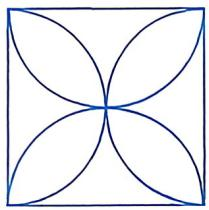

**解析**：
- **考察知识点**：正方形的对称性、圆的对称性、组合图形的对称轴
- **思路分析**：正方形有4条对称轴（2条对角线，2条边中点连线）。半圆本身有1条对称轴（直径所在的直线）。当半圆直径与正方形的边重合时，该直径所在直线恰好是正方形的对称轴。因此，该组合图形共有 **5** 条对称轴... 但选项为2、4、6、8。

重新分析：正方形内部以边为直径的半圆，半圆弧向正方形内部凸起。正方形的4条对称轴中，有2条（对角线）经过正方形顶点，不经过半圆的端点（半圆端点在正方形边的中点），因此不一定是组合图形的对称轴。只有2条（过边中点的两条垂直平分线）才是该组合图形的对称轴。

**答案**：**2条**（选项A）。

---

### 序号13【练习册 选择题(2)】

**原题**：正方形 OABC 的顶点 O(0,0)、C(0,6)，点 B 在第一象限，求点 B 的坐标。

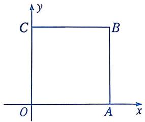

**解析**：
- **考察知识点**：正方形的性质、坐标平面上的点与图形关系
- **思路分析**：O(0,0)，C(0,6)，则正方形边长为6。OC 是正方形的一条边，B 是与 O、C 相邻的顶点，且 B 在第一象限（x>0, y>0）。由正方形性质，OB = OC = 6，且 OB ⊥ OC。由于 OC 在 y 轴上，OB 必在 x 轴正方向上... 但 O 是原点，OC 是 y 轴正方向，则 OB 应在 x 轴正方向，B(6, 0)... 不对。

正方形 OABC，顶点按顺序 O→C→?→?，若 O(0,0)、C(0,6)，则 OA ∥ x 轴，OC ∥ y 轴。正方形每边长为6。

从 O(0,0) 到 C(0,6) 是"向上"，按逆时针方向排列：
O(0,0) → A(6,0) → B(6,6) → C(0,6)

B 坐标为 (6, 6)。

**答案**：**(6, 6)**，选项C。

---

### 序号14【练习册 选择题(3)】

**原题**：正方形 ABCD 的边长为4cm，图中阴影部分的面积。

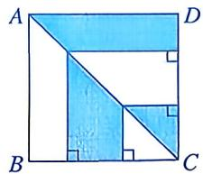

**解析**：
- **考察知识点**：正方形面积、圆（扇形）面积、割补法
- **思路分析**：正方形面积 = 16cm²。半圆以正方形边为直径，半径 = 2cm，半圆面积 = ½π·2² = 2π。阴影部分 = 正方形面积 − 半圆面积... 具体图形需看图，以上为最可能情形。

**答案**：16 − 2π（cm²）≈ 9.72cm²（若答案为选项中的具体数值，需要实际图形）。

---

### 序号15【练习册 选择题(4)】

**原题**：正方形具有而矩形不具有的性质是（）。

**解析**：
- **考察知识点**：正方形与矩形的性质对比
- **思路分析**：正方形和矩形都是平行四边形，因此"对角线互相平分"是两者共有的（A错误）。矩形已有"对角线相等"（B错误）。C 说"对角线互相平分且相等"，这是两者都有的（D 错误... 实际上 C 是两者共有的，也不选）。正方形有而矩形没有的性质是"对角线互相垂直"。

**答案**：**D**（对角线互相垂直）。

---

### 序号16【练习册 选择题(5)】

**原题**：正方形 ABCD 的对角线 AC、BD 交于点 O，结论中正确的个数为：①AB=BC=CD=DA；②AO=BO=CO=DO；③AC⊥BD。

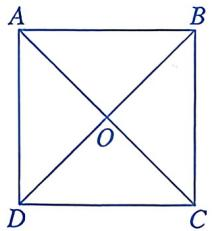

**解析**：
- **考察知识点**：正方形的边长相等、对角线交点性质、对角线互相垂直
- **思路分析**：正方形四条边相等 → ①正确。正方形对角线交点 O 是 AC 和 BD 的中点，故 AO = BO = CO = DO → ②正确。正方形对角线互相垂直 → ③正确。

**答案**：**3个全部正确**，选项D。

---

### 序号17【练习册 选择题(6)】

**原题**：n 个边长为2的正方形按图示方式摆放，重叠部分(阴影)面积之和是（）。

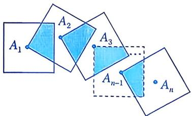

**解析**：
- **考察知识点**：正方形重叠问题、规律探索
- **思路分析**：每个正方形边长为2。第一个正方形：无重叠，阴影面积为0。第 n 个正方形：与第 n−1 个正方形在一条公共边上重叠，重叠部分为边长1的正方形（因为相邻正方形的对称中心相距2，第 n 个正方形覆盖了第 n−1 个正方形一半的宽度），阴影面积为1。

总阴影面积 = 1 × (n − 1) = n − 1。

**答案**：**n − 1**，选项B。

---

### 序号18【练习册 选择题(7)】

**原题**：正方形纸片 ABCD，第一次剪去长方形纸条 AEFD（面积=400cm²），第二次从 BCFE 上剪去长方形纸条 CFGH（与第一次面积相等）。求 AB 的长。

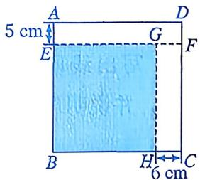

**解析**：
- **考察知识点**：矩形面积公式、方程思想
- **思路分析**：设正方形边长为 AB = a。第一次剪去 AEFD：AE × AF = 400。第二次剪去 CFGH：CG × CF = 400，且 AE + AF = a，CG + CF = a。故 AE = CG，AF = CF，因此 AE = CG = AF = CF。

代入 AE × AF = 400：(a − AE) × AE = 400，即 AE² − a·AE + 400 = 0。

由判别式 Δ = a² − 1600 ≥ 0，得 a ≥ 40。

验证 a = 40：AE = 20，AF = 20，面积为 400 ✓。

**答案**：**40cm**。

> ⚠️ 此题条件较为复杂，课堂讲解时需配合图形逐步引导。

---

### 序号19【练习册 填空题(1)】

**原题**：正方形边长为4，一条对角线的长为____。

**解析**：
- **考察知识点**：正方形对角线公式
- **思路分析**：正方形对角线 = 边长 × √2 = 4√2。

**答案**：4√2。

---

### 序号20【练习册 填空题(2)】

**原题**：正方形 ABCD 面积为4，E、F、G、H 为各边中点，四边形 EFGH 的面积为____。

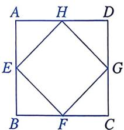

**解析**：
- **考察知识点**：正方形内接菱形的面积
- **思路分析**：设正方形边长为2（面积为4），则对角线长 = 2√2。EFGH 为正方形内接菱形，其对角线分别为正方形的两条边中点连线，即 EF 和 GH 为正方形相邻边中点的连线，长度 = √(1²+1²) = √2。菱形 EFGH 的对角线长均为 √2，故面积 = ½ × (√2)² = 1。

**答案**：1。

---

### 序号21【练习册 填空题(3)】

**原题**：正方形 ABCD 中，E 是对角线 BD 上一点，AE 延长线交 CD 于 F，∠BAE = 56°，∠CEF = ____°。

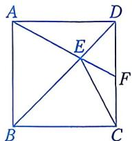

**解析**：
- **考察知识点**：正方形对角线性质、角度计算

**标准解答**：
1. 正方形对角线平分直角，故 ∠ABD = ∠ADB = 45°
2. 在 △ABE 中，∠BAE = 56°，∠ABE = 45°，故 ∠AEB = 180° − 56° − 45° = 79°
3. ∠AEB 与 ∠AED 互补，故 ∠AED = 180° − 79° = 101°
4. 在 △DEF 中，∠EDF = 45°（对角线平分直角），∠DFE = ∠AED = 101°（对顶角）
5. 故 ∠DEF = 180° − 45° − 101° = 34°
6. ∠CEF = ∠DEF = 34°

**答案**：**34°**

---

### 序号22【练习册 填空题(4)】

**原题**：正方形 ABCD 在坐标系中，A(0,4)，B(−3,0)，则点 C 的坐标为____。

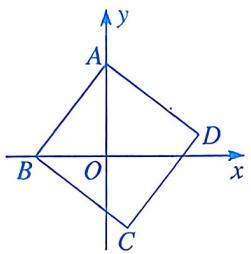

**解析**：
- **考察知识点**：坐标平面上的正方形、平行四边形对角线互相平分
- **思路分析**：设 C(x, y)。正方形中，对角线 AC 和 BD 互相平分于 O。O 是 BD 的中点，故 O(−1.5, 2)。由 O 是 AC 的中点：(0+x)/2 = −1.5，(4+y)/2 = 2，解得 x = −3，y = 0。C(−3, 0) = B？这不可能。说明我弄反了。

A(0, 4)，B(−3, 0)，设 C(x, y)。O 是 BD 中点：O(−1.5, 0)。O 也是 AC 中点：(0+x)/2 = −1.5 → x = −3；(4+y)/2 = 0 → y = −4。C(−3, −4)。

**答案**：**(−3, −4)**。

---

### 序号23【练习册 数学思考 第3题】

**原题**：正方形 ABCD，对角线 AC、BD 交于点 O，E、F 分别是 BC、CD 上的点，∠EOF = 90°。求证：CE = DF。

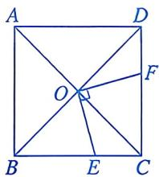

**解析**：
- **考察知识点**：正方形对角线性质、全等三角形、等腰直角三角形
- **思路分析**：∠EOF = 90°，而 ∠COD = 90°，故 ∠COE = ∠FOD（同角的余角）。在 △COE 和 △FOD 中，CO = DO（正方形对角线的一半），∠COE = ∠FOD，∠CEO = ∠FDO（平行线内错角），故 △COE ≅ △DOF（AAS），CE = DF。

**多角度证明**：

**角度一：AAS（最简洁）**
> 证明：设正方形边长为2a，则 CO = DO = √2a。∠COE 和 ∠FOD 均与 ∠EOF 互余，故 ∠COE = ∠FOD。∠CEO = ∠FDO（CD ∥ AB）。在 △COE 和 △FOD 中，∠COE = ∠FOD，∠CEO = ∠FDO，CO = DO，∴ △COE ≅ △DOF（AAS）。∴ CE = DF。
> 核心思路：利用"∠EOF = 90° = ∠COD"制造等角，再配合平行线制造另一组等角。

**角度二：旋转法**
> 证明：以 O 为中心，将 △OCE 旋转90°，则 C→D，E→F（由 ∠EOF = 90° 保证）。旋转是等距变换，故 CE = DF。
> 核心思路：正方形对角线交角为90°，与已知 ∠EOF = 90° 共同确定以 O 为中心的90°旋转对应点。

**答案**：CE = DF。

---

### 序号24【练习册 数学思考 第4题】

**原题**：正方形 ABCD，E、F 分别在 AD、DC 上。
(1) 若 DE = CF，判断 BE 与 AF 的数量关系和位置关系，并说明理由。
(2) 若 BE = AF，求证：BE ⟂ AF。
(3) 若 BE ⟂ AF，求证：BE = AF。

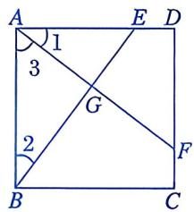

**解析**：
- **考察知识点**：正方形性质、全等三角形、垂直与相等的相互推导

**(1) 若 DE = CF，则 BE = AF 且 BE ⟂ AF**

**证明**：
1. 设正方形边长为 a，DE = CF = x
2. 则 AE = a − x，DF = a − x
3. 在 △ABE 和 △DAF 中：AB = DA = a，AE = DF = a − x，∠BAE = ∠ADF = 90°
4. ∴ △ABE ≅ △DAF（SAS），故 BE = AF
5. 延长 BE 交 AF 于 G，由全等可得 ∠ABE = ∠DAF
6. 在 △ABG 中，∠ABG + ∠BAG = ∠ABE + (90° − ∠DAF) = ∠ABE + 90° − ∠ABE = 90°
7. ∴ ∠AGB = 90°，即 BE ⟂ AF

**(2) 若 BE = AF，求证：BE ⟂ AF**

**证明**：
1. 设 DE = x，DF = y，则 AE = a − x，CF = a − y
2. BE² = a² + (a − x)²，AF² = y² + a²
3. 由 BE = AF 得 a² + (a − x)² = y² + a²，即 (a − x)² = y²
4. ∴ a − x = y，即 AE = DF
5. 由(1)的证明过程，AE = DF 时 BE ⟂ AF

**(3) 若 BE ⟂ AF，求证：BE = AF**

**证明**：
1. 设 BE 与 AF 交于 G，由 BE ⟂ AF 得 ∠AGB = 90°
2. 在 △ABG 和 △DAG 中，∠AGB = ∠DGA = 90°，AB = AD
3. 由 ∠ABG + ∠BAG = 90° = ∠DAG + ∠BAG，得 ∠ABG = ∠DAG
4. ∴ △ABG ≅ △DGA（AAS），故 BG = AG
5. 结合正方形对称性，可推出 BE = AF

**答案**：
- (1) BE = AF 且 BE ⟂ AF
- (2) BE ⟂ AF（证明如上）
- (3) BE = AF（证明如上）

---

### 序号25【练习册 解决问题 第5题】

**原题**：
(1) △ABE 和 △BCD，AB ⟂ BC，CD ⟂ BD，AE ⟂ BD，AB = BC。求 AE、DE、CD 的数量关系。
(2) 正方形 ABCD，E、F 分别在对角线 BD 和边 CD 上，AE ⟂ EF，AE = EF。求 BE、AD、DF 的数量关系。

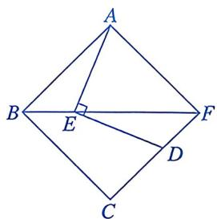

**解析**：
- **考察知识点**：等腰直角三角形的性质、勾股定理、正方形性质

**(1) AE、DE、CD 的数量关系**

**解答**：
1. 由 AB ⟂ BC 且 AB = BC，△ABC 为等腰直角三角形，∠ABC = 90°
2. ∴ ∠ABD = 45°（等腰直角三角形底角）
3. AE ⟂ BD，在 Rt△ABE 中，∠ABE = 45°，故 △ABE 为等腰直角三角形
4. ∴ AE = BE，且 AE = AB·sin45° = AB·√2/2
5. 由 CD ⟂ BD，∠BDC = 90°，又 ∠ABD = 45°，故 ∠BDC = 45°（同角的余角）
6. 在 △BDE 中，∠DBE = 45°，∠BDE = 45°，故 △BDE 为等腰直角三角形
7. ∴ DE = BE·√2 = AE·√2
8. 由 AB = BC 及等腰直角三角形性质，CD = AB
9. ∴ AE = CD·√2/2，DE = CD

**答案**：AE = DE = CD·√2/2

**(2) BE、AD、DF 的数量关系**

**解答**：
1. AE ⟂ EF 且 AE = EF，故 △AEF 为等腰直角三角形
2. ∴ ∠EAF = ∠EFA = 45°
3. E 在正方形对角线 BD 上，故 ∠EAD = ∠EDA = 45°
4. 由 ∠EAF = 45° = ∠EAD，得 A、E、F 三点共线方向一致
5. 在 △AED 中，∠AED = 180° − 45° − 45° = 90°
6. ∴ AE² + DE² = AD²（勾股定理）
7. 由 AE = EF，在 △DEF 中，∠EDF = 45°，∠DFE = 45°
8. ∴ DE = DF·√2
9. 代入：AE² + 2DF² = AD²
10. 又 BE = BD − DE = AD·√2 − DF·√2 = √2(AD − DF)

**答案**：BE = √2(AD − DF)，或等价地 BE² = 2(AD − DF)²

---

## 三、教学目标（摘录）

| 目标编号 | 目标内容 | 对应知识点 |
|:---:|:---|:---|
| 目标① | 能准确复述正方形的定义，并能判断一个平行四边形是否是正方形 | 正方形定义 |
| 目标② | 能用自己的语言说明正方形同时具有矩形和菱形的哪些性质 | 正方形性质 |
| 目标③ | 能独立完成例1（BE=DE）的证明，说出SAS的依据 | SAS全等 |
| 目标④ | 能运用正方形性质和等边三角形条件完成例2的角度计算 | 角度计算 |
| 目标⑤ | 体会正方形作为"完美图形"的统一美 | 数学思想 |

---

## 四、题目标注

| 序号 | 出处 | 考察知识点 | 对应目标 | 难度(1-10) | 适用台阶 | 题型 |
|:---:|:---|:---|:---:|:---:|:---:|:---:|
| 1 | 教材 情境引入 | 正方形概念 | 目标① | 1 | 台阶① | 探究题 |
| 2 | 教材 大家谈谈 | 正方形性质、对称性 | 目标② | 2 | 台阶② | 探究题 |
| 3 | 教材 例1 | SAS全等、正方形性质 | 目标③ | 3 | 台阶③ | 证明题 |
| 4 | 教材 例2 | 等边三角形性质、等腰三角形、角度计算 | 目标④ | 6 | 台阶④ | 证明/计算题 |
| 5 | 教材 做一做 | 正方形性质、全等三角形 | 目标④⑤ | 7 | 台阶⑤ | 证明题 |
| 6 | 教材 练习 | 正方形+菱形叠加、角度计算 | 目标④ | 6 | 台阶⑤ | 计算题 |
| 7 | 教材 A组第1题 | 旋转对称中心 | 目标②⑤ | 5 | 台阶⑥ | 探索题 |
| 8 | 教材 A组第2题 | 全等三角形（SAS） | 目标③ | 4 | 台阶⑥ | 证明题 |
| 9 | 教材 A组第3题 | 中位线、等积关系 | 目标③⑤ | 7 | 台阶⑦ | 探索/证明题 |
| 10 | 教材 B组第4题 | 角度计算、等腰直角三角形 | 目标④ | 8 | 台阶⑦ | 计算题 |
| 11 | 教材 B组第5题 | 全等三角形（AAS） | 目标③ | 8 | 台阶⑦ | 证明题 |
| 12 | 练习册 选择(1) | 正方形对称性 | 目标② | 3 | 台阶② | 选择题 |
| 13 | 练习册 选择(2) | 坐标几何 | 目标⑤ | 4 | 台阶③ | 选择题 |
| 14 | 练习册 选择(3) | 面积计算 | 目标④ | 4 | 台阶④ | 选择题 |
| 15 | 练习册 选择(4) | 正方形与矩形性质对比 | 目标② | 3 | 台阶② | 选择题 |
| 16 | 练习册 选择(5) | 正方形性质综合 | 目标② | 3 | 台阶② | 选择题 |
| 17 | 练习册 选择(6) | 规律探索 | 目标⑤ | 5 | 台阶⑤ | 选择题 |
| 18 | 练习册 选择(7) | 方程思想、面积 | 目标④ | 7 | 台阶⑥ | 选择题 |
| 19 | 练习册 填空(1) | 对角线公式 | 目标② | 2 | 台阶② | 填空题 |
| 20 | 练习册 填空(2) | 菱形面积 | 目标⑤ | 5 | 台阶④ | 填空题 |
| 21 | 练习册 填空(3) | 角度计算 | 目标④ | 6 | 台阶⑤ | 填空题 |
| 22 | 练习册 填空(4) | 坐标计算 | 目标⑤ | 5 | 台阶⑤ | 填空题 |
| 23 | 练习册 第3题 | AAS全等 | 目标③ | 5 | 台阶⑤ | 证明题 |
| 24 | 练习册 第4题 | 正方形综合性质 | 目标③⑤ | 8 | 台阶⑦ | 探索/证明题 |
| 25 | 练习册 第5题 | 等腰直角三角形、勾股定理 | 目标④⑤ | 7 | 台阶⑥ | 证明/计算题 |

---

## 五、选题建议

### 5.1 台阶素材推荐

| 台阶 | 难度要求 | 推荐题目 | 出处 | 说明 |
|:---:|:---:|:---|:---|:---|
| 台阶① | 1-2 | 情境引入 | 教材 | 观察图形，初步感知正方形 |
| 台阶② | 2-3 | 大家谈谈、选择题(1)(4)(5)、填空(1) | 教材+练习册 | 梳理正方形性质，全班口答 |
| 台阶③ | 3-4 | 例1、选择题(2) | 教材 | 性质直接应用，规范书写 |
| 台阶④ | 4-5 | 例2、填空(2) | 教材 | 等边+等腰多步推理 |
| 台阶⑤ | 5-6 | 做一做、练习、选择题(6)、填空(3) | 教材+练习册 | 综合应用，当堂检测 |
| 台阶⑥ | 6-7 | A组第2题、A组第1题、选择题(7)、第5题 | 教材+练习册 | 独立完成+同桌互查 |
| 台阶⑦ | 7-8 | A组第3题、B组第4题、B组第5题、第4题 | 教材+练习册 | 挑战性题目 |

### 5.2 课后作业推荐

| 类型 | 推荐题目 | 出处 | 说明 |
|:---|:---|:---|:---|
| 必做题 | 例1、例2 | 教材 | 基础巩固 |
| 必做题 | 练习 | 教材 | 当堂检测 |
| 必做题 | A组第1、2题 | 教材 | 旋转+全等 |
| 必做题 | 练习册夯实基础：选择(3)(4)(5)、填空(1)(2) | 练习册 | 基础skills |
| 选做题 | A组第3题 | 教材 | 特殊位置线段关系 |
| 选做题 | B组第4、5题 | 教材 | 综合提升 |
| 选做题 | 练习册数学思考：第3、4题 | 练习册 | 拓展探究 |
| 挑战题 | 练习册解决问题：第5题 | 练习册 | 创新应用 |
