# 21.7 正方形（第2课时）习题解析

---

## 教材内容回顾

### 知识点
判定一个四边形是正方形，有两条路径：
1. 先证矩形，再证矩形是菱形
2. 先证菱形，再证菱形是矩形

---

### 例3
**原题**：如图，分别延长正方形ABCD的边AB，BC，CD，DA到点E，F，G，H，使BE=CF=DG=AH，连接EF，FG，GH，HE，得到四边形EFGH。求证：四边形EFGH是正方形。

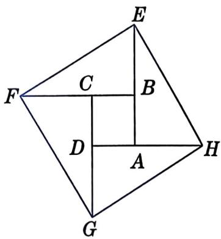

**解析**：
- **考察知识点**：正方形判定、全等三角形
- **路径选择**：边的关系丰富→先证菱形，再证90°

**证明**：
1. ∵ 四边形ABCD是正方形
   ∴ AB=BC=CD=DA，∠EBF=∠FCG=∠GDH=∠HAE=90°
2. 又∵ BE=CF=DG=AH
   ∴ AE=BF=CG=DH
3. ∴ △EBF ≌ △FCG ≌ △GDH ≌ △HAE（SAS）
4. ∴ EF=FG=GH=HE
   ∴ 四边形EFGH是菱形
5. 又∵ ∠EFB + ∠FEB = 90°
   ∴ ∠FEB + ∠HEA = 90°（即∠FEH=90°）
6. ∴ 菱形EFGH是正方形

---

### 例4
**原题**：如图，在菱形ABCD中，对角线AC，BD相交于点O，点E，F在对角线BD上，且BE=DF，OE=OA。求证：四边形AECF是正方形。

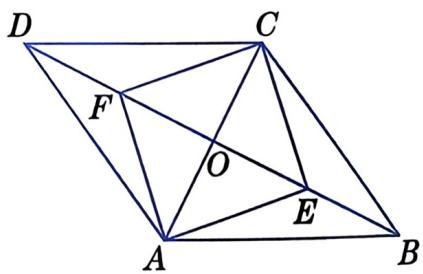

**解析**：
- **考察知识点**：正方形判定、菱形性质
- **路径选择**：对角线关系丰富→先证菱形，再证对角线相等

**证明**：
1. ∵ 四边形ABCD是菱形
   ∴ AC⊥BD，OA=OC，OB=OD
2. 又∵ BE=DF
   ∴ OE=OF
3. ∴ 四边形AECF是菱形
4. 又∵ OE=OA
   ∴ OE=OF=OA=OC，即EF=AC
5. ∴ 菱形AECF是正方形

---

### 做一做
**原题**：已知：如图，点E，F，M，N分别在正方形ABCD的四条边上，且AE=BF=CM=DN。求证：四边形EFMN是正方形。

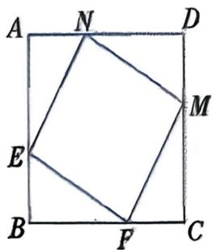

**解析**：
- **考察知识点**：正方形判定、全等三角形
- **路径选择**：边的关系丰富→先证菱形，再证90°

**证明**：
1. ∵ 四边形ABCD是正方形
   ∴ AB=BC=CD=DA，∠A=∠B=∠C=∠D=90°
2. 又∵ AE=BF=CM=DN
   ∴ AF=AB-BF=AB-AE，BM=BC-CM=AB-AE
   ∴ AF=BM
   同理 CN=DE
3. 在△AEF和△BFM中：
   AE=BF，∠A=∠B=90°，AF=BM
   ∴ △AEF ≌ △BFM（SAS）
   同理 △BFM ≌ △CMN，△CMN ≌ △DNE
4. ∴ EF=FM=MN=NE
   ∴ 四边形EFMN是菱形
5. 由△AEF ≌ △BFM得∠AEF=∠BFM
   ∵ ∠AEF + ∠AFE = 90°
   ∴ ∠BFM + ∠AFE = 90°
   ∴ ∠EFM=180°-90°=90°
6. ∴ 菱形EFMN是正方形

---

### 练习
#### 练习1
**原题**：如图，把一张矩形纸片折叠，把重叠部分剪下来，展开后可以得到一个怎样的四边形？为什么？

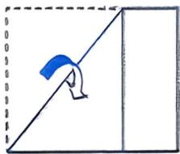

**解析**：
- **考察知识点**：正方形判定、折叠性质
- **结论**：菱形（若矩形本身是正方形，则结果也是正方形）
- **理由**：折叠后，重叠部分的邻边相等→四边形是菱形

---

#### 练习2
**原题**：判定一个四边形是正方形有哪些方法？请至少写出三种方法。

**解析**：
- **考察知识点**：正方形判定方法整理
- **参考方法**（至少三种）：
  1. 先证矩形，再证一组邻边相等
  2. 先证矩形，再证对角线垂直
  3. 先证菱形，再证一个角是直角
  4. 先证菱形，再证对角线相等
  5. 四条边相等，且有一个角是直角

---

### 习题

#### A组
##### 第1题
**原题**：已知：如图，在矩形ABCD中，点E，F分别在边AB，BC上，且DE=AF，DE⊥AF，垂足为P。求证：四边形ABCD是正方形。

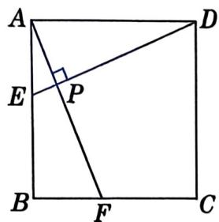

**解析**：
- **考察知识点**：正方形判定、全等三角形
- **路径选择**：已知是矩形→只需证一组邻边相等

**证明**：
1. ∵ 四边形ABCD是矩形
   ∴ ∠DAE = ∠ABF = 90°
2. ∵ DE⊥AF
   ∴ ∠DPA = 90°
   ∴ ∠ADP + ∠DAP = 90°
3. 又∵ ∠DAP + ∠BAF = 90°
   ∴ ∠ADP = ∠BAF
4. 在△ADE和△BAF中：
   ∠DAE = ∠ABF，∠ADE = ∠BAF，DE = AF
   ∴ △ADE ≌ △BAF（AAS）
5. ∴ AD = AB
6. ∴ 矩形ABCD是正方形

---

##### 第2题
**原题**：已知：如图，四边形ABCD是矩形，AD=2AB，M是AD的中点，N是矩形ABCD外一点，且BN∥CM，CN∥BM。求证：四边形BNCM是正方形。

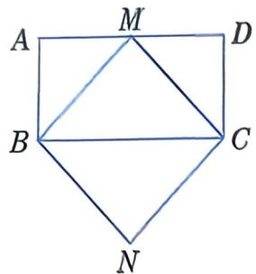

**解析**：
- **考察知识点**：正方形判定、平行四边形判定
- **路径选择**：先证菱形，再证对角线相等

**证明**：
1. ∵ BN∥CM，CN∥BM
   ∴ 四边形BNCM是平行四边形
2. ∵ AD=2AB，M是AD中点
   ∴ AM=AB
3. ∵ 四边形ABCD是矩形
   ∴ ∠A=∠BCD=90°，AB=CD
   ∴ AM=AB=CD
   又∵ M是AD中点，AD=2AB
   ∴ MD=AB=CD
   ∴ △CDM也是等腰直角三角形
4. ∴ ∠AMB=∠CMD=45°
   ∴ ∠BMC=180°-∠AMB-∠CMD=90°
   又∵ BM=CM（等腰直角三角形两腰相等）
5. ∴ 平行四边形BNCM是菱形
6. 又∵ ∠BMC=90°
   ∴ 菱形BNCM是正方形

---

##### 第3题
**原题**：如图，小红选中了一块丝巾作为生日礼物送给妈妈。她想验证这块丝巾是不是正方形，可以用什么方法呢？说说理由。

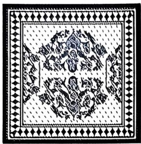

**解析**：
- **考察知识点**：正方形判定的生活应用
- **验证方法**（至少三种）：
  1. 量四条边相等，且有一个角是直角
  2. 量对角线相等且垂直平分
  3. 量邻边相等，且有一个角是直角
  4. 折叠验证邻边相等，且对角线垂直平分

---

#### B组
##### 第4题
**原题**：如图，已知△ABC，分别以AB，AC，BC为边，在BC的同侧作等边三角形ABD、等边三角形ACF和等边三角形BCE。
(1) 求证：四边形ADEF是平行四边形。
(2) 当△ABC满足什么条件时，四边形ADEF是正方形？

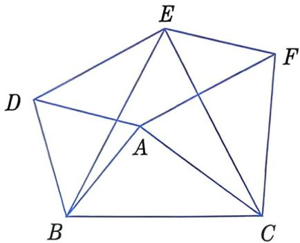

**解析**：
- **考察知识点**：正方形判定、等边三角形性质、全等三角形
- **路径选择**（第2问）：先证平行四边形，再证菱形，最后证矩形

**(1) 证明四边形ADEF是平行四边形**：
1. ∵ △ABD、△ACF、△BCE都是等边三角形
   ∴ AB=DB，BC=BE=EC，AC=FC，
   ∠ABD=∠CBE=∠ACF=60°
2. ∴ ∠ABC = ∠DBE（减去公共角∠ABE）
3. 在△ABC和△DBE中：
   AB=DB，∠ABC=∠DBE，BC=BE
   ∴ △ABC ≌ △DBE（SAS）
   ∴ AC=DE
4. 又∵ AC=AF
   ∴ DE=AF
5. 同理可证：AD=EF
6. ∴ 四边形ADEF是平行四边形

**(2) 当△ABC满足什么条件时，四边形ADEF是正方形**：
- 当∠BAC=150°，且AB=AC时，四边形ADEF是正方形
- 理由：
  1. 由AB=AC→AD=AF→平行四边形ADEF是菱形
  2. 由∠BAC=150°→∠DAF=90°→菱形ADEF是正方形

---

##### 第5题
**原题**：七巧板是我国一项传统的智力游戏，可以用来拼出多种图形。请分别选择七巧板中的两块、三块、四块、五块，尝试拼出一个新的正方形。（相邻两块之间无缝隙、不重叠）

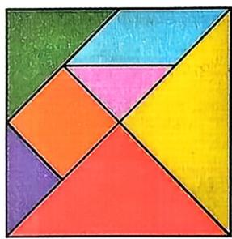

**解析**：
- **考察知识点**：正方形判定的操作活动
- **这是开放性问题**，鼓励学生尝试不同组合。常见组合示例：
  - **两块**：两个小三角形
  - **三块**：两个小三角形+一个正方形
  - ...（还有多种组合方式）

---

## 练习册习题

### 知识点拨
判定一个四边形是正方形，可以先判定这个四边形是矩形，再证明这个矩形是菱形；也可以先判定这个四边形是菱形，再证明这个菱形是矩形。

---

### 夯实基础

#### 1. 选择题
##### (1)
**原题**：已知四边形ABCD是平行四边形。下列说法中，正确的是（ ）
A. 当AC⊥BD时，它是矩形
B. 当AC⊥BD时，它是菱形
C. 当AC=BD时，它是正方形
D. 当AC⊥BD时，它是正方形

**解析**：
- **考察知识点**：特殊四边形判定
- **答案**：B
- **解析**：
  - A错：AC⊥BD→菱形，不是矩形
  - B对：AC⊥BD→菱形
  - C错：AC=BD→矩形，不是正方形
  - D错：AC⊥BD→菱形，不是正方形

---

##### (2)
**原题**：如图，在矩形ABCD中，对角线AC，BD相交于点O。添加下列一个条件后，能使矩形ABCD成为正方形的是（ ）

A. BD=AC
B. DC=AD
C. ∠AOB=60°
D. OD=CD

**解析**：
- **考察知识点**：正方形判定
- **答案**：B
- **解析**：
  - A错：矩形对角线本来就相等
  - B对：DC=AD→一组邻边相等→矩形是正方形
  - C错：∠AOB=60°→不能判定正方形
  - D错：OD=CD→不能判定正方形

---

##### (3)
**原题**：小琦在复习几种特殊四边形之间的关系时，整理了下面的关系图。下列添加的条件中，不正确的是（ ）

A. (1)处可填∠A=90°
B. (2)处可填AD=AB
C. (3)处可填BC=CD
D. (4)处可填∠B=∠D

**解析**：
- **考察知识点**：特殊四边形关系
- **答案**：D
- **解析**：
  - A对：平行四边形+∠A=90°→矩形
  - B对：矩形+AD=AB→正方形
  - C对：平行四边形+BC=CD→菱形
  - D错：∠B=∠D是平行四边形性质，不能判定菱形

---

##### (4)
**原题**：如图，在四边形ABCD中，O是对角线的交点。下列条件中，能判定这个四边形是正方形的是（ ）

A. AC=BD，AB∥CD，AB=CD
B. AD∥BC，∠BAD=∠BCD
C. AO=CO，BO=DO，AB=BC
D. AO=BO=CO=DO，AC⊥BD

**解析**：
- **考察知识点**：正方形判定
- **答案**：D
- **解析**：
  - A：矩形，不是正方形
  - B：平行四边形，不是正方形
  - C：菱形，不是正方形
  - D：AO=BO=CO=DO→矩形；AC⊥BD→菱形；∴正方形

---

##### (5)
**原题**：依次连接正方形各边的中点，得到的四边形是（ ）
A. 矩形
B. 平行四边形
C. 菱形
D. 正方形

**解析**：
- **考察知识点**：正方形判定
- **答案**：D
- **解析**：连接正方形各边中点得到的四边形是正方形

---

##### (6)
**原题**：如图，在正方形ABCD中，AB=2，P是AD边上的动点，PE⊥AC于点E，PF⊥BD于点F，则PE+PF的值为（ ）
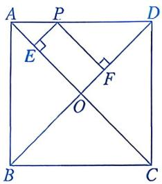
A. 4
B. 2√2
C. √2
D. 2

**解析**：
- **考察知识点**：正方形性质、等腰直角三角形
- **答案**：C
- **解析**：
  1. AB=2→AC=BD=2√2
  2. AO=BO=√2
  3. PE+PF=AO=√2

---

##### (7)
**原题**：如图，将正方形ABCD的各边AB，BC，CD，DA分别延长至点E，F，G，H，且使BE=CF=DG=AH，则四边形EFGH为（ ）
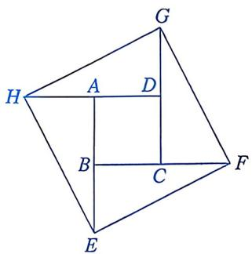
A. 平行四边形
B. 菱形
C. 矩形
D. 正方形

**解析**：
- **考察知识点**：正方形判定
- **答案**：D
- **解析**：同教材例3，四边形EFGH是正方形

---

##### (8)
**原题**：学习了正方形后，王老师提出如下问题：要判定一个四边形是正方形，有哪些思路？
甲同学说：先判定四边形是菱形，再证明这个菱形有一个角是直角。
乙同学说：先判定四边形是矩形，再证明这个矩形有一组邻边相等。
丙同学说：判定四边形的对角线相等，并且互相垂直平分。
丁同学说：先判定四边形是平行四边形，再证明这个平行四边形有一个角是直角并且有一组邻边相等。
四名同学的说法中，正确的是（ ）
A. 甲、乙
B. 甲、丙
C. 乙、丙、丁
D. 甲、乙、丙、丁

**解析**：
- **考察知识点**：正方形判定方法
- **答案**：D
- **解析**：四个同学的说法都正确

---

#### 2. 填空题
##### (1)
**原题**：如图，正方形ABCD的边长为2，E是BC的中点，DF⊥AE与AB交于点F，则DF的长为____。

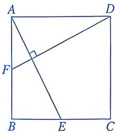

**解析**：
- **考察知识点**：正方形性质、全等三角形
- **答案**：√5
- **解析**：
  1. 证△ABE≌△DAF
  2. DF=AE=√(2²+1²)=√5

---

##### (2)
**原题**：如图，在正方形ABCD的内部，作等边三角形ADE，连接BE，则∠CBE的度数为____。

**解析**：
- **考察知识点**：正方形性质、等边三角形性质
- **答案**：15°
- **解析**：
  1. ∠BAE=90°-60°=30°
  2. AB=AE→∠ABE=(180°-30°)/2=75°
  3. ∠CBE=90°-75°=15°

---

##### (3)
**原题**：如图，在平面直角坐标系中，四边形OABC是正方形，点A的坐标为(0,2)，E是线段BC上一点，且∠AEB=60°，△ABE沿AE折叠后点B落在点F处，则点F的坐标为____。

**解析**：
- **考察知识点**：正方形性质、折叠、坐标系
- **答案**：(√3, 1)
- **解析**略

---

##### (4)
**原题**：如图，以边长为2的正方形的对角线交点O为端点，引两条互相垂直的射线，分别与正方形的边CD，DA交于A，B两点，则线段AB长度的最小值为____。

**解析**：
- **考察知识点**：正方形性质、最小值
- **答案**：√2
- **解析**略

---

### 数学思考
#### 3
**原题**：已知：如图，四边形ABCD是矩形，E是BD上一点，∠BAE=∠BCE，∠AED=∠CED。求证：四边形ABCD是正方形。

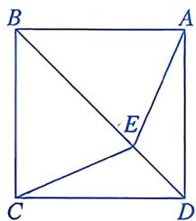

**解析**：
- **考察知识点**：正方形判定、全等三角形
- **路径选择**：已知是矩形→只需证一组邻边相等

**证明**：
1. 在△AEB和△CEB中：
   ∠BAE=∠BCE，∠AEB=180°-∠AED，∠CEB=180°-∠CED
   ∵ ∠AED=∠CED，∴ ∠AEB=∠CEB
   又∵ EB=EB
   ∴ △AEB ≌ △CEB（AAS）
   ∴ AB=BC
2. ∴ 矩形ABCD是正方形（有一组邻边相等的矩形是正方形）

---

### 解决问题
#### 4
**原题**：如图，在四边形ABCD中，AB=BC，对角线BD平分∠ABC，P是BD上一点，过点P作PM⊥AD，PN⊥CD，垂足分别为M，N。
(1) 求证：∠ADB=∠CDB。
(2) 当∠ADC=____时，四边形MPND是正方形。填空并说明理由。

**解析**：
- **考察知识点**：正方形判定、角平分线性质
- **答案**：(2) 90°

**(1) 证明∠ADB=∠CDB**：
1. 在△ABD和△CBD中：
   AB=CB，∠ABD=∠CBD（BD平分∠ABC），BD=BD
   ∴ △ABD ≌ △CBD（SAS）
   ∴ ∠ADB=∠CDB

**(2) 当∠ADC=90°时，四边形MPND是正方形**：
理由：
1. PM⊥AD，PN⊥CD→∠PMD=∠PND=90°
2. ∠ADC=90°→四边形MPND是矩形
3. ∠ADB=∠CDB，PM⊥AD，PN⊥CD→PM=PN（角平分线性质）
4. ∴ 矩形MPND是正方形
