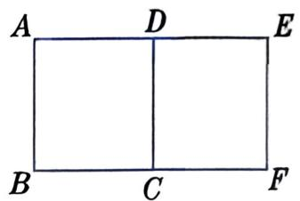
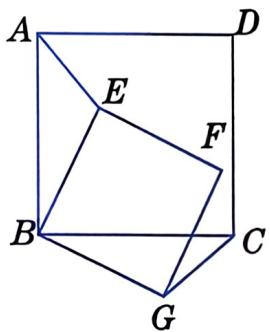
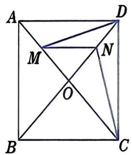
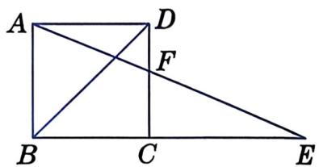
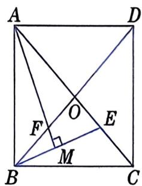

# 21.7 正方形 第1课时

---

## 情境引入

正方形是我们熟悉的四边形，它也是一类特殊的平行四边形。那么，正方形有怎样的特殊性质和判定方法呢？

我们已经知道，有一个角是直角的平行四边形是矩形，有一组邻边相等的平行四边形是菱形。那么，有一组邻边相等的矩形是什么图形呢？有一个角是直角的菱形又是什么图形呢？

---

## 正方形的定义

有一组邻边相等且有一个角是直角的平行四边形叫作**正方形（square）**。

---

## 大家谈谈

**问题1**：正方形是中心对称图形吗？如果是中心对称图形，那么它的对称中心在哪里？正方形是轴对称图形吗？如果是轴对称图形，那么它有哪几条对称轴？

**问题2**：谈谈正方形与平行四边形、矩形和菱形的关系。

**问题3**：正方形有哪些性质？

**回答**：正方形是中心对称图形，它的对角线交点是对称中心。正方形还是轴对称图形，它有四条对称轴：两条对角线和每组对边中点连线所在的直线。

**正方形具有平行四边形、矩形和菱形的一切性质。**

---

## 例1

**例1**：如图 21.7-1，在正方形 ABCD 中，点 E 在对角线 AC 上。

求证：BE = DE。

**证明**：

∵ 四边形 ABCD 是正方形，

∴ AB = AD，∠BAC = ∠DAC。

又∵ AE = AE，

∴ △AEB ≅ △AED（SAS）。

∴ BE = DE。

图21.7-1

---

## 例2

**例2**：如图 21.7-2，在正方形 ABCD 中，△BCE 是等边三角形。

求证：∠EAD = ∠EDA = 15°。

**证明**：

∵ 四边形 ABCD 是正方形，

∴ AB = BC，∠ABC = ∠BAD = 90°。

∵ △BCE 是等边三角形，

∴ BC = BE，∠EBC = 60°。

∴ AB = BE，∠ABE = ∠ABC − ∠EBC = 90° − 60° = 30°。

∴ ∠BAE = ∠BEA = ½ × (180° − 30°) = 75°。

∴ ∠EAD = ∠BAD − ∠BAE = 90° − 75° = 15°。

同理 ∠EDA = 15°。

∴ ∠EAD = ∠EDA = 15°。

图21.7-2

---

## 做一做

**题目**：如图 21.7-3，点 E、F、G 分别在正方形 ABCD 的边 AB、AD 和 CD 上，且 EF ⊥ FG，AF = DG。

求证：EF = FG。

图21.7-3

---

## 练习

**练习**：如图，正方形 ABCD 的对角线 AC 为菱形 AEFC 的一边，求 ∠FAB 的度数。

---

## 习题

### A组

**A组第1题**：如图，如果正方形 ABCD 旋转后能与正方形 CFED 重合，那么图形所在的平面上可以作为旋转中心的点共有多少个？请指出它们的位置。

（第1题）

**A组第2题**：如图，四边形 ABCD 和四边形 BGFE 都是正方形。求证：AE = CG。

（第2题）（第3题）

**A组第3题**：如图，正方形 ABCD 的两条对角线相交于点 O，点 M、N 分别在 OA、OD 上，且 MN ∥ AD。请探究线段 DM 和 CN 之间的数量关系，写出结论并给出证明。

### B组

**B组第4题**：如图，E 是正方形 ABCD 的边 BC 的延长线上一点，且 CE = BD，AE 交 DC 于点 F。求 ∠AFC 的度数。

（第4题）

（第5题）

**B组第5题**：如图，正方形 ABCD 的两条对角线相交于点 O，E 为 OC 上一点，AM ⊥ BE，垂足为 M，AM 与 DB 相交于点 F。求证：OE = OF。

---

**第1课时结束**
