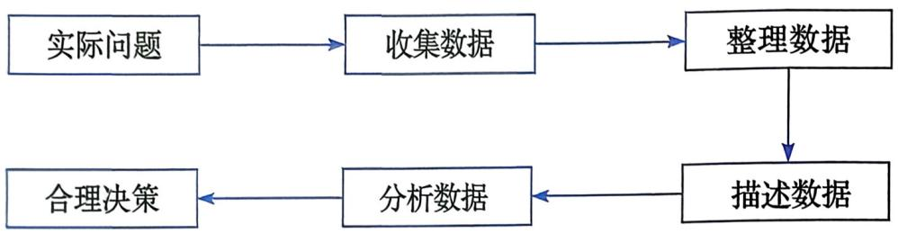

### 📐 第二十二章 数据的收集、整理与描述

## 22.1 统计的初步认识

**八年级数学**

---

*本课我们将认识统计的基本思想：如何用数据认识周围的事情。*

### 🎯 本课目标

1. 能够说出统计的一般过程包含收集数据、整理数据、描述数据和分析数据四个环节
2. 能够运用画"正"字法完成简单数据的整理，并用统计表和统计图描述数据
3. 能够在具体情境中识别统计过程的各个环节，认识到"用数据说话"的必要性

### 📖 统计的初步认识

**为什么要用数据说话？**

生活中我们经常需要对某个群体的看法做出判断：

> 班级要组织体育比赛，老师想知晓大家最喜欢的运动项目

**讨论**：你们觉得应该怎么做？

---

有人说"我觉得喜欢篮球的人最多"，你凭什么相信他？

**结论**：每个人感觉不一样，只有通过调查获得数据，用数据说话才可信。

### 📖 从杂乱数据到有用信息

**问题**：某班50名同学对体育课喜欢程度的调查数据如下：

（来源：教材 第22.1节，source_id: "冀教版八年级下数学教材_22.1", source_type: "textbook", question_id: "教材正文-体育课喜欢程度数据"）

**问题**：面对这些字母数据，能直接看出全班同学对体育课的喜欢程度吗？

🗣️ 口头回答

**【基础层提问】**：请[唐梓涵]同学回答。

### 📝 统计整理：画"正"字法

**问题**：有什么办法能让这些杂乱的数据变得有规律、能看清楚？

**提示**：可以借鉴投票计数的常用方法——画"正"字

---

完成统计表：

| 选项代号 | 画"正"字计数 | 人数 | 百分比 |
|:---:|:---:|:---:|:---:|
| A（喜欢） | 正 | ? | ?% |
| B（比较喜欢） | 正 | ? | ?% |
| C（一般） | 正 | ? | ?% |
| D（不喜欢） | 正 | ? | ?% |
| 合计 | — | 50 | 100% |

✏️ 请在练习本上完成统计表

（限时 3 分钟）

### 📖 从数据到图表

**条形统计图**可以直观看出各选项的人数：

（来源：教材 第22.1节）

**扇形统计图**能告诉我们什么不同的信息？

🗣️ 口头回答

**【中间层提问】**：请[陈美霖]同学回答。

### 📝 练习：不同调查情境

**情境①**：知晓你所在班全体男生立定跳远的成绩

**问题**：这个调查的调查对象是谁？

🗣️ 口头回答

（来源：教材 第22.1节，source_id: "冀教版八年级下数学教材_22.1", source_type: "textbook", question_id: "练习(1)"）

**【基础层提问】**：请[张庭赫]同学回答。

---

**情境②**：知晓你所在学校全体同学每天写作业的时间

**问题**：要得到结论需要哪些步骤？

🗣️ 口头回答

（限时 1 分钟）

（来源：教材 第22.1节，source_id: "冀教版八年级下数学教材_22.1", source_type: "textbook", question_id: "练习(2)"）

**【中间层提问】**：请[刘倚彤]同学回答。

### 📖 统计的一般过程

把刚才做的事情按顺序分成几个阶段：

**讨论**（2分钟）

🗣️ 小组讨论后回答

**【基础层提问】**：请[邵雅姿]同学回答。

---

**【中间层提问】**：请[廉骐玮]同学回答。

**问题**：拿到数据之后，我们接着做了什么？

---

**【拓展层提问】**：请[朱曼钰]同学回答。

**问题**：你能用自己的话把统计的完整过程说一遍吗？

### 📖 统计过程框图

统计的一般过程可以按下面框图所示的步骤进行：

（来源：教材 第22.1节）

**核心结论**：统计是通过收集数据、整理数据、描述数据和分析数据来获取信息、做出判断的完整过程。

### 💡 统计思想

**为什么需要"用数据说话"？**

- 个人感觉往往不准确，不可信
- 通过调查获得数据，用数据支撑结论才可靠

**统计的核心思想**：用数据说话

**迁移应用**：遇到需要认识群体情况的问题时，都可以按照"收集—整理—描述—分析"流程来解决。

### 🤔 应用拓展：设计调查方案

**情境**：学校想知晓同学们最希望开放哪个时间段的自习室

**问题**：这个调查要问什么问题？调查对象是谁？

🗣️ 小组讨论后回答

**【基础层提问】**：请[张楷瑞]同学回答。

### 💬 调查方案设计

**问题**：你打算调查全校同学还是部分同学？选择部分同学时要注意什么？

（思考1分钟）

**【中间层提问】**：请[管婧伊]同学回答。

---

**问题**：调查结果出来后，用什么方式呈现给学校领导？为什么选这种方式？

**【拓展层提问】**：请[李奇禹]同学回答。

### 📝 辨析：不同调查方式的差异

**情境①和情境②在调查方式上有什么不同？为什么会有这种不同？**

🗣️ 口头回答

（限时 2 分钟）

**【拓展层提问】**：请[李奕丹]同学回答。

**要点提示**：
- 调查范围不同（全班 vs 全校）
- 根据范围选择合适的调查方法
- 抽样调查要注意样本的代表性

### 💡 本课小结

| 层次 | 问题 |
|:---|:---|
| 基础层 | 对照今天学的统计过程，说说"知晓全班同学最喜欢的运动"需要哪几步？ |
| 中间层 | 统计过程中"收集—整理—描述—分析"各环节分别解决了什么问题？ |
| 拓展层 | 举一个生活中需要"用数据说话"的例子，并说明为什么不能用感觉代替数据 |

---

**【基础层提问】**：请[张庭赫]同学回答基础层问题。

**【中间层提问】**：请[刘倚彤]同学回答中间层问题。

**【拓展层提问】**：请[焦子轩]同学回答拓展层问题。

### 💡 本课核心要点

**1. 统计的四个步骤**

收集数据 → 整理数据 → 描述数据 → 分析数据

**2. 为什么要用数据说话**

个人感觉不可靠，用数据支撑结论才可信

**3. 统计方法的选择**

根据调查范围和目的选择合适的调查方法

### 📝 课后作业

**必做**：
1. 教材 第22.1节 练习 第(1)题（source_id: "冀教版八年级下数学教材_22.1", source_type: "textbook", question_id: "练习(1)"）
2. 教材 第22.1节 练习 第(2)题（source_id: "冀教版八年级下数学教材_22.1", source_type: "textbook", question_id: "练习(2)"）

**选做**：
1. 教材 第22.1节 习题A组 第1题（source_id: "冀教版八年级下数学教材_22.1", source_type: "textbook", question_id: "习题A组.1"）

**挑战**：
1. 思考：生活中还有哪些场景需要"用数据说话"？举出两个例子并说明用什么方式收集数据。

### 📝 课堂检测

**快速检测**：判断下列说法是否正确，并说明理由。

1. "统计就是画统计图"——这个说法对吗？为什么？

2. "调查全班同学的视力情况只能采用问卷调查"——这个说法对吗？

🗣️ 口头回答

评分：正确指出错误并说明理由，每题2分

（source_id: "自编", source_type: "self", question_id: "课堂检测(1)(2)"）

**【基础层提问】**：请[唐梓涵]同学回答第1题。

**【拓展层提问】**：请[吴瑾瑶]同学回答第2题。
