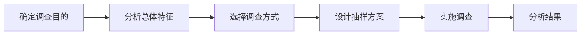

### 📐 第22章 数据的收集、整理与描述
### 22.2 数据的收集(第1课时)

**学科**：数学
**年级**：八年级
**课时**：第1课时
**课型**：新授课

---

### 🎯 本课目标

1. 能够区分普查和抽样调查，说出总体、个体、样本、样本容量的定义
2. 能够解释普查和抽样调查的适用条件，选择合适的调查方式
3. 能够设计简单的抽样方案，理解简单随机抽样的特征

---

### 📖 情境导入

🗣️ 全班参与

2022年北京冬奥会，我国运动健儿取得了15枚奖牌的优异成绩！

**比赛项目：**
- A. 短道速滑
- B. 花样滑冰  
- C. 自由式滑雪空中技巧
- D. 自由式滑雪U形场地技巧

**动手做：** 请大家用举手的方式投票，选择你最爱观看的比赛项目，我们一起来记录数据。

（限时2分钟）

| 比赛项目 | 短道速滑 | 花样滑冰 | 自由式滑雪空中技巧 | 自由式滑雪U形场地技巧 |
|:---|:---:|:---:|:---:|:---:|
| 人数 | | | | |

**问题**：我们对哪些同学进行了调查？

请缪欣怡同学回答

---

### 🤔 认知冲突

**问题**：如果要调查全校3000名学生最爱观看的比赛项目，用刚才举手投票的方法可行吗？为什么？

请陈美霖同学回答

**追问**：除了举手投票，你能想到更高效的方法吗？为什么这种方法可行？

请吴瑾瑶同学回答

---

### 📖 普查与抽样调查

**普查**：对全体对象进行调查

**抽样调查**：从总体中抽取部分个体进行调查

| 调查方式 | 优点 | 缺点 |
|:---|:---|:---|
| 普查 | 结果准确、全面 | 工作量大、耗时费力 |
| 抽样调查 | 省时省力、效率高 | 结果有误差 |

**问题**：结合生活实例，说说什么情况下适合用普查？什么情况下适合用抽样调查？

请贺新萌同学回答

---

### ✏️ 例题：从50名学生中选5名

**题目**：从八年级(1)班50名学生中选择5名学生，要求每名学生被选到的机会相同。请设计抽样方案。

（来源：教材原文_22.2_数据的收集(第1课时)）

---

### 💬 方法探究

**方案一（抽签法）**：对50名学生编号，写在卡片上摇匀后抽取

**方案二（系统抽样）**：从1～10号中随机抽1个号，按间隔10选取

**问题**：方案一（抽签法）为什么能保证每个学生被选中的机会相同？

请张楷瑞同学回答

**问题**：对比两种方案，方案二（系统抽样）的优点是什么？在什么情况下更适用？

请刘森泽同学回答

**问题**：除了这两种方法，你还能设计其他公平的抽样方法吗？请说明你的方案如何保证公平性。

请焦子轩同学回答

---

### ✏️ 推理链分析

**推理链**：明确目的 → 分析总体 → 选择方式 → 设计方案 → 实施调查 → 分析结果

---

### ✏️ 规范解答

**方案一（抽签法）**：

对50名学生按1～50分别进行编号，并将号码写在50张卡片上。

把卡片装在一个盒子中，摇匀后，从中抽取5张卡片，得到5个号码，选出对应这5个号码的学生。

**方案二（系统抽样）**：

从1～10号卡片中任意抽出1张，比如抽到3号，那么对应3号、13号、23号、33号、43号的这5名学生入选。

---

### 📖 概念辨析——借助例题内化新概念

回到刚才"从50名学生中选5名"的例子，我们引入四个新概念：

- **总体**：要考察对象的全体 → 本例中的50名学生
- **个体**：组成总体的每一个对象 → 本例中的每1名学生
- **样本**：从总体中抽取的部分个体 → 本例中选出的5名学生
- **样本容量**：样本中包含个体的数目 → 本例中的5

**问题**：请你用自己的话解释，为什么这5名学生被称为"样本"？它和"总体"是什么关系？

请尹若涵同学回答

**问题**：有人把样本容量说成"样本"，你觉得对吗？为什么？

请蔡孟言同学回答

---

### 📝 课堂练习

✏️ 请在练习本上完成

**题目1**：为了解某市八年级5000名学生的平均身高，应采用什么方式进行调查？如果按5%的比例抽样，请指出总体、个体、样本及样本容量。

（限时3分钟）
评分：正确选择调查方式得2分，准确识别四个概念各得1分，共6分
产出：写出完整答案

---

### 📝 课堂练习

✏️ 请在练习本上完成

**题目2**：分析下列调查分别适合普查还是抽样调查，并说明理由：
(1) 检测一批炮弹的杀伤力
(2) 了解全校学生的数学成绩

（限时3分钟）
评分：每题判断正确得2分，理由充分得2分，共8分
产出：写出判断结果和理由

---

### 🤔 大家谈谈

🗣️ 小组讨论后回答

**问题1**：中央电视台对"春节联欢晚会"的收视情况进行调查，得出该节目电视端的直播平均收视率约为20%。请推测这个结果是怎样得到的？为什么不用普查？

**问题2**：如果要了解一批节能灯泡的寿命，能用普查的方式吗？为什么？

请韩亚彤同学回答问题1，请唐梓涵同学回答问题2

---

### 💡 本课小结

**核心概念**：普查、抽样调查、总体、个体、样本、样本容量

**核心方法**：简单随机抽样、系统抽样

**核心思想**：准确性与效率的权衡——普查准确但耗时长，抽样调查高效但有误差

---

### 💡 三问三答

**基础层**：普查和抽样调查各有什么特点？在什么情况下选择普查？

请缪欣怡同学回答

**中间层**：为什么抽样调查可以用来估计总体情况？样本和总体之间是什么关系？

请陈美霖同学回答

**拓展层**：设计抽样方案时，如何保证样本能够代表总体？请结合实例说明。

请焦子轩同学回答

---

### 📝 课后作业

**必做**：
1. 教材P7 A组 第1题（判断调查方式）
2. 教材P7 A组 第2题（选择适合的调查方式）

**选作**：
1. 教材P7 B组 第3题（立定跳远判断正误）

**挑战**：
1. 教材P7 C组 第5题（设计调查方案：了解本校八年级学生睡眠状况）

同时配套完成练习册 Pxx 夯实基础第1、3题

---

*课件结束*