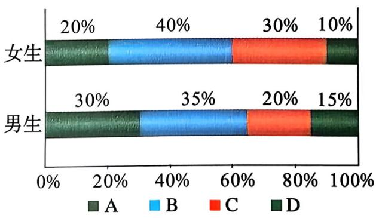
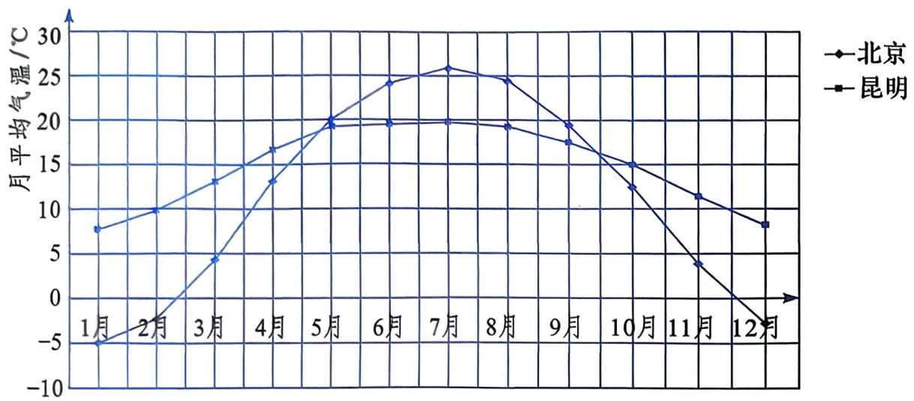
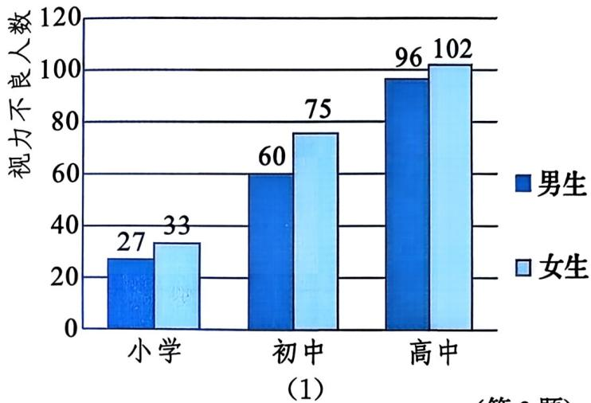

### 📐 22.3 数据的整理与描述（第2课时）

**第二十二章 数据的收集、整理与描述**

折线统计图 · 统计图的选择

source_id: 22.3.2 | source_type: textbook | question_id: 22.3.2_courseware

### 🎯 本课目标

- 能够从折线统计图中读取数据，说出其主要反映数据的变化趋势
- 能够解释条形统计图、扇形统计图、折线统计图各自的适用场景和差异
- 能够根据数据特征和统计目的，选择合适的统计图描述数据

### 📖 观察与思考 — 认识折线统计图

2012～2021年我国城镇居民人均可支配收入数据：

| 年份 | 收入/元 | 年份 | 收入/元 |
|:---:|:---:|:---:|:---:|
| 2012 | 24127 | 2017 | 36396 |
| 2013 | 26467 | 2018 | 39251 |
| 2014 | 28844 | 2019 | 42359 |
| 2015 | 31195 | 2020 | 43834 |
| 2016 | 33616 | 2021 | 47412 |

根据上表数据绘制的折线统计图如下：

*图22.3-5 城镇居民人均可支配收入折线统计图*

### 🤔 问题引导

口头回答

从统计表的数值看，2012年到2021年城镇居民人均可支配收入总体上是增加还是减少？

请张楷瑞同学回答

---

口头回答

统计表也能看到收入在增长，为什么教材还要再画一张折线统计图？从两种方式中你得到的信息有什么不同？

请陈美霖同学回答

---

口头回答

折线统计图为什么能让你更快发现数据的变化？折线上哪些特征对应了数据的变化？

请吴瑾瑶同学回答

### 📖 折线统计图

像图22.3-5这样的图形叫作**折线统计图**。

**折线统计图主要反映数据的变化趋势。**

折线上的**点**：对应每个年份的数据值

点之间的**连线**：表示数据变化的走向

连线向上：数据增加；连线向下：数据减少；连线水平：数据不变

连线越陡：变化越快；连线越缓：变化越慢

### 📖 折线统计图（续）

请在练习本上完成

从图22.3-5中，读出2015年和2018年的城镇居民人均可支配收入数值。

（限时 1 分钟）

### 📖 做一做 — 从统计图中读取数据

某学校八年级随机抽取男生和女生各60名，根据数学水平测试成绩绘制成统计图：

| 男生（图22.3-6） | 女生（图22.3-7） |
|:---:|:---:|
|  图22.3-6 |  图22.3-7 |

成绩由高到低分为 A、B、C、D 四个等级。

请根据统计图所反映的信息回答下面问题。

### 🤔 问题引导

口头回答

男生得A等级的有多少人？女生得B等级的有多少人？

请缪欣怡同学回答

---

口头回答

男生和女生得D等级的百分比分别是多少？哪个更高？

请尹若涵同学回答

### 📝 填表练习

请在练习本上完成

根据图22.3-6和图22.3-7所反映的信息填写下表：

| 男生（图22.3-6） | 女生（图22.3-7） |
|:---:|:---:|
|  |  |

| 性别 | A·人数 | A·% | B·人数 | B·% | C·人数 | C·% | D·人数 | D·% | 总和 |
|:---:|:---:|:---:|:---:|:---:|:---:|:---:|:---:|:---:|:---:|
| 男 | | | | | | | | | |
| 女 | | | | | | | | | |
| 合计 | | | | | | | | | |

（限时 4 分钟）
评分：每个空格数值正确得0.5分，总和栏正确得2分，满分12分
产出：完整填写表格

### 🤔 问题引导

口头回答

结合所有等级的人数和百分比，谈谈该校八年级男女生数学水平各有什么特点？

请蔡孟言同学回答

### 📖 大家谈谈 — 三种统计图比较

我们已学过三种统计图：

条形统计图 —— 用柱子的高低表示

扇形统计图 —— 用扇形面积表示

折线统计图 —— 用折线走势表示

*图22.3-5 折线统计图示例*

小组讨论后回答

条形统计图、扇形统计图和折线统计图分别适合描述数据的哪些特征？

（限时 2 分钟）

### 🤔 问题引导

口头回答

我们学过哪三种统计图来描述数据？

请韩亚彤同学回答

---

口头回答

如果要描述全班同学的身高分布，选哪种统计图？为什么选它而不是另外两种？

请刘倚彤同学回答

---

口头回答

扇形统计图和折线统计图的核心区别是什么？各适合在什么场景下使用？

请焦子轩同学回答

### 📖 三种统计图的功能总结

用统计表可以按某种顺序系统条理地排列数据，便于阅读、检查和计算分析。

用统计图描述数据资料，形象直观：

| 统计图类型 | 擅长描述的特征 | 一句话概括 |
|:---|:---|:---|
| 条形统计图 | 数量的多少 | 看谁多谁少 |
| 扇形统计图 | 各部分所占百分比 | 看谁占多少 |
| 折线统计图 | 数据的变化趋势 | 看怎么变的 |

*图22.3-5 折线统计图示例*

**选择依据**：先看数据有何特征，再看想让读者看出什么。

### 📝 课堂练习1 — 选择统计图

请在练习本上完成

为深入贯彻习近平生态文明思想，聚焦绿色低碳发展的理念，我国大力发展清洁能源。2017～2021年我国清洁能源消费量占能源消费总量的百分比如下表：

| 年份 | 2017 | 2018 | 2019 | 2020 | 2021 |
|:---:|:---:|:---:|:---:|:---:|:---:|
| 清洁能源占比 | 20.5% | 22.1% | 23.3% | 24.3% | 25.5% |

选择合适的统计图描述我国清洁能源消费量占能源消费总量百分比的增长趋势。

（来源：教材练习）
（限时 2 分钟）
产出：写出所选统计图类型并说明理由

### 🤔 问题引导

口头回答

要反映清洁能源消费量占比的"逐年增长趋势"，应该选哪种统计图？

请唐梓涵同学回答

---

口头回答

为什么条形统计图和扇形统计图不适合这个任务？

请廉骐玮同学回答

### 📝 课堂练习2 — 分析气温统计图

请在练习本上完成

北京和昆明12个月月平均气温折线统计图：

*(第1题)*

（来源：教材习题A组第1题）
（限时 4 分钟）
评分：(1)描述趋势得2分 (2)填空正确得2分 (3)填空正确得1分，满分5分
产出：在练习本上写出答案

### 📝 参考答案

**课堂练习1**

选择**折线统计图**。数据按年份排列，需要反映"增长趋势"。条形统计图便于各年份比高低但不显趋势；扇形统计图适合展示各部分占比构成但各年占比之和不等于100%，不符合扇形图使用条件。

---

**课堂练习2**

(1) 北京：1月至7月逐步上升，7月至12月逐步下降，全年变化幅度大（约30°C），冬冷夏热。昆明：全年变化幅度小（约10°C），四季如春。最明显的差别：北京年变化幅度远大于昆明。

(2) 北京最低1月、最高7月；昆明最低1月、最高7月。

(3) 差别最大1月，最接近7月。

### 💡 课堂小结

| 层次 | 问题 |
|:---|:---|
| 基础层 | 折线统计图的主要功能是什么？ |
| | 请孟凡浩同学回答 |
| 中间层 | 三种统计图各适合描述数据的什么特征？各用一句话概括 |
| | 请贺新萌同学回答 |
| 拓展层 | 给定数据和统计目的，选择统计图的判断流程是什么？ |
| | 请朱曼钰同学回答 |

### 📝 课后作业

**必做**：

- 教材习题A组第2题(1)：计算各届奥运会奖牌总数和金、银、铜牌总数，并填表
- 练习册夯实基础 第1(1)题：选择题 — 从折线统计图中判断说法正误
- 练习册夯实基础 第2(1)题：填空题 — 选择合适的统计图

**选作**：

- 教材习题A组第2题(2)(3)：画扇形统计图和折线统计图描述奥运会奖牌数据
- 练习册夯实基础 第2(4)题：比较甲、乙两公司销售增长情况

**挑战**：

- 教材习题B组第3题：计算男女生视力不良率，绘制折线统计图，分析变化趋势和性别差异

| 男生视力不良率（第3题(1)） | 女生视力不良率（第3题） |
|:---:|:---:|
|  |  |
