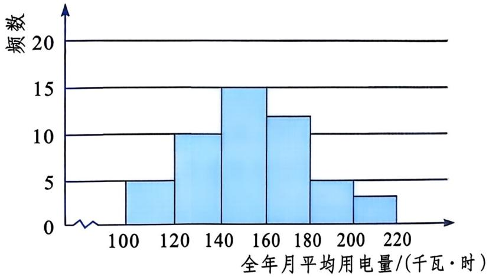

### 📐 22.4 频数分布与直方图

第22章 数据的收集、整理与描述

从一组分散数据出发

用频数表和直方图支持实际判断

基础层 / 中间层 / 拓展层

### 🎯 本课目标

基础层：能找出数据范围，辨认频数、频率、组距和组数。

中间层：能按步骤整理数据，并把频数表转成直方图。

拓展层：能用频数和频率评价阶梯电价或校服订购方案。

图示：本课把分散数据转成可判断的图表。

### 📖 50户用电量数据

为了倡导节约能源，居民用电采用阶梯电价。

制定方案时，需要判断第一档电价能否覆盖大多数家庭。

下面是某城市50户居民全年月平均用电量数据。

单位：千瓦·时

| 155 | 198 | 175 | 158 | 158 | 124 | 154 | 148 | 169 | 120 |
|---:|---:|---:|---:|---:|---:|---:|---:|---:|---:|
| 190 | 133 | 160 | 215 | 172 | 126 | 145 | 130 | 131 | 118 |
| 108 | 157 | 145 | 165 | 122 | 106 | 165 | 150 | 136 | 144 |
| 140 | 159 | 110 | 134 | 170 | 168 | 162 | 170 | 205 | 186 |
| 182 | 156 | 138 | 187 | 100 | 142 | 168 | 218 | 175 | 146 |

source_id: 教材原文_22.4_频数分布与直方图  
source_type: textbook  
question_id: 22.4-正文-居民用电量数据

### 🤔 统计目的

口头回答

制定阶梯电价时，要判断第一档电价能否覆盖大多数家庭，仅看上一页50个原始用电量数据够不够？还需要统计什么信息？

**【基础层提问】**：请[张楷瑞]同学回答

提示：第一档关注“小于180千瓦·时”的家庭有多少户、占多大比例。

### 📖 先找数据范围

请在练习本上完成

为了划分用电量范围，请在原始数据中确定最小值、最大值，并写出数据跨度。

**【基础层提问】**：请[陈虹羽]同学回答

结论栏：最小值____，最大值____，跨度____。

（限时 1 分钟）

### 📖 确定组数和组距

请在练习本上完成

教材把118的跨度分成6组，并取组距20。请结合 $118 \div 6 \approx 19.7$ 说明这样分组对统计户数有什么便利。

**【中间层提问】**：请[尹若涵]同学回答

如果数据正好是120，它应放入哪一组？请用相邻两个区间说明理由。

**【中间层提问】**：请[刘森泽]同学回答

### 📖 列频数分布表

请在练习本上完成

请在频数分布表中找到 $140 \leqslant x < 160$ 这一行，写出这一组的频数、频率，并列出频率计算式。

**【基础层提问】**：请[韩亚彤]同学回答

$15 \div 50 = 30\%$

频数是户数，频率是占总数的比值。

### ✏️ 表图转化：频数表

请在练习本上完成

| 全年月平均用电量 $x$ | $100 \leqslant x < 120$ | $120 \leqslant x < 140$ | $140 \leqslant x < 160$ | $160 \leqslant x < 180$ | $180 \leqslant x < 200$ | $200 \leqslant x < 220$ |
|---|---:|---:|---:|---:|---:|---:|
| 频数 | 5 | 10 | 15 | 12 | 5 | 3 |
| 频率 | 10% | 20% | 30% | 24% | 10% | 6% |

为了把频数表转成直方图，横轴、纵轴、小长方形高度分别应对应表中的什么信息？

**【中间层提问】**：请[郝玲誉]同学回答

### ✏️ 第1步：先搭坐标轴

请在练习本上完成

为了让直方图完整显示全部频数，纵轴刻度至少要覆盖到多少？请说明依据。

**【中间层提问】**：请[刘倚彤]同学回答

（图源：教材第22章，因统计图需看清刻度，使用45%宽度）

### ✏️ 第2-3步：画前两根

请在练习本上完成

根据频数表画出前两根长方形，并写出它们对应的区间和高度。

**【基础层提问】**：请[缪欣怡]同学回答

| 第一根 | 第二根 |
|:---:|:---:|
|  |  |

### ✏️ 第4-6步：直方图生长

✏️ 请在练习本上完成

补全后几根长方形后，请说明相邻长方形表示的是哪些连续用电量范围。

**【中间层提问】**：请[李奕洁]同学回答

| 第三根 | 第四根 |
|:---:|:---:|
|  |  |

### ✏️ 第7步：完成直方图

请在练习本上核对

核对：横轴区间连续；纵轴标频数；高度依次为 $5,10,15,12,5,3$。

最高频数组：$140 \leqslant x < 160$。

（图源：教材第22章，因统计图需看清刻度，使用45%宽度）

### 🤔 第8步：用图作判断

口头回答

| 档次 | 全年月平均用电量 | 电价 |
|---|---|---:|
| 第一档 | $0 \sim 180$ | 0.52 |
| 第二档 | $181 \sim 280$ | 0.57 |
| 第三档 | 大于280 | 0.82 |

判断第一档电价是否覆盖大多数居民，需要把哪些组的频数相加？结果是多少户，占多少？

**【拓展层提问】**：请[吴瑾瑶]同学回答

证据句：小于180千瓦·时的有____户，占____。

### 📝 练习/检测

请在练习本上完成

教材练习(1)(2)

source_id: 教材原文_22.4_频数分布与直方图  
source_type: textbook  
question_id: 22.4-练习(1)(2)

（限时 1.5 分钟）
评分：每问2分，共4分
产出：写出数据个数、分布范围、组距和组数。

### 📝 参考答案

source_id: 教材原文_22.4_频数分布与直方图  
source_type: textbook  
question_id: 22.4-练习(1)(2)

练习(1)：数据个数 $n=80$；数据的大致分布范围在 $147.5$ 与 $174.5$ 之间。

练习(2)：组距为 $3$，组数为 $9$。

评分：数据个数1分，范围1分，组距1分，组数1分。

### 📝 练习/检测

请在练习本上完成

教材练习(3)(4)(5)

source_id: 教材原文_22.4_频数分布与直方图  
source_type: textbook  
question_id: 22.4-练习(3)(4)(5)

给八年级男生订校服时，请从练习图表中提取小、中、大三个尺码对应的频数或频率，再给订购建议。

**【拓展层提问】**：请[蔡孟言]同学回答

### 📝 参考答案

source_id: 教材原文_22.4_频数分布与直方图  
source_type: textbook  
question_id: 22.4-练习(3)(4)(5)

练习(3)：频数最大的组为 $156.5 \leqslant x < 159.5$；频数 $22$，频率 $27.5\%$。

练习(4)：三组频数分别为 $16,53,11$，频率分别为 $20\%,66.25\%,13.75\%$。

练习(5)：建议小号约 $16$ 套，中号约 $53$ 套，大号约 $11$ 套；中号可适当预留余量。

### 💡 本课小结

| 层次 | 问题 | 回答人 |
|---|---|---|
| 基础层 | 为了从原始数据得到可判断的结论，第一步和第二步分别做什么？ | 请[王澎辉]同学回答 |
| 中间层 | 从“频数分布表 → 直方图”这一步看，表中的哪一项决定长方形高度？ | 请[陈美霖]同学回答 |
| 拓展层 | 当要评价一个实际方案时，直方图中的最高组和累计比例分别能提供什么证据？ | 请[李奕丹]同学回答 |

### 📝 课后作业

**必做**：

教材练习(1)-(4)错题订正，写出错因和订正过程。

**选作**：

教材A组第1题；若课堂已完成，则补写第(1)(2)(3)的依据。

**挑战**：

教材B组第3题，比较组距 $0.2$ 和 $0.1$ 的分组呈现效果，并完成频数统计表。

source_id: 教材原文_22.4_频数分布与直方图  
source_type: textbook  
question_id: 22.4-练习(1)(2)(3)(4)+22.4-A组-1+22.4-B组-3

