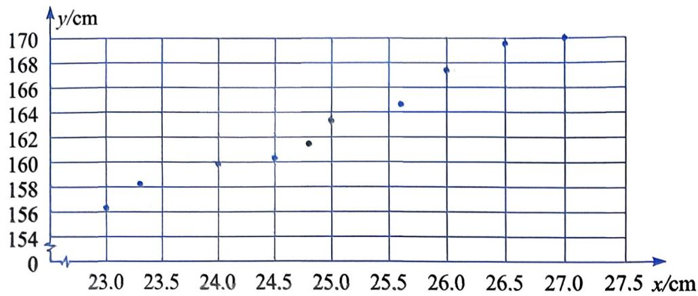
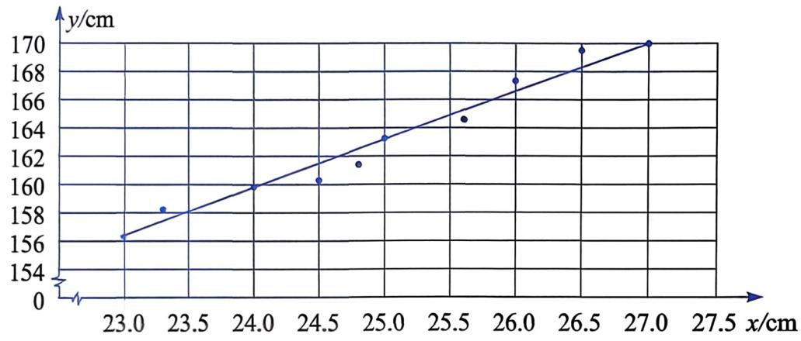
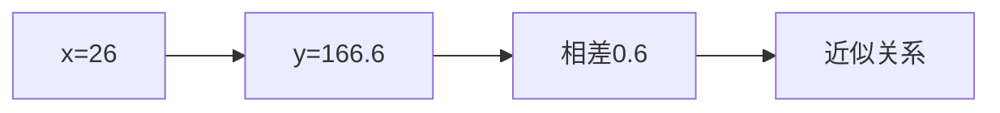
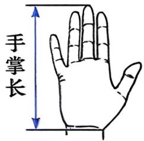

### 📐 数据变化趋势的刻画

第22章 数据的收集、整理与描述

用散点图观察变化趋势

用直线和一次函数近似描述趋势

基础层 / 中间层 / 拓展层

### 🎯 本课目标

① 能够观察散点图，说出数据点的整体方向和大致变化趋势。

② 能够在趋势直线上选取两点，用待定系数法写出一次函数。

③ 能够用一次函数作推测，并说明推测结果可能出现误差。

④ 能够结合数据范围评价推测结果的合理性。

### 📖 问题背景

小丽想通过测量小臂长推算人的身高。

她在班里抽签选取10名女生。

每名女生都有一组小臂长和身高数据。

问题：这些数据能否呈现某种变化趋势？

source_id: 教材原文_22.5_数据变化趋势的刻画  
source_type: textbook  
question_id: 22.5-正文-1

### 📖 小臂长与身高数据

| 编号 | 1 | 2 | 3 | 4 | 5 | 6 | 7 | 8 | 9 | 10 |
|---:|---:|---:|---:|---:|---:|---:|---:|---:|---:|---:|
| 小臂长/cm | 23.0 | 23.3 | 24.0 | 24.5 | 24.8 | 25.0 | 25.6 | 26.0 | 26.5 | 27.0 |
| 身高/cm | 156.2 | 158.1 | 159.8 | 160.2 | 161.3 | 163.2 | 164.5 | 167.2 | 169.5 | 170.0 |

source_id: 教材原文_22.5_数据变化趋势的刻画  
source_type: textbook  
question_id: 22.5-正文-1

### 🤔 图22.5-1：读图判断趋势

观察后口头回答

问题：点群从左到右整体向哪个方向移动？据此怎样描述身高随小臂长增加的变化趋势？

**【基础层提问】**：请闫梦琪同学说出你的答案和依据。

source_id: 教材原文_22.5_数据变化趋势的刻画  
source_type: textbook  
question_id: 22.5-大家谈谈-1

### 📖 图22.5-2：用直线刻画趋势

观察后口头回答

问题：这条直线没有经过所有数据点，仍可用于描述变化趋势，依据是什么？

**【中间层提问】**：请管婧伊同学说明依据。

source_id: 教材原文_22.5_数据变化趋势的刻画  
source_type: textbook  
question_id: 22.5-大家谈谈-2

### 🤔 趋势线是否唯一

观察思考后口头回答

问题：如果换一条也整体接近点群的直线，所得函数一定相同吗？

**【拓展层提问】**：请朱曼钰同学说明判断证据。

source_id: 教材原文_22.5_数据变化趋势的刻画  
source_type: textbook  
question_id: 22.5-大家谈谈-2

### ✏️ 由趋势线确定一次函数

请先在练习本上完成

选取趋势直线上的两点：$(24.0,159.8)$、$(27.0,170.0)$。

问题：把它们代入 $y=kx+b$ 后得到哪两个等式？

**【基础层提问】**：请孟凡浩同学说出点与方程组。

source_id: 教材原文_22.5_数据变化趋势的刻画  
source_type: textbook  
question_id: 22.5-大家谈谈-2

### ✏️ 方程组与函数

请先在练习本上完成

$$
\begin{cases}
159.8=24k+b,\\
170.0=27k+b.
\end{cases}
$$

问题：求出 $k$ 和 $b$，并说明所得函数表示准确关系还是近似关系。

**【中间层提问】**：请贺新萌同学说出函数和依据。

source_id: 教材原文_22.5_数据变化趋势的刻画  
source_type: textbook  
question_id: 22.5-大家谈谈-2

### 📝 做一做：小红身高推测

请在练习本上完成

小红的小臂长为 $26\ \mathrm{cm}$。

用 $y=3.4x+78.2$ 推测她的身高，并与实际身高 $166\ \mathrm{cm}$ 比较。

（限时 3 分钟）

评分：代入1分，差值1分，误差原因2分

source_id: 教材原文_22.5_数据变化趋势的刻画  
source_type: textbook  
question_id: 22.5-做一做-1

### 📝 参考答案：小红身高推测

$$
y=3.4\times26+78.2=166.6\ \mathrm{cm}
$$

推测身高为 $166.6\ \mathrm{cm}$。

与实际身高相差 $0.6\ \mathrm{cm}$。

误差可来自近似关系、个体差异、样本数量或测量偏差。

**【中间层提问】**：请廉骐玮同学说出误差和原因。

### 📖 收入数据表

| 年份 | 2016 | 2017 | 2018 | 2019 | 2020 | 2021 | 2022 |
|---:|---:|---:|---:|---:|---:|---:|---:|
| 对应的 $t$ 值 | 0 | 1 | 2 | 3 | 4 | 5 | 6 |
| $R$/万元 | 1.97 | 2.15 | 2.34 | 2.57 | 2.71 | 2.94 | 3.09 |

任务：用统计图表示趋势，确定一个一次函数，推测2024年收入。

source_id: 教材原文_22.5_数据变化趋势的刻画  
source_type: textbook  
question_id: 22.5-做一做-2-1

### 📝 做一做：收入趋势任务

请在练习本上完成

画出数据点，选取能反映整体趋势的直线。

写出一个近似函数，并推测2024年的 $R$。

（限时 5 分钟）

评分：趋势1分，函数2分，推测1分，依据1分

**【拓展层提问】**：请李奇禹同学说出函数、推测值和依据。

source_id: 教材原文_22.5_数据变化趋势的刻画  
source_type: textbook  
question_id: 22.5-做一做-2-2
question_id: 22.5-做一做-2-3

### 📝 参考答案：收入趋势任务

一种取法：经过 $(0,1.97)$ 和 $(6,3.09)$ 的直线。

$$
k=\frac{3.09-1.97}{6}\approx0.187,\quad R=0.187t+1.97
$$

2024年对应 $t=8$。

$$
R=0.187\times8+1.97\approx3.47
$$

推测结果约为 $3.47$ 万元，是近似结果。

### 📖 A组第2题：树高与胸径

| 编号 | 1 | 2 | 3 | 4 | 5 | 6 | 7 | 8 |
|---:|---:|---:|---:|---:|---:|---:|---:|---:|
| 胸径/cm | 18.1 | 20.1 | 22.3 | 24.4 | 26.0 | 28.3 | 29.6 | 32.4 |
| 树高/m | 18.8 | 19.2 | 21.0 | 21.0 | 22.1 | 22.1 | 22.3 | 22.6 |

请用直线近似刻画树高随胸径增加的趋势。

source_id: 教材原文_22.5_数据变化趋势的刻画  
source_type: textbook  
question_id: 22.5-习题A-2

### 📝 练习/检测

请在练习本上完成

教材A组第2题：用直线近似刻画树高随胸径增加的趋势，并推测胸径 $50\ \mathrm{cm}$ 时的树高。

（限时 5 分钟）

评分：趋势1分，函数2分，推测1分，可靠性判断1分

**【拓展层提问】**：请焦子轩同学说出可靠性判断依据。

source_id: 教材原文_22.5_数据变化趋势的刻画  
source_type: textbook  
question_id: 22.5-习题A-2

### 📝 参考答案：树高与胸径

一种取法：用 $(18.1,18.8)$ 和 $(32.4,22.6)$ 确定直线。

$$
k=\frac{22.6-18.8}{32.4-18.1}\approx0.266,\quad b\approx13.99
$$

可取 $y=0.266x+13.99$。

当 $x=50$ 时，$y\approx27.3\ \mathrm{m}$。

$50\ \mathrm{cm}$ 超出原数据范围，推测误差可能增大。

### 💡 本课小结

| 层次 | 回看问题 | 指名 |
|:---|:---|:---|
| 基础层 | 观察散点图时，怎样描述数据点的整体方向？ | 闫梦琪 |
| 中间层 | 用趋势直线确定函数时，为什么要在线上取点？ | 贺新萌 |
| 拓展层 | 推测值超出原数据范围时，为什么要谨慎评价？ | 焦子轩 |

方法链：读图 → 判趋势 → 借助直线 → 定函数 → 作推测 → 说误差

### 📝 课后作业

**必做**：教材A组第1题第（1）问，记录10名男生手掌长与身高，并描点。

**选作**：教材A组第1题第（2）问，确定一个近似函数。

**挑战**：教材A组第1题第（3）问，比较推测身高与实际身高，并说明误差。

source_id: 教材原文_22.5_数据变化趋势的刻画  
source_type: textbook  
question_id: 22.5-习题A-1-1
question_id: 22.5-习题A-1-2
question_id: 22.5-习题A-1-3
