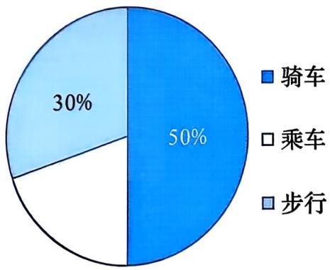

### 📐 第22章 回顾与反思（第2课时）

**数据的收集、整理与描述**

综合习题应用

---

### 🎯 本课目标

- 能够根据原始数据计算频数、频率，填写统计表并画出条形统计图
- 能够从不完整的统计图中提取隐含信息，反推缺失数据
- 能够自主确定分组方案，列出频数分布表并画出直方图，用数据描述分布特征

---

### 📖 四种统计图回顾

第1课时我们梳理了本章的知识结构。请回忆：

| 统计图 | 描述数据的什么特征 |
|--------|------------------|
| 条形统计图 | 比较各类数据的数量大小 |
| 扇形统计图 | 表示各部分占总体的百分比 |
| 折线统计图 | 描述数据的变化趋势 |
| 频数分布直方图 | 描述连续分组数据的分布形态 |

---

### 🤔 活动1 回顾

**上节课我们学了四种统计图。请看着知识结构图，说出条形图、扇形图、折线图、直方图分别用来描述数据的什么特征？**

请王梓懿同学回答

---

### 📝 B组第7题 面粉质量统计：原始数据

面粉厂生产的面粉，每袋标准质量为 50 kg。任选 40 袋，称得质量（单位：kg）如下：

| 48.5 | 50.0 | 49.0 | 50.0 | 51.0 | 50.0 | 49.5 | 50.5 | 50.0 | 51.0 |
|------|------|------|------|------|------|------|------|------|------|
| 49.5 | 49.5 | 50.0 | 50.5 | 49.0 | 50.5 | 50.0 | 51.0 | 50.0 | 49.5 |
| 49.5 | 50.5 | 50.5 | 50.0 | 50.0 | 50.5 | 49.0 | 50.0 | 51.0 | 49.5 |
| 50.0 | 50.0 | 50.5 | 50.0 | 49.5 | 51.5 | 49.5 | 48.5 | 51.0 | 51.5 |

---

### 📝 B组第7题 面粉质量统计：整理任务

(1) 计算每袋面粉的质量与标准质量的差。统计各类误差的面粉袋数，并填写统计表：

| 误差/kg | -1.5 | -1.0 | -0.5 | 0 | 0.5 | 1.0 | 1.5 |
|---------|------|------|------|---|---|------|------|
| 袋数 | | | | | | | |
| 百分比 | | | | | | | |

(2) 画条形统计图表示数据，描述误差分布的特点。

---

### 📝 第7题 学生任务

✏️ 请在练习本上完成

**第7题的40袋面粉数据中，误差为0kg的有多少袋？你是怎么数出来的？**

请韩艾璋同学回答

**画条形统计图时，横轴标什么、纵轴标什么？条形的高度对应统计表中的哪一列？**

请陈禹含同学回答

（限时 6 分钟）
评分：统计表填对得3分，条形图绘制正确得2分

---

### 📝 第7题 参考答案

(1) 误差 = 实际质量 - 50kg

| 误差/kg | -1.5 | -1.0 | -0.5 | 0 | 0.5 | 1.0 | 1.5 |
|---------|------|------|------|---|---|------|------|
| 袋数 | 1 | 4 | 8 | 12 | 6 | 6 | 3 |
| 百分比 | 2.5% | 10% | 20% | 30% | 15% | 15% | 7.5% |

(2) 条形统计图：

误差分布特点：数据分布近似对称，以0误差为中心；误差在±0.5kg范围内占65%，装袋工艺较为稳定。

---

### 🤔 B组第9题 到校方式调查：扇形统计图

小明就班内所有同学的到校方式进行了一次调查。

图(1) 扇形统计图：

---

### 🤔 B组第9题 到校方式调查：条形统计图

图(2) 条形统计图：

---

### 🤔 B组第9题 到校方式调查：问题

请根据两幅不完整统计图回答：

(1) 该班共有多少名学生？

(2) 该班有多少名学生乘车到校？

(3) 在图(1)中，将表示“乘车”的部分补充完整。

---

### 🤔 第9题 学生任务

✏️ 请口头回答

**扇形统计图中"步行占40%"对应条形统计图中步行人数为16人。根据这两个信息，怎样求出全班总人数？**

请陈美霖同学回答

**算出总人数后，乘车人数和乘车对应的圆心角各是多少？**

请刘森泽同学回答

（限时 5 分钟）
评分：总人数2分，乘车人数2分，圆心角2分，满分6分

---

### 📝 第9题 参考答案

(1) 步行人数 = 总人数 × 40%

总人数 = 16 ÷ 40% = 40 人

(2) 乘车比例 = 1 - 40% - 15% = 45%

乘车人数 = 40 × 45% = 18 人

(3) "乘车"圆心角 = 360° × 45% = 162°

在扇形图中画出圆心角为 162° 的扇形。

---

### 📝 B组第8题 门诊等候时间

某医院记录了一周内 60 名病人在门诊看病时等候的时间（单位：min），并对记录数据进行分组统计，结果见下表：

| 时间 t/min | 0≤t<10 | 10≤t<20 | 20≤t<30 | 30≤t<40 | 40≤t<50 | 50≤t<60 |
|-----------|--------|---------|---------|---------|---------|---------|
| 频数 | 7 | 17 | 13 | x | 7 | 6 |
| 频率 | | | | | | |

(1) 求 x 的值，计算各组的频率并填表。
(2) 绘制频数分布直方图。
(3) 估计在这家医院门诊看病的病人等候时间超过 30 min 的百分比。

---

### 📝 第8题 学生任务

✏️ 请在练习本上完成

**已知总人数为60人，各组频数之和等于总人数。根据这个关系，x的值是多少？写出你的计算过程。**

请李奕洁同学回答

**观察屏幕上的直方图，等候时间在哪个区间的人数最多？等候时间超过30分钟的有多少人？**

请郭玲誊同学回答

（限时 7 分钟）
评分：x值正确得2分，频率表正确得2分，百分比正确得3分，满分7分

---

### 📝 第8题 参考答案

(1) 7 + 17 + 13 + x + 7 + 6 = 60 → 50 + x = 60 → **x = 14**

| 时间 t/min | 0≤t<10 | 10≤t<20 | 20≤t<30 | 30≤t<40 | 40≤t<50 | 50≤t<60 |
|-----------|--------|---------|---------|---------|---------|---------|
| 频数 | 7 | 17 | 13 | 14 | 7 | 6 |
| 频率 | 7/60 | 17/60 | 13/60 | 14/60 | 7/60 | 6/60 |

(2) 频数分布直方图：

(3) 超过30min：14 + 7 + 6 = 27人，27 ÷ 60 = **45%**

---

### 🤔 B组第10题 橘子维生素C含量

对 48 个橘子的维生素 C 含量（单位：mg）进行测量，数据如下：

| 26.2 | 28.0 | 29.6 | 28.3 | 26.6 | 30.3 | 28.5 | 29.8 | 26.8 | 30.4 | 29.2 | 28.7 |
|------|------|------|------|------|------|------|------|------|------|------|------|
| 29.7 | 30.0 | 30.2 | 29.4 | 31.6 | 27.0 | 30.5 | 32.8 | 31.3 | 30.0 | 29.9 | 27.1 |
| 31.6 | 29.8 | 30.5 | 28.6 | 30.7 | 30.8 | 29.2 | 31.4 | 28.3 | 32.7 | 30.4 | 31.8 |
| 27.5 | 28.4 | 30.6 | 29.6 | 27.6 | 30.9 | 32.0 | 29.2 | 31.5 | 27.8 | 32.4 | 28.9 |

确定适当的分组个数，整理数据，列频数分布表，画频数分布直方图，描述数据的分布情况。

---

### 🤔 第10题 学生任务

✏️ 请在练习本上完成

**请计算极差，并说明你打算分几组、组距取多少？**

请贺新萌同学回答

**根据屏幕上的直方图，描述橘子维生素C含量的分布有什么特点？你的描述中至少用两个具体数据。**

请李奕丹同学回答

（限时 7 分钟）
评分：分组方案合理得2分，频数分布表正确得3分，分布描述有数据支撑得2分，满分7分

---

### 📝 第10题 参考答案：分组方案

极差 = 32.8 - 26.2 = 6.6，建议分8组，组距 ≈ 1

| 分组 | 频数 | 频率 |
|------|------|------|
| 26.2~27.2 | 5 | 10.42% |
| 27.2~28.2 | 6 | 12.5% |
| 28.2~29.2 | 9 | 18.75% |
| 29.2~30.2 | 14 | 29.17% |

---

### 📝 第10题 参考答案：分组方案续表

| 分组 | 频数 | 频率 |
|------|------|------|
| 30.2~31.2 | 8 | 16.67% |
| 31.2~32.2 | 4 | 8.33% |
| 32.2~33.2 | 2 | 4.17% |

---

### 📝 第10题 参考答案：直方图与描述

分布特点：呈右偏态，大部分橘子含量集中在29~31mg之间，极端值较少。

---

### 📝 课堂检测 C组第12题：数据表

✏️ 请在练习本上完成

下表是我国某两个城市月平均降水量（单位：mm）的统计表：

| 月份 | 1 | 2 | 3 | 4 | 5 | 6 | 7 | 8 | 9 | 10 | 11 | 12 |
| :--- | :--- | :--- | :--- | :--- | :--- | :--- | :--- | :--- | :--- | :--- | :--- | :--- |
| 甲市 | 10 | 15 | 20 | 30 | 60 | 130 | 200 | 210 | 70 | 35 | 20 | 15 |
| 乙市 | 20 | 40 | 80 | 160 | 290 | 280 | 250 | 240 | 200 | 110 | 35 | 20 |

---

### 📝 课堂检测 C组第12题：作图要求

(1) 在下面的网格图中画折线统计图表示两市各月份平均降水量的变化情况。

---

### 📝 课堂检测 C组第12题：作图网格

---

### 🤔 课堂检测 C组第12题：观察问题

(2) 从总体看，两市月平均降水量之间最明显的差别是什么？

(3) 两市月平均降水量差别最大的月份是____月，最接近的月份是____月。

---

### 📝 第12题 学生任务

✏️ 请口头回答

**观察屏幕上的两市降水量图表，从"总体降水量""季节分布""差异最大的月份"三个方面，用数据说明两市降水特点有什么不同？**

请吴瑾瑶同学回答

**两市月平均降水量差别最大的月份是哪个月？最接近的月份是哪个月？**

请李奇禹同学回答

（限时 5 分钟）
评分：三个维度分析各得1分，差别最大月份1分，最接近月份1分，满分5分

---

### 📝 第12题 参考答案：折线统计图

(1) 折线统计图：

---

### 📝 第12题 参考答案：数据分析

(2) 最明显差别：乙市总体降水量明显高于甲市；甲市降水集中在夏季（6-8月），呈单峰型；乙市降水季节分布相对均匀。

(3) 差别最大的月份：**5月**（差值230mm）；最接近的月份：**12月**（差值5mm）。

---

### 💡 三问三答小结

| 层次 | 问题 | 核心答案 |
|:---|------|------|
| 基础层 | 四种统计图各描述什么特征？ | 条形图→比较数量，扇形图→表示比例，折线图→看变化，直方图→看分布 |
| 中间层 | 从原始数据到统计图需要哪几步？ | 计算频数→填统计表→选合适统计图→绘图→用数据描述分布 |
| 拓展层 | 怎样从统计图中提取信息并做出判断？ | 看标题和轴标签，找关键数据点，对比不同组数据，用数据支撑结论 |

---

### 💡 统计tools-2选择策略

✏️ 请在练习本上完成

**回顾今天做的所有题目，什么时候用条形图、什么时候用直方图、什么时候用折线图？各举一个今天题目中的例子说明。**

请廉骐玮同学回答

| 统计图 | 适用场景 | 今天题目举例 |
|--------|---------|------------|
| 条形统计图 | 离散分类数据，比较各类数量 | 第7题 各误差区间的面粉袋数 |
| 频数分布直方图 | 连续分组数据，描述分布形态 | 第8题 等候时间分布 |
| 折线统计图 | 描述数据变化趋势 | 第12题 两市降水量随月份变化 |

---

### 📝 课后作业：必做

**必做**：C组第11题 BMI测量与统计

- 测量自己的身高（精确到 0.01 m）和体重（精确到 0.1 kg）
- 按公式 K = 体重 / (身高)² 计算个人 K 值
- 汇总全班数据，按教材表格分组，填写频数分布表
- 判断自己的 K 值所在区间，对照健康标准
- 根据全班分布结果，提出健康建议

---

### 📝 课后作业：选做与挑战

**选做**：

复习题 A组第1-6题（第1课时已讲解，用于巩固基础）

**挑战**：

自行收集一组生活中的数据，完成：收集数据→整理数据→画统计图→描述分布→提出建议，形成一份完整的统计调查报告。

（课下完成，测量+计算约15分钟）