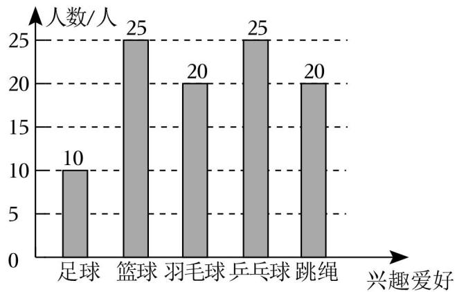
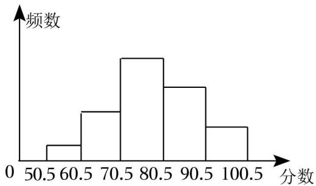
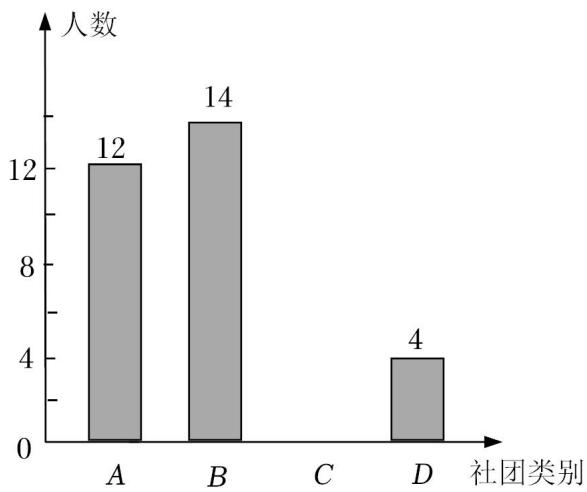
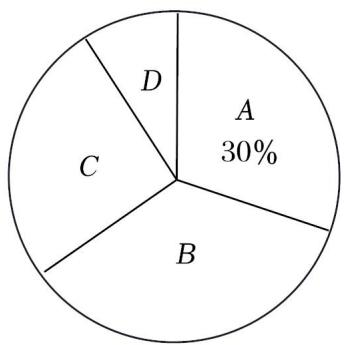

# 第13讲 统计调查与直方图复习

## 知识点01 调查、收集数据的过程与方法

1. 统计调查的一般步骤：

（1）确定调查问题；

（2）确定调查对象；

（3）确定调查方式；

（4）展开调查；

（5）统计、整理调查数据；

（6）分析数据得出结论。

2. 收集数据的方式与方法：

方法：①问卷调查法；②访问调查法；③电话调查法；④实验法。

方式：全面调查与抽样调查。

3. 整理数据的方法：

统计中，一般采用表格整理的数据，采用"划记"的方法，写"正"字，字的每一笔代表一个数据。

4. 描述数据的方法：

一般用统计表与统计图描述数据。

## 知识点02 全面调查与抽样调查

1. 全面调查：

调查全体对象的调查叫做全面调查。适用于调查范围较小，调查不具有破坏性且数据要求准确全面的调查。

优点：结果准确、全面。

缺点：工作量大，有时具有破坏性。

2. 抽样调查：

抽取部分对象进行调查的方法叫做抽样调查。适用于调查范围广，涉及面大，受条件限制或具有破坏性的调查。

优点：工作量小，节省时间和人力。

缺点：结果不如全面调查准确，可能有误差。

## 知识点03 数据的描述

1. 数据的两种描述方法：

数据的描述常利用统计表或统计图。常见的统计图有条形统计图、折线统计图和扇形统计图。

2. 条形统计图、折线统计图以及扇形统计图的优缺点：

条形统计图：优点：能够清楚的表示出每一组的具体数据。缺点：不能表示出数据在不同时间内的变化情况以及数据占总数的百分比。

折线统计图：优点：能够清楚反映出数据的变化情况。缺点：不能表示出数据占总数的百分比。

扇形统计图：优点：能够清楚的表示出各部分在总体中所占的百分比。缺点：不能清楚的表示出每一项的数目。

3. 画扇形统计图的步骤：

第一步：计算百分比：计算各部分数据占总数的百分比。

第二步：求圆心角：计算各部分在圆中所对应的圆心角度数，利用公式 $360°\times 百分比$计算。

第三步：画扇形：根据第二步求出的圆心角度数在圆中画出各部分的扇形。

第四步：在每个扇形中标出相应的名称以及百分比。

## 知识点04 总体、个体、样本及样本容量

1. 总体、个体、样本及其样本容量：

总体：要考察的全体对象。

个体：组成总体的每一个考察对象。

样本：所有被抽取出来的个体组成一个样本。

样本容量：样本中个体的数目称为样本容量（样本容量没有单位）。

2. 简单随机抽样：

在抽取样本的过程中，总体中的每一个个体都有相等的机会被抽到，这样的抽样方法是一种简单随机抽样。抽出的样本必须具有代表性、广泛性。

## 知识点05 频数分布直方图

1. 相关概念：

（1）极差：一组数据中的最大值与最小值的差叫做极差。

（2）组距：每一组数据两个端点之间的距离。

（3）组数：把数据分成若干组，分成组数的多少叫做组数。

（4）频数：对落在各个小组内的数据进行累计，得到的各个小组内的数据的个数叫做该小组的频数。

（5）频率：各个小组中频数与数据总数的比值。

（6）频数分布表：把各个类别及其对应的频数用表格的形式表示出来，所得表格就是频数分布表。

2. 画频数分布直方图的步骤：

第一步：计算极差；

第二步：确定组数与组距；要求组数与组距的乘积大于极差。

第三步：画频数分布表；

第四步：画频数分布直方图。

## 知识点06 统计图的综合应用

1. 条形图：

通过条形的高度来表示数据的大小，它能显示每一组的具体数据，易于比较数据之间的差别。

2. 折线图：

通过用数据点的连线来表示一些"连续型"数据的变化趋势，它能清楚的反映数据的变化情况。

3. 扇形图：

圆代表整体，图中的各部分扇形分别代表整体中的不同部分，它能反映部分占总体的百分比。

## 例题讲解

1．为了了解某校九年级1200学生的体重情况，请你运用所学的统计知识，将解决上述问题要经历的几个重要步骤进行排序．①收集数据；②设计调查问卷；③用样本估计总体；④整理数据；⑤分析数据．则正确的排序为 ．（填序号）

2．下列调查中，适宜采用普查方式的是（ ）

A．调查市场上蔬菜保鲜的情况

B．调查乘坐高铁的旅客是否携带了违禁物品

C．调查某品牌电池的使用寿命

D．调查某地区初中生一天完成作业所用时间

3．某一家电卖场对其销售的空调情况进行了调查，得到下面的信息：

2008年至2010年各种品牌空调的销售量（单位：万台）

| 年份 | A | B | C | 其他品牌 | 总量 |
|------|---|---|---|---------|------|
| 2008 | 1.7 | 1 | 0.8 | 4.5 | 8 |
| 2009 | 1.6 | 1.2 | 1.2 | 5 | 9 |
| 2010 | 1.55 | 1.45 | 2 | 5 | 10 |

请你制作适当的统计图，反映下列信息：

（1）2008年至2010年，C品牌空调在该卖场销售量的变化情况；

（2）2010年，A，B，C及其他品牌的空调在该卖场的市场占有率情况．

4．为了解某校初二年级900名学生每天花费在数学学习上的时间，抽取了100名学生进行调查，以下说法正确的是（ ）

A．样本容量是100

B．每名学生是个体

C．从中抽取的100名学生是样本

D．初二年级900名学生是总体

5．某班在大课间活动中抽查了20名学生每分钟跳绳次数，得到如下数据（单位：次）：65，74，83，87，88，89，91，93，100，102，108，111，117，121，130，133，146，158，177，188．则跳绳次数在90～110这一组的频率是 ．

6．某校有学生3000人，准备开展学校社团活动，组建摄影社、国学社、篮球社、科技制作社四个社团．每名学生最多只能报一个社团，也可以不报．为了估计各社团人数，现在学校随机抽取了50名学生做问卷调查，得到了如图所示的两个不完整的统计图

结合以上信息，回答下列问题：

（1）本次抽样调查的样本容量是 ；

（2）条形统计图国学（B）上的具体数据是 ；

（3）参与科技制作社团（D）所在扇形的圆心角度数是 ；

（4）请你估计全校有多少学生报名参加篮球社团活动．

## 当堂练习

7．实施"双减"政策后，为了解我县初中生每天完成家庭作业所花时间及质量情况，根据以下四个步骤完成调查：①收集数据；②分析数据；③制作并发放调查问卷；④得出结论，提出建议和整改意见．你认为这四个步骤合理的先后排序为（ ）

A．①②③④　　B．①③②④　　C．③①②④　　D．②③④①

8．万州区教师进修学院为了督查国家双减政策的落实情况，现调查某校学生每日睡眠时长问题，选用下列哪种方法最恰当（ ）

A．查阅文献资料　　B．对学生问卷调查　　C．上网查询　　D．对校领导问卷调查

9．下列调查中，适宜采用普查方式的是（ ）

A．了解神舟飞船的设备零部件的质量情况

B．了解一批灯泡的使用寿命

C．了解江苏省中学生观看电影《第二十条》的情况

D．了解无锡市中小学生的课外阅读时间

10．下列调查中，适合用抽样调查的是（ ）

A．订购校服时了解学生衣服尺寸

B．了解全班学生上学的交通方式

C．了解神舟七号飞船零部件的质量

D．了解我国初中生视力情况

11．为了解我校八年级600名学生期中数学考试成绩，从中抽取了100名学生的数学成绩进行统计．下列判断正确的是（ ）

A．被抽取的100名学生的数学成绩是总体

B．样本容量是600

C．被抽取的100名学生是总体的一个样本

D．样本容量是100

12．某厂生产了1000只灯泡．为了解这1000只灯泡的使用寿命，从中随机抽取了50只灯泡进行检测，结果有28只灯泡的使用寿命超过了2500小时，那么估计这1000只灯泡中使用寿命超过2500小时的灯泡的数量为 只．

13．在一次数学测试中，将某班40名学生的成绩分为5组，第一组到第四组的频率之和为0.8，则第5组的频数是（ ）

A．7　　B．8　　C．9　　D．10

14．某校为了解九年级1000名学生一分钟跳绳的情况，随机抽取50名学生进行一分钟跳绳测试，获得了他们跳绳的数据（单位：个），数据整理如下：

| 跳绳的个数/个 | $115\le x<135$ | $135\le x<155$ | $155\le x<175$ | $175\le x<195$ | $x\ge 195$ |
|--------------|----------------|----------------|----------------|----------------|------------|
| 人数/人 | 2 | 5 | 13 | 24 | 6 |

根据以上数据，估计九年级1000名学生中跳绳的个数不低于175个的人数为 人．

15．兰州市现行城镇居民用水量划分为三级，水价分级递增．第一级为每户每年不超过$144m^{3}$的用水量，执行现行居民用水价格；第二级为超出$144m^{3}$但不超过$180m^{3}$的用水量，执行现行居民用水价格的1.5倍；第三级为超出$180m^{3}$的用水量，执行现行居民用水价格的3倍．某小区志愿队为了解该小区居民的用水情况，随机抽样调查了50户家庭的年用水量，并整理绘制了频数分布直方图（如图），若该小区共有1000户居民，请根据相关信息估计该小区年用水量达到第三级标准的户数（ ）

A．30　　B．45　　C．60　　D．90

16．我校有2000名学生参加"我为大运添风采"为主题的知识竞赛，赛后随机抽取部分参赛学生的成绩进行整理并制作成图表如下：

| 分数段 | 频数 | 频率 |
|--------|------|------|
| $60\le x<70$ | 40 | 0.40 |
| $70\le x<80$ | 35 | y |
| $80\le x<90$ | x | 0.15 |
| $90\le x<100$ | 10 | 0.10 |

请根据上述信息，解答下列问题：

（1）表中：$x=$ ；

（2）请补全频数分布直方图；

（3）如果将比赛成绩80分以上（含80分）定为优秀，那么优秀率是多少？并且估算该校参赛学生获得优秀的人数．

## 课后作业

17．实施"双减政策"之后，为了解贵阳市某初中2735名学生平均每天完成各科家庭作业所用的时间，根据以下4个步骤进行调查活动：①整理数据；②得出结论，提出建议；③分析数据；④收集数据．对这4个步骤进行合理的排序移动： ．

18．下列调查中，适合普查方式的是（ ）

A．调查全国初中生的睡眠时间

B．调查某班级学生的身高情况

C．调查长江江苏段的水质情况

D．调查某品牌灯泡的使用寿命

19．下列调查中，适合用抽样调查的是（ ）

A．订购校服时了解某班学生衣服的尺寸

B．考察一批灯泡的使用寿命

C．发射运载火箭前的检查

D．对登机的旅客进行安全检查

20．劳动教育是发挥劳动的育人功能，对学生进行热爱劳动、热爱劳动人民的教育活动．为了解某校3500名学生参加课外劳动的时间，从中抽取500名学生，对他们参加课外劳动的时间进行分析，在此项调查中，样本是指（ ）

A．3500名学生

B．从中抽取的500名学生参加课外劳动的时间

C．从中抽取的500名学生

D．3500名学生参加课外劳动的时间

21．为了估计湖里有多少条鱼，先从湖里捕捞100条鱼做上标记，然后放回池塘去，经过一段时间，带有标记的鱼完全混合于鱼群后，小刚又从湖里捕捞200条鱼，发现有15条有标记，那么你估计池塘里有多少条鱼（ ）

A．1333条　　B．3000条　　C．300条　　D．1500条

22．为了更好地落实课后延时服务工作，某校决定根据学生的兴趣爱好采购一批体育用品供学生使用．该校团委随机抽取了该校100名学生就体育兴趣爱好情况进行调查，并将收集到的数据整理绘制成如图所示的统计图．若该校共有学生1500人，则该校喜欢足球的学生大约有（ ）

A．100人　　B．150人　　C．200人　　D．250人

23．对某校八年级（1）班50名同学的一次数学测验成绩进行统计，其中80.5～90.5分这一组的频数是18，那么这个班的学生这次数学测验成绩在80.5～90.5分之间的频率是（ ）

A．18　　B．0.36　　C．18%　　D．0.9

24．某校为了解本校学生每天在校体育锻炼时间的情况，随机抽取了若干名学生进行调查，获得了他们每天在校体育锻炼时间的数据（单位：min），并对数据进行了整理、描述，部分信息如下：

a．每天在校体育锻炼时间分布情况：

| 每天在校体育锻炼时间x(min) | 频数(人) | 百分比 |
|---------------------------|---------|--------|
| $60\le x<70$ | 14 | 14% |
| $70\le x<80$ | 40 | m |
| $80\le x<90$ | 35 | 35% |
| $x\ge 90$ | n | 11% |

b．每天在校体育锻炼时间在$80\le x<90$这一组的是：80，81，81，81，82，82，83，83，84，84，84，84，84，85，85，85，85，85，85，85，85，86，87，87，87，87，87，88，88，88，89，89，89，89，89．

根据以上信息，回答下列问题：

（1）表中$m=$ ，$n=$ ；

（2）若该校共有1000名学生，估计该校每天在校体育锻炼时间不低于80分钟的学生的人数；

（3）该校准备确定一个时间标准$p$（单位：min），对每天在校体育锻炼时间不低于$p$的学生进行表扬．若要使25%的学生得到表扬，则$p$的值可以是 ．

25．某班有48位同学，在一次数学检测中，分数只取整数，统计其成绩，绘制出频数分布直方图．如图所示，从左到右的小长方形的高度比是1：3：6：4：2，则由图可知，其中分数在70.5～80.5之间的人数是（ ）

A．18　　B．9　　C．12　　D．6

26．为丰富学生课余活动，博熙中学组建了A体育类、B美术类、C音乐类和D其它类四类学生活动社团，要求每人必须参加且只参加一类活动．学校随机抽取九年级（1）班全体学生进行调查，以了解学生参加社团情况．根据调查结果绘制了两幅不完整的统计图（如图所示）．请结合统计图中的信息，解决下列问题：

（1）在这次调查中，九年级（1）班学生总人数是多少人；

（2）请通过计算补全条形统计图，并求扇形统计图中区域D所对应的扇形的圆心角的度数是多少；

（3）博熙中学共有学生2000人，请估算该校参与体育类和美术类社团的学生总人数．

## 原始数量与选用数量对比

| 来源 | 类别 | 原始数量 | 选用数量 | 备注 |
|------|------|---------|---------|------|
| review-01.md | 知识点 | 4 | 4 | 全部保留 |
| review-01.md | 即学即练 | 7 | 4 | 4题选作例题 |
| review-01.md | 典例（题型精讲） | 6 | 6 | 全部纳入当堂练习 |
| review-01.md | 变式（题型精讲） | 11 | 6 | 6题纳入课后作业 |
| review-01.md | 强化训练 | 20 | 0 | 未选用 |
| review-02.md | 知识点 | 2 | 2 | 全部保留 |
| review-02.md | 即学即练 | 3 | 2 | 2题选作例题 |
| review-02.md | 典例（题型精讲） | 4 | 4 | 全部纳入当堂练习 |
| review-02.md | 变式（题型精讲） | 14 | 4 | 4题纳入课后作业 |
| review-02.md | 强化训练 | 20 | 0 | 未选用 |
| **合计** | — | **91** | **32** | 知识点6 + 例题6 + 当堂练习10 + 课后作业10 |
