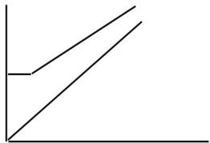
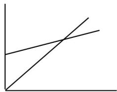
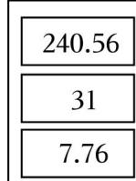
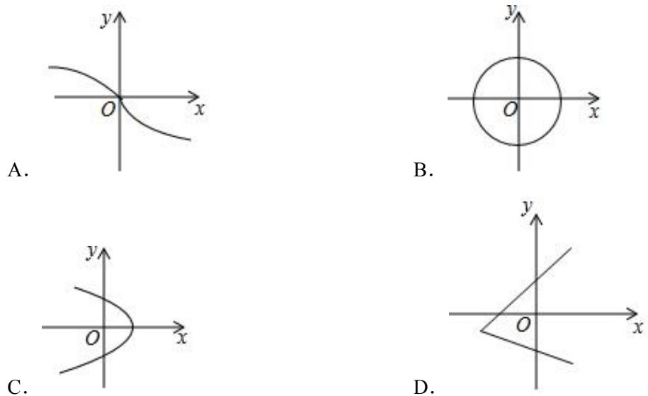
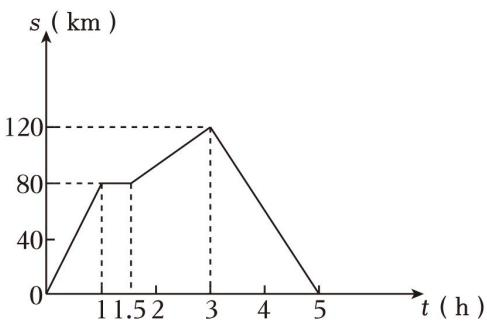
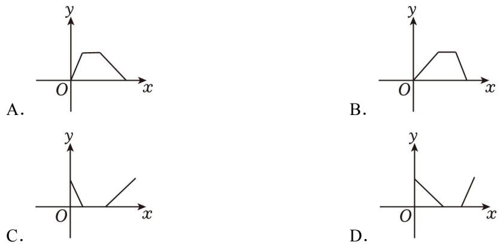
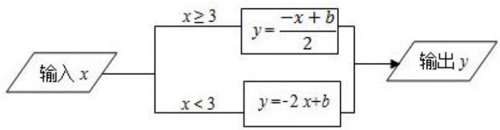
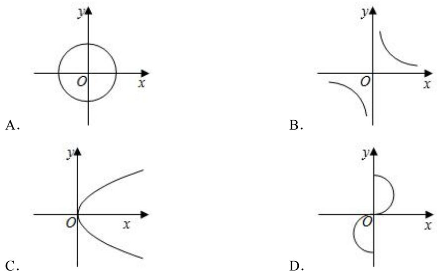
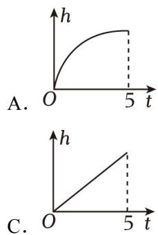
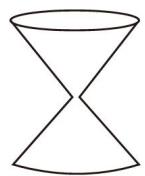

## 第 03 讲 函数

## 知识点01 常量与变量

变量：在一个变化过程中，数值发生变化的量称为变量。

常量：在一个变化过程中，数值保持不变的量称为常量。

变量与常量一定存在于一个变化过程中，有时可以相互转化。

## 例题讲解

1．阅读并完成下面一段叙述：

（1）某人持续以 a 米/分的速度经 t 分时间跑了 s 米，其中常量是 ，变量是

（2）在 t 分内，不同的人以不同的速度 a 米/分跑了 s 米，其中常量是 ，变量是

（3）s 米的路程不同的人以不同的速度 a 米/分各需跑的时间为 t 分，其中常量是 ，变量是

（4）根据以上三句叙述，写出一句关于常量与变量的结论：

## 知识点02 函数的概念与函数值

一般地，在一个变化过程中，如果有两个变量 x 和 y，并且对于 x 的每一个确定的值，y 都有唯一确定的值与之对应，那么我们就说 x 是自变量，y 是 x 的函数，又称因变量。

对于函数概念的理解：有两个变量；一个变量的数值随着另一个变量的数值的变化而发生变化；对于自变量的每一个确定的值，函数值有且只有一个值与之对应，即单对应。

在一个函数中，若存在 x = a 时 y = b，则 b 就是自变量为 a 时的函数值。

## 例题讲解

2．关于变量 x，y 有如下关系：① $x - y = 5$；② $y ^ { 2 } = 2 x$；③ $y = | x |$；④ $y = \frac { 3 } { x }$。其中 y 是 x 函数的是（ ）

A．①②③

B．①②③④

C．①③

D．①③④

## 知识点03 自变量的取值范围

在函数表达式中，自变量的取值必须使相应的函数表达式有意义。

常见的几种函数解析式中自变量的取值范围：整式型函数表达式中自变量一般可取全体实数；分式型函数表达式中分母不能为 0；根式型函数表达式中被开方数要满足相应要求；零次幂与负整数指数幂函数表达式中底数不能为 0。

在实际问题与几何图形中，既要满足函数表达式有意义，也要满足实际问题的实际意义，还要满足几何图形的几何意义。

## 例题讲解

3．函数 $y = \frac { \sqrt { x + 5 } } { x + 2 }$ 的自变量 x 的取值范围是

## 知识点04 函数的图像

一般地，对于一个函数，如果把自变量与函数值的每对对应值分别看作点的横、纵坐标，那么坐标平面内由这些点组成的图形，是这个函数的图像。

函数图像上的任意一点 $( x , y )$ 中的 x，y 都满足函数关系；满足函数关系的任意一对有序数对所对应的点都在函数图像上。

## 例题讲解

4．两家牛奶销售公司招聘送奶员，下面的海报显示两家公司的周薪计算方式：

甲公司：星期内送出的前 240 瓶牛奶，每瓶牛奶 0.5 元，此后，每多送一瓶每瓶多 0.3 元。

乙公司：底薪 200 元。此外，每送出一瓶牛奶将额外有 0.3 元。

小明决定应聘当送奶员，下列正确表示两家公司的周薪计算方式的图是（ ）

A

B

C

D

## 知识点05 函数图像的画法

画函数图像的步骤：列表，表中给出一些自变量及其自变量对应的函数值；描点，在平面直角坐标系中，以自变量作为横坐标，函数值作为纵坐标，描出表格中的数值所对应的点；连线，按照横坐标由小到大的顺序，把所描出的点用光滑的曲线连接起来。

## 例题讲解

5．小朋在学习过程中遇到一个函数 $y { = } \frac { 1 } { 2 } x ^ { 3 }$。

（1）观察这个函数的解析式可知，x 的取值范围是 ，函数值 y 的取值范围是

（2）进一步研究，y 与 x 的几组对应值如下表：

| x | ... | -2 | $-\frac{3}{2}$ | -1 | 0 | 1 | $\frac{3}{2}$ | 2 | ... |
|---|---|---|---|---|---|---|---|---|---|
| y | ... |  |  |  | 0 |  |  |  | ... |

（3）结合上表，画出函数图象：

（4）结合函数图象，写出两条性质

## 知识点06 函数的三种表达方式

解析式法：用含有自变量 x 的式子来表示函数的方法叫做解析式法。它能准确地反映整个变化过程中两个变量的关系。

列表法：把一系列自变量 x 的值与对应的函数值 y 列成一个表来表示函数关系的方法。它可以由表格知道已知自变量的相应函数值。

图像法：用图像来表示函数关系的方法。它能直观形象地表达函数关系。判断图像是否为函数图像，需确认一个自变量是否对应一个函数值，即作 x 轴的垂线，与图像只能有一个交点。

## 例题讲解

6．油箱中存油 40 升，油从油箱中均匀流出，流速为 0.2 升/分钟，则油箱中剩余油量 Q（升）与流出时间 t（分钟）的函数关系是（ ）

A．Q＝0.2t

B．Q＝40﹣0.2t

C．Q＝0.2t+40

D．Q＝0.2t﹣40

## 当堂练习

7．小亮爸爸到加油站加油，如图是所用的加油机上的数据显示牌，金额随着数量的变化而变化．则下列判断正确的是（ ）

A．金额是自变量

B．单价是自变量

C．7.76 和 31 是常量

D．金额是数量的函数

8．下列变量间的关系不是函数关系的是（ ）

A．长方形的宽一定，其长与面积

B．正方形的周长与面积

C．圆柱的底面半径与体积

D．圆的周长与半径

9．在函数 $y = \frac { x - 2 } { 2 x + 1 }$ 中，自变量 x 的取值范围是

10．在关系式 $y = \frac { 1 } { 3 } x + 2 4$ 中，当因变量 y＝﹣2 时，自变量 x 的值为（ ）

A．$\frac { 8 } { 3 }$

B．﹣4

C．﹣12

D．12

11．下列关系式中，y 不是 x 的函数的是（ ）

A．$y = x + 1$

B．$y = x ^ { - 1 }$

C．y＝﹣2x

D．$\vert y \vert { = } x$

12．如表是研究弹簧长度与所挂物体质量关系的实验表格，则弹簧不挂物体时的长度为（ ）

| 所挂物体重量 $x$ (kg) | 1 | 2 | 3 | 4 | 5 |
|---|---|---|---|---|---|
| 弹簧长度 $y$ (cm) | 10 | 12 | 14 | 16 | 18 |

A．4cm

B．6cm

C．8cm

D．10cm

13．如图，下列各曲线中能够表示 y 是 x 的函数的（ ）

14．在一辆小汽车行驶过程中，小汽车离出发地的距离 s（km）和行驶时间 t（h）之间的函数关系如图，根据图中的信息，下列说法错误的是（ ）

A．小汽车共行驶 240km

B．小汽车中途停留 0.5h

C．小汽车出发后前 3 小时的平均速度为 40 千米/时

D．小汽车自出发后 3 小时至 5 小时之间行驶的速度在逐渐减小

15．周日上午，小张跑步去公园锻炼身体，到达公园后原地锻炼了一会之后散步回家，下面能反映小张离公园的距离 y 与时间 x 的函数关系的大致图象是（ ）

## 课后作业

16．一个圆形花坛，周长 C 与半径 r 的函数关系式为 $C { = } 2 \pi r$，其中关于常量和变量的表述正确的是（ ）

A．常量是 2，变量是 C，π，r

B．常量是 2，变量是 r，π

C．常量是 2，变量是 C，π

D．常量是 2π，变量是 C，r

17．下列所述不属于函数关系的是（ ）

A．长方形的面积一定，它的长和宽的关系

B．x+2 与 x 的关系

C．匀速运动的火车，时间与路程的关系

D．某人的身高和体重的关系

18．使函数 $y = \sqrt { x + 3 }$ 有意义的 x 的取值范围是

19．根据如图所示的程序计算函数 y 的值，若输入 x 的值是 8，则outputs y 的值是﹣3，若输入 x 的值是﹣8，则outputs y 的值是（ ）

A．10

B．14

C．18

D．22

20．下列关于变量 x 和 y 的关系式：

$x \cdot y = 0 , y ^ { 2 } = x , \vert y \vert = 2 x , y ^ { 2 } = x ^ { 2 } , y = 3 - x , y = 2 x ^ { 2 } - 1 , y = \frac { 3 } { x }$，其中 y 是 x 的函数的个数为（ ）

A．3

B．4

C．5

D．6

21．已知蓄水池有水 $5 m ^ { 3 }$ 现匀速放水，池中水量和放水时间的关系如表所示，则放水 14min 后，池中水量为（ ）

| 放水时间/min | 0 | 1 | 2 | 3 | 4 | ... |
|---|---|---|---|---|---|---|
| 池中水量/ $m^{3}$ | 50 | 48 | 46 | 44 | 42 | ... |

A．$2 2 m ^ { 3 }$

B．$2 4 m ^ { 3 }$

C．$2 6 m ^ { 3 }$

D．$2 8 m ^ { 3 }$

22．下列各曲线中，表示 y 是 x 的函数的是（ ）

23．甲、乙两工程队分别同时开挖两条 600 米长的管道，所挖管道长度 y（米）与挖掘时间 x（天）之间的关系如图所示，则下列说法中：①甲队每天挖 100 米；②乙队开挖两天后，每天挖 50 米；③甲队比乙队提前 3 天完成任务；④当 x＝2 或 6 时，甲乙两队所挖管道长度都相差 100 米．正确的有（ ）

A．①②③

B．①②④

C．①③④

D．②③④

24．如图，现有一个计时沙漏，开始时盛满沙子，沙子从上部均匀下漏，经过 5 分钟漏完，则该沙漏中沙面下降的高度 h（cm）与下漏时间 t（min）之间的函数图象大致是（ ）

## 题目信息总览

| 题目ID | 知识考察点 | 难度 | 入选理由 |
|--------|-----------|------|---------|
| 第01讲-变量与函数-原卷版-即学即练-1 | 常量与变量 | ★★ | 覆盖常量、变量的判断和变化过程辨析 |
| 第01讲-变量与函数-原卷版-即学即练-2 | 函数概念与函数值 | ★★★ | 覆盖函数单对应关系判断 |
| 第01讲-变量与函数-原卷版-即学即练-4 | 自变量取值范围 | ★★ | 覆盖分式与根式共同限制 |
| 第02讲-函数的图像-原卷版-即学即练-1 | 函数图像 | ★★★ | 覆盖实际情境与函数图像对应 |
| 第02讲-函数的图像-原卷版-即学即练-2 | 函数图像的画法 | ★★★ | 覆盖列表、描点、连线与图像性质 |
| 第02讲-函数的图像-原卷版-即学即练-3 | 函数的三种表达方式 | ★★ | 覆盖解析式表示实际函数关系 |
| 第01讲-变量与函数-原卷版-题型01-典例1 | 常量与变量 | ★★ | 源docs典型例题，训练自变量、因变量与常量辨析 |
| 第01讲-变量与函数-原卷版-题型02-典例1 | 函数概念与函数值 | ★★★ | 源docs典型例题，训练函数关系判断 |
| 第01讲-变量与函数-原卷版-题型03-典例1 | 自变量取值范围 | ★★ | 源docs典型例题，训练分式型函数定义域 |
| 第01讲-变量与函数-原卷版-题型04-典例1 | 函数概念与函数值 | ★★★ | 源docs典型例题，训练函数值与自变量互求 |
| 第02讲-函数的图像-原卷版-题型01-典例1 | 函数概念与函数值 | ★★★ | 源docs典型例题，训练关系式是否表示函数 |
| 第02讲-函数的图像-原卷版-题型02-典例1 | 函数的三种表达方式 | ★★★ | 源docs典型例题，训练表格信息读取 |
| 第02讲-函数的图像-原卷版-题型03-典例1 | 函数图像 | ★★★ | 源docs典型例题，训练图像是否表示函数 |
| 第02讲-函数的图像-原卷版-题型04-典例1 | 函数图像 | ★★★★ | 源docs典型例题，训练图像信息综合读取 |
| 第02讲-函数的图像-原卷版-题型05-典例1 | 函数图像 | ★★★★ | 源docs典型例题，训练实际变化过程的大致图像 |
| 第01讲-变量与函数-原卷版-题型01-变式1 | 常量与变量 | ★★ | 源docs例题变式，巩固常量与变量识别 |
| 第01讲-变量与函数-原卷版-题型02-变式1 | 函数概念与函数值 | ★★★ | 源docs例题变式，巩固函数关系辨析 |
| 第01讲-变量与函数-原卷版-题型03-变式1 | 自变量取值范围 | ★★ | 源docs例题变式，巩固根式型取值范围 |
| 第01讲-变量与函数-原卷版-题型04-变式4 | 函数概念与函数值 | ★★★★ | 源docs例题变式，综合函数值与程序图 |
| 第02讲-函数的图像-原卷版-题型01-变式1 | 函数概念与函数值 | ★★★ | 源docs例题变式，巩固关系式函数判断 |
| 第02讲-函数的图像-原卷版-题型02-变式1 | 函数的三种表达方式 | ★★★ | 源docs例题变式，巩固表格变化规律读取 |
| 第02讲-函数的图像-原卷版-题型03-变式1 | 函数图像 | ★★★ | 源docs例题变式，巩固图像函数判别 |
| 第02讲-函数的图像-原卷版-题型04-变式2 | 函数图像 | ★★★★ | 源docs例题变式，训练双图像信息综合 |
| 第02讲-函数的图像-原卷版-题型05-变式2 | 函数图像 | ★★★★ | 源docs例题变式，训练实际情境大致图像判断 |

