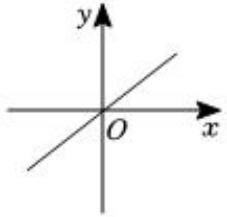
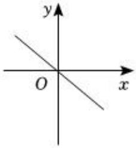
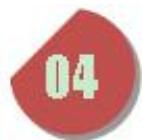
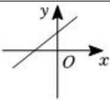
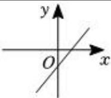
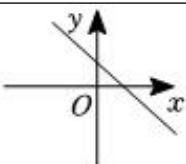
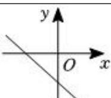
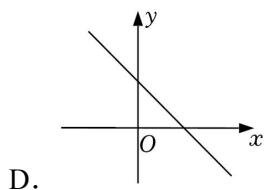
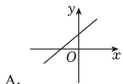
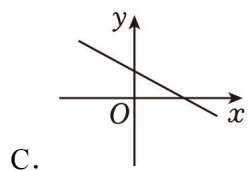

## 第 04 讲 一次函数

## 知识点01 正比例函数的定义

1. 正比例函数的定义：

一般地，形如 的函数叫做正比例函数。其中，k 叫做 。

注意：①自变量系数不能为

②自变量次数一定是 。

③正比例函数解析式中，自变量后面为

## 例题讲解

1．下面各组变量的关系中，成正比例关系的有（ ）

A．人的身高与年龄

B．汽车从甲地到乙地，所用时间与行驶速度

C．正方形的面积与它的边长

D．圆的周长与它的半径

## 知识点02 正比例函数的图像与性质

1. 正比例函数的图像与性质：

<table><tr><td>k的取值</td><td>经过象限</td><td>大致图像</td><td>y随x的变化情况</td></tr><tr><td>k&gt;0</td><td>____</td><td></td><td>y随x的增大而____</td></tr><tr><td>k&lt;0</td><td>____</td><td></td><td>y随x的增大而____</td></tr></table>

正比例函数的图像是必经过 的一条直线。在画正比例函数图像时，还需确定除原点外的另一个点即可。

## 例题讲解

2．下列关于正比例函数 $y = 3 x$ 的说法中，正确的是（ ）

A．当 x＝3时，y＝1

B．它的图象是一条过原点的直线

C．y 随 x 的增大而减小

D．它的图象经过第二、四象限

## 知识点03 正比例函数解析式

1. 待定系数法求函数解析式

具体步骤：

①设：设 函数解析式 $y = k x { \big ( } k \neq 0 { \big ) }$ 。

②带：把已知点带入函数解析式中，得到关于未知系数k 的方程。

③解方程：解步骤②中得到的方程，得到比例系数k 的值。

④反带：将求得的比例系数带入函数解析式即可

## 例题讲解

3．已知 y 与 x成正比例，且当 $x = - 6$ 时， $y = 2$

（1）求 y 与 x 之间的函数关系式；

（2）设点 $\left( a , \quad - 3 \right)$ 在这个函数的图象上，求 a 的值

## 知识点04 一次函数的定义

1. 一次函数的定义：

一般地，形如 的函数是一次函数。

注意：一次函数的结构中，k 0，自变量系数为 。b为任意实数。当b 的值等于 时，一次函数变成正比例函数。

## 例题讲解

4．函数 ① $y = k x + b$ ； ② $y = 2 x$ ；③ $y = \frac { 3 } { x }$ ；④ $y = \frac { 1 } { 3 } x + 3$ ；⑤ $y = x ^ { 2 } - 2 x + 1$ ．是一次函数的有（ ）

A．1 个

B．2 个

C．3 个

D．4 个

## 知识点05 一次函数的图像与性质

1. 一次函数的图像：

一次函数的图像是一条直线。

2. 一次函数的图像与性质：

<table><tr><td>k的取值</td><td>b的取值</td><td>经过象限</td><td>大致图像</td><td>y随x的变化情况</td></tr><tr><td rowspan="2">k&gt;0一定过____象限</td><td>b&gt;0与y轴交于__半轴</td><td>____</td><td></td><td rowspan="2">y随x的增大而____。自变量越大,函数值就____</td></tr><tr><td>b&lt;0与y轴交于__半轴</td><td>____</td><td></td></tr><tr><td rowspan="2">k&lt;0一定过____象限</td><td>b&gt;0与y轴交于__半轴</td><td>____</td><td></td><td rowspan="2">y随x的增大而____。自变量越大,函数值就____</td></tr><tr><td>b&lt;0与y轴交于__半轴</td><td>____</td><td></td></tr></table>

3. 一次函数的图像与坐标轴的交点坐标：

①一次函数与纵坐标的交点坐标为 。  
②一次函数与横坐标的交点坐标为 。

画一次函数图像时用两点法，两点确定一条直线。通常情况下选择的两点就是图像与坐标轴的交点。

## 例题讲解

5．关于函数 y＝3x+1，下列结论正确的是（ ）

A．函数图象过一、二、三象限

B．函数图象是一条线段

C．y 随 x 增大而减小

D．点（1，3）在函数图象上

## 当堂练习

6．下列函数中是正比例函数的是（ ）

A． $y = - \ 7 x$

B．y $y = \frac { - 7 } { \frac { x } { 3 } }$

C． $y = 2 x ^ { 2 } + 1$

D． $y = 0 . 6 x - 5$

7．若函数 $y = - 2 x + m$ 是关于 x 的正比例函数，则 m 的值为（ ）

A．﹣1

B．0

C．1

D．2

8．已知正比例函数 $y = k x ( k 是常数，k≠0）$，y 随 x 的增大而增大，写出一个符合条件的 k 的值

9．已知正比例函数 $y = k x$ 的图象经过点（2，4），k 的值是（ ）

A．﹣2

B． $- \frac { 1 } { 2 }$

C．2

D．1

10．下列函数中，y 是 x 的一次函数的是（ ）

A． $y = 2 x ^ { 2 } - 3$

B． $y = - \ 3 x$

C．y＝3

D． $y ^ { 2 } { = } x$

11．下列函数：（1）$y = 3x$；（2）$y = 2x - 1$；（3）$y = \frac { 1 } { x }$；（4）$y = x ^ { 2 } - 1$；（5）$y = \frac { x } { 8 }$ 中，是一次函数的有（ ）个．

A．4

B．3

C．2

D．1

12．关于一次函数 $y = - \ x + 1$ 的描述，下列说法正确的是（ ）

A．图象经过点（﹣2，1）

B．图象经过第一、二、三象限

C．y 随 x 的增大而增大

D．图象与 y 轴的交点坐标是（0，1）

13．已知 k＞0，则一次函数 $y = - k x + k$ 的图象可能是（ ）

14．已知点（3，y1），（﹣7，y2）都在直线 $y = - 2 x + 1$ 上，则 y1，y2 的大小关系为（ ）

A． $y _ { 1 } > y _ { 2 }$

B． $y _ { 1 } = y _ { 2 }$

C． $y 1 { < } y 2$

D．不能比较

## 课后作业

15．下列关系中，属于成正比例函数关系的是（ ）

A．正方形的面积与边长

B．三角形的周长与边长

C．圆的面积与它的半径

D．速度一定时，路程与时间

16．若函数 $y = { x + 1 } - m$ 是正比例函数，则 m 的值是（ ）

A．2

B．1

C．﹣1

D．0

17．已知正比例函数 $y = k x .$ ，当 x每增加 1时，y 减少 2，则 k的值为（ ）

A． $- { \frac { 1 } { 2 } }$

B． $\frac 1 2$

C．2

D．﹣2

18．已知 y 与 x 成正比例且当 $x { = } 2$ 时， $y = 4$

（1）求 y 与 x 之间的函数表达式；

（2）当 y＝2时，x 的值是多少？

19．下列函数： ① $y = - 3 x$ ， ② $y = - 3 x + 3$ ， ③ $y = - 3 x ^ { 2 }$ ，④ $y = \frac { 3 } { x }$ ； 其中一次函数的个数是（ ）

A．1

B．2

C．3

D．4

20．已知函数 $y = \left( m - 3 \right) x + 2$ 是 y 关于 x 的一次函数，则 m 的取值范围是（ ）

A． $m { \neq } 0$

B． $m \neq 3$

C． $m \neq - 3$

D．m 为任意实数

21．对于一次函数 $y = - 3 x + m$ ，下列说法正确的是（ ）

A．函数图象一定不过原点

B．当 m＝﹣1时，函数图象不经过第一象限

C．当 m＝2 时函数图象经过点（1，1）

D．点（﹣2，1）和（2，n）均在函数图象上，则 $n { > } 0$

22．若点 $( m , \ n )$ 在第二象限，则一次函数 $y = n x + m - n$ 的图象可能是（ ）

23．点 $A \ ( x _ { 1 } , \ y _ { 1 } )$ 和 $B \ ( x _ { 2 } , \ y _ { 2 } )$ 都在直线 $y = - \ 3 x + 2$ 上，且 $x _ { 1 } { < } x _ { 2 }$ ，则 y1 与 y2 的关系是（ ）

A． $y _ { 1 } { \leqslant } y _ { 2 }$

B． $y _ { 1 } \geqslant y _ { 2 }$

C． $y _ { 1 } { < } y _ { 2 }$

D． $y _ { 1 } > y _ { 2 }$

24．若函数 $y = ( m + 1 ) x ^ { | m | } - 6$ 是一次函数，则 m 的值为（ ）

A．±1

B．﹣1

C．1

D．2

## 原始数量与选用数量对比

| 来源 | 类别 | 原始数量 | 选用数量 | 备注 |
|------|------|---------|---------|------|
| 03讲 | 知识点 | 3 | 3 | 全部保留 |
| 03讲 | 即学即练 | 5 | 3 | 选作例题 |
| 03讲 | 题型01 典例 | 1 | 1 | 全部纳入当堂练习 |
| 03讲 | 题型01 变式 | 2 | 1 | 课后作业选用 |
| 03讲 | 题型02 典例 | 1 | 1 | 全部纳入当堂练习 |
| 03讲 | 题型02 变式 | 5 | 1 | 课后作业选用 |
| 03讲 | 题型03 典例 | 1 | 1 | 全部纳入当堂练习 |
| 03讲 | 题型03 变式 | 5 | 1 | 课后作业选用 |
| 03讲 | 题型04 典例 | 1 | 1 | 全部纳入当堂练习 |
| 03讲 | 题型04 变式 | 4 | 1 | 课后作业选用 |
| 04讲 | 知识点 | 2 | 2 | 全部保留 |
| 04讲 | 即学即练 | 4 | 2 | 选作例题 |
| 04讲 | 题型01 典例 | 1 | 1 | 全部纳入当堂练习 |
| 04讲 | 题型01 变式 | 2 | 1 | 课后作业选用 |
| 04讲 | 题型02 典例 | 1 | 1 | 全部纳入当堂练习 |
| 04讲 | 题型02 变式 | 5 | 2 | 课后作业选用 |
| 04讲 | 题型03 典例 | 1 | 1 | 全部纳入当堂练习 |
| 04讲 | 题型03 变式 | 5 | 1 | 课后作业选用 |
| 04讲 | 题型04 典例 | 1 | 1 | 全部纳入当堂练习 |
| 04讲 | 题型04 变式 | 5 | 1 | 课后作业选用 |
| 04讲 | 题型05 典例 | 1 | 1 | 全部纳入当堂练习 |
| 04讲 | 题型05 变式 | 4 | 1 | 课后作业选用 |
| **合计** | — | **60** | **29** | — |
