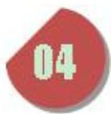
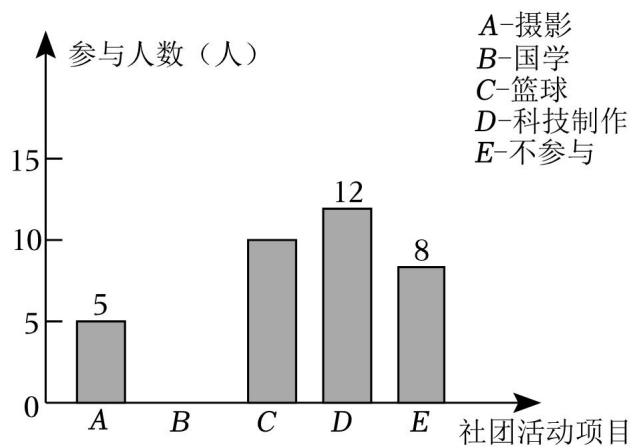
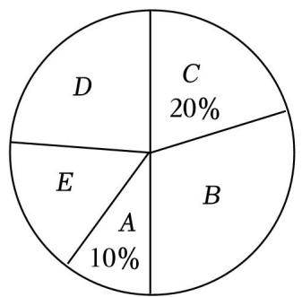
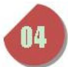
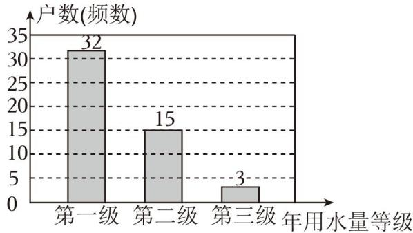
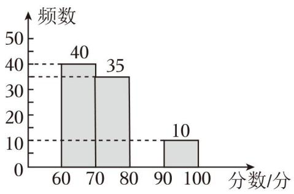
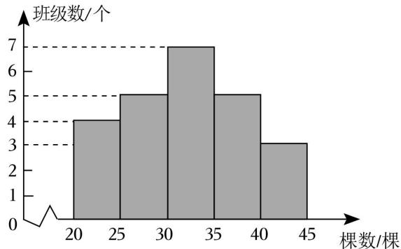
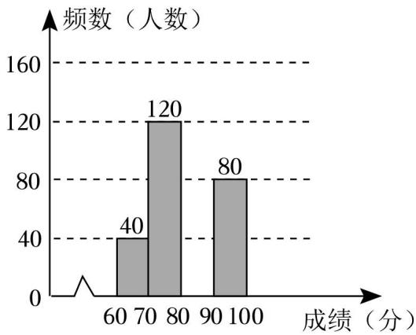
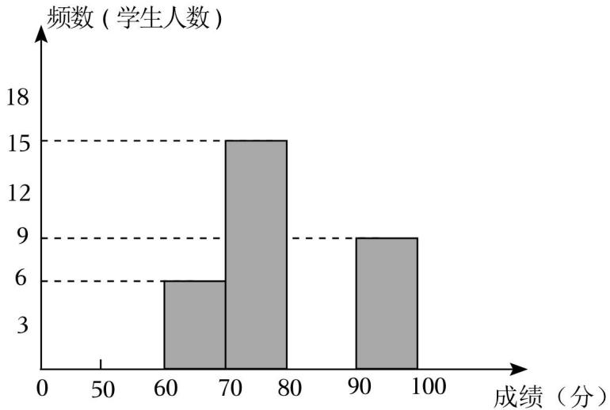

## 第 11 讲 统计调查与直方图

## 知识点01 调查、收集数据的过程与方法

## 1. 统计调查的一般步骤：

（1）确定 

（2）确定 

（3）确定 

（4）展开调查； 

（5）统计、整理调查数据； 

（6）分析数据得出结论； 

2. 收集数据的方式与方法： 

方法：① 调查；② 调查 ；③ 调查；④实验法。 

方式： 调查与 调查。 

3. 整理数据的方法： 

统计中，一般采用表格整理的数据，采用“划记”的方法，写“正”字，字的每一笔代表一个数据。 

4. 描述数据的方法： 

一般用 ____ 与 ____ 描述数据。

## 例题讲解

1．为了了解某校九年级 1200 学生的体重情况，请你运用所学的统计知识，将解决上述问题要经历的几个 重要步骤进行排序．①收集数据；②设计调查问卷；③用样本估计总体；④整理数据；⑤分析数据．则 正确的排序为 ____．（填序号）

## 知识点02 全面调查与抽样调查

1. 全面调查： 

调查 对象的调查叫做全面调查。适用于调查范围较小，调查不具有破坏性且数据要求准确全 面的调查。 

优点： 。 

缺点： 。 

2. 抽样调查： 

抽取 对象进行调查的方法叫做抽样调查。适用于调查范围广，涉及面大，受条件限制或具 有破坏性的调查。 

优点： 。 

缺点： 。

## 例题讲解

2．下列调查中，适宜采用普查方式的是（ 

A．调查市场上蔬菜保鲜的情况 

B．调查乘坐高铁的旅客是否携带了违禁物品 

C．调查某品牌电池的使用寿命 

D．调查某地区初中生一天完成作业所用时间

## 知识点03 数据的描述

1. 数据的两种描述方法： 

数据的描述常利用 或 。常见的统计图有 

2. 条形统计图、折线统计图以及扇形统计图的优缺点： 

条形统计图：优点：能够清楚的表示出每一组的具体数据。 

缺点：不能表示出数据在不同时间内的变化情况以及数据占总数的百分比。 

折线统计图：优点：能够清楚反映出数据的变化情况。 

缺点：不能表示出数据占总数的百分比。 

扇形统计图：优点：能够清楚的表示出各部分在总体中所占的百分比。 

缺点：不能清楚的表示出每一项的数目。 

3. 画扇形统计图的步骤： 

第一步：计算百分比：计算各部分数据占总数的百分比。 

第二步：求圆心角：计算各部分在圆中所对应的圆心角度数，利用公式 360°×百分比 计算。 

第三步：画扇形：根据第二步求出的圆心角度数在圆中画出各部分的扇形。 

第四步：在每个扇形中标出相应的名称以及百分比。

## 例题讲解

3．某一家电卖场对其销售的空调情况进行了调查，得到下面的信息： 

2008年至 2010年各种品牌空调的销售量（单位：方台） 

<table><tr><td>年份</td><td>A</td><td>B</td><td>C</td><td>其他品牌</td><td>总量</td></tr><tr><td>2008</td><td>1.7</td><td>1</td><td>0.8</td><td>4.5</td><td>8</td></tr><tr><td>2009</td><td>1.6</td><td>1.2</td><td>1.2</td><td>5</td><td>9</td></tr><tr><td>2010</td><td>1.55</td><td>1.45</td><td>2</td><td>5</td><td>10</td></tr></table>

请你制作适当的统计图，反映下列信息： 

（1）2008年至 2010年，C 品牌空调在该卖场销售量的变化情况； 

（2）2010 年，A，B，C 及其他品牌的空调在该卖场的市场占有率情况

## 知识点04 总体、个体、样本及样本容量

1. 总体、个体、样本及其样本容量： 

总体：要考察的 对象。 

个体：组成总体的 考察对象。 

样本：所有被抽取出来的个体组成一个样本。 

样本容量：样本中个体的 称为样本容量。 

2. 简单随机抽样： 

在抽取样本的过程中，总体中的每一个个体都有 的机会被抽到，这样的抽样方法是一 种简单随机抽样。抽出的样本必须具有 、 。

## 例题讲解

4．为了解某校初二年级 900名学生每天花费在数学学习上的时间，抽取了 100名学生进行调查，以下说法 正确的是（ ） 

A．样本容量是 100 

B．每名学生是个体 

C．从中抽取的 100 名学生是样本 

D．初二年级 900名学生是总体 

## 知识点05 频数分布直方图

## 1. 相关概念：

（1）极差：一组数据中的 与 的差叫做极差。 

（2）组距：每一组数据两个 之间的距离。 

（3）组数：把数据分成若干组，分成组数的 叫做组数。 

（4）频数：对落在各个小组内的数据进行累计，得到的各个小组内的数据的 叫做该小组的 频数。 

（5）频率：各个小数中 与 的百分比。 

（6）频数分布表：把各个类别及其对应的频数用表格的形式表示出来，所得表格就是频数分布表。 

## 2. 画频数分布直方图的步骤：

第一步：计算 

第二步：确定组数与组距；要求组数与组距的乘积 极差。 

第三步：画频数分布表； 

第四步：画频数分布直方图。

## 例题讲解

5．某班在大课间活动中抽查了 20名学生每分钟跳绳次数，得到如下数据（单位：次）：65，74，83，87， 88，89，91，93，100，102，108，111，117，121，130，133，146，158，177，188．则跳绳次数在 90～ 110这一组的频率是 ____

## 知识点06 统计图的综合应用

1. 条形图： 

通过条形的高度来表示数据的大小，它能显示每一组的具体数据，易于比较数据之间的差别。 

2. 折线图： 

通过用数据点的连线来表示一些“连续型”数据的变化趋势，它能清楚的反映数据的变化情况。 

3. 扇形图： 

圆代表整体，图中的各部分扇形分别代表整体中的不同部分，它能反映部分占总体的百分比。

## 例题讲解

6．某校有学生 3000人，准备开展学校社团活动，组建摄影社、国学社、篮球社、科技制作社四个社团．每 名学生最多只能报一个社团，也可以不报．为了估计各社团人数，现在学校随机抽取了 50名学生做问卷 调查，得到了如图所示的两个不完整的统计图 

结合以上信息，回答下列问题： 

（1）本次抽样调查的样本容量是 ____

（2）条形统计图国学（B）上的具体数据是 ____

（3）参与科技制作社团（D）所在扇形的圆心角度数是 ____

（4）请你估计全校有多少学生报名参加篮球社团活动 

## 当堂练习

7．实施“双减”政策后，为了解我县初中生每天完成家庭作业所花时间及质量情况，根据以下四 个步骤完成调查：①收集数据；②分析数据；③制作并发放调查问卷；④得出结论，提出建议和整改 意见．你认为这四个步骤合理的先后排序为（ ） 

A．①②③④ 

B．①③②④ 

C．③①②④ 

D．②③④①

8．万州区教师进修学院为了督查国家双减政策的落实情况，现调查某校学生每日睡眠时长问题， 选用下列哪种方法最恰当（ ） 

A．查阅文献资料 

B．对学生问卷调查 

C．上网查询 

D．对校领导问卷调查

9．下列调查中，适宜采用普查方式的是（ ） 

A．了解神舟飞船的设备零部件的质量情况 

B．了解一批灯泡的使用寿命 

C．了解江苏省中学生观看电影《第二十条》的情况 

D．了解无锡市中小学生的课外阅读时间

10．下列调查中，适合用抽样调查的是（ ） 

A．订购校服时了解学生衣服尺寸 

B．了解全班学生上学的交通方式 

C．了解神舟七号飞船零部件的质量 

D．了解我国初中生视力情况

11．为了解我校八年级600名学生期中数学考试成绩，从中抽取了100名学生的数学成绩进行统计．下 列判断正确的是（ 

A．被抽取的 100名学生的数学成绩是总体 

B．样本容量是 600 

C．被抽取的 100名学生是总体的一个样本 

D．样本容量是 100

12．某厂生产了 1000 只灯泡．为了解这 1000 只灯泡的使用寿命，从中随机抽取了 50 只灯泡进行检 测，结果有 28 只灯泡的使用寿命超过了 2500 小时，那么估计这 1000只灯泡中使用寿命超过 2500小时 的灯泡的数量为 ____ 只．

13．在一次数学测试中，将某班 40 名学生的成绩分为 5 组，第一组到第四组的频率之和为 0.8，则 第 5 组的频数是（ ） 

A．7 

B．8 

C．9 

D．10

14．某校为了解九年级 1000 名学生一分钟跳绳的情况，随机抽取 50 名学生进行一分钟跳绳测试， 获得了他们跳绳的数据（单位：个），数据整理如下： 

<table><tr><td>跳绳的个数/个</td><td>115≤x&lt;135</td><td>135≤x&lt;155</td><td>155≤x&lt;175</td><td>175≤x&lt;195</td><td>x≥195</td></tr><tr><td>人数/人</td><td>2</td><td>5</td><td>13</td><td>24</td><td>6</td></tr></table>

根据以上数据，估计九年级 1000名学生中跳绳的个数不低于 175个的人数为 人

15．兰州市现行城镇居民用水量划分为三级，水价分级递增．第一级为每户每年不超过 $1 4 4 m ^ { 3 }$ 的用 水量，执行现行居民用水价格；第二级为超出 $1 4 4 m ^ { 3 }$ 但不超过 $1 8 0 m ^ { 3 }$ 的用水量，执行现行居民用水价格 的 1.5 倍；第三级为超出 $1 8 0 m ^ { 3 }$ 的用水量，执行现行居民用水价格的 3 倍．某小区志愿队为了解该小区 居民的用水情况，随机抽样调查了 50户家庭的年用水量，并整理绘制了频数分布直方图（如图），若该 小区共有 1000 户居民，请根据相关信息估计该小区年用水量达到第三级标准的户数（ 

A．30 

B．45 

C．60 

D．90

16．我校有 2000 名学生参加“我为大运添风采”为主题的知识竞赛，赛后随机抽取部分参赛学生的 成绩进行整理并制作成图表如下： 

<table><tr><td colspan="3">频率分布统计表</td><td>频率分布直方图</td></tr><tr><td>分数段</td><td>频数</td><td>频率</td><td rowspan="5"></td></tr><tr><td>60≤x&lt;70</td><td>40</td><td>0.40</td></tr><tr><td>70≤x&lt;80</td><td>35</td><td>y</td></tr><tr><td>80≤x&lt;90</td><td>x</td><td>0.15</td></tr><tr><td>90≤x&lt;100</td><td>10</td><td>0.10</td></tr></table>

请根据上述信息，解答下列问题： 

（1）表中：x＝ 

（2）请补全频数分布直方图； 

（3）如果将比赛成绩 80 分以上（含 80分）定为优秀，那么优秀率是多少？并且估算该校参赛学生获得 优秀的人数 ____

## 课后作业

17．实施“双减政策”之后，为了解贵阳市某初中 2735名学生平均每天完成各科家庭作业所用的时 间，根据以下 4个步骤进行调查活动：①整理数据；②得出结论，提出建议；③分析数据；④收集数 据． 

对这 4 个步骤进行合理的排序移动：

18．下列调查中，适合普查方式的是（ 

A．调查全国初中生的睡眠时间 

B．调查某班级学生的身高情况 

C．调查长江江苏段的水质情况 

D．调查某品牌灯泡的使用寿命

19．为了了解我校八年级的 1200名学生的数学期中成绩，随机抽取 80 名学生的数学成绩进行分析， 则下列说法错误结是（ ） 

A．总体是我校八年级的 1200名学生的数学期中成绩的全体 

B．其中 80 名学生是总体的一个样本 

C．样本容量是 80 

D．个体是我校八年级学生中每名学生数学期中成绩

20．为了估计湖里有多少条鱼，先从湖里捕捞 100条鱼做上标记，然后放回池塘去，经过一段时间， 带有标记的鱼完全混合于鱼群后，小刚又从湖里捕捞 200 条鱼，发现有 15条有标记，那么你估计池塘里 有多少条鱼（ ） 

A．1333 条 

B．3000 条 

C．300 条 

D．1500 条

21．对某校八年级（1）班 50 名同学的一次数学测验成绩进行统计，其中 80.5﹣90.5 分这一组的频 数是 18，那么这个班的学生这次数学测验成绩在 80.5﹣90.5 分之间的频率是（ ） 

A．18 

B．0.36 

C．18% 

D．0.9

22．某校为了解本校学生每天在校体育锻炼时间的情况，随机抽取了 100 名学生进行调查，获得了 他们每天在校体育锻炼时间的数据（单位：min），并对数据进行了整理，每天在校体育锻炼时间分布情 况如表： 

<table><tr><td>每天在校体育锻炼时间x(min)</td><td>60≤x&lt;70</td><td>70≤x&lt;80</td><td>80≤x&lt;90</td><td>×≥90</td></tr><tr><td>人数</td><td>14</td><td>46</td><td>30</td><td>10</td></tr></table>

该校准备确定一个时间标准 p（单位：min），对每天在校体育锻炼时间不低于 p 的学生进行表扬．若要 使 40%的学生得到表扬，则 p 的值可以是 ____

23．为保护人类赖以生存的生态环境，我国将每年的 3 月 12日定为中国植树节．在植树节当天，某 校组织各班级进行植树活动，事后统计了各班级种植树木的数量，绘制成如图频数分布直方图（每组含 

前一个数值，不含后一个数值），根据统计结果，下列说法 错误的是（ ） 

A．共有 24个班级参加植树活动 

B．频数分布直方图的组距为 5 

C．有 $\frac { 2 } { 3 }$ 的班级种植树木的数量少于 35 棵 

D．有 3 个班级都种了 45棵树 

24．为了解今年全县 2000名初二学生“创新能力大赛”的笔试情况，随机抽取了部分同学的成绩， 整理并制作如图所示的图表（部分未完成）．请你根据提供的信息，解答下列问题： 

<table><tr><td>分数段</td><td>频数</td><td>频率</td></tr><tr><td>60≤x&lt;70</td><td>40</td><td>0.1</td></tr><tr><td>70≤x≤80</td><td>120</td><td>n</td></tr><tr><td>80≤x&lt;90</td><td>m</td><td>h</td></tr><tr><td>90≤x&lt;100</td><td>80</td><td>0.2</td></tr></table>

（1）此次调查的样本容量为 ____

（2）在表中：m＝ ；n＝ ；h＝ 

（3）补全频数分布直方图； 

（4）根据频数分布表、频数分布直方图，你获得哪些信息？ 

25．王老师了解到七年级 5 个班学生完成课后作业的平均时间分别为（单位：分钟）：30，45，40， 30，35，获得这组数据的方法（ ） 

A．直接观察 

B．测量 

C．实验 

D．调查

26．“天宫课堂”第三课在中国空间站的问天实验舱开讲，“太空教师”陈冬、刘洋、蔡旭哲为广大 青少年带来一场精彩的太空科普课．为了激发学生的航天兴趣，弘扬科学精神，某校七年级共 800名学 生参加了以“格物致知，叩问苍穹“为主题的太空科普知识竞赛．为了解七年级学生的科普知识掌握情 况，调查小组从七年级共选取 50名学生的竞赛成绩（百分制，成绩取整数）作为样本，进行了抽样调查， 下面是对样本数据进行了整理和描述后得到的部分信息： 

a.50名学生竞赛成绩的频数分布表： 

<table><tr><td>成绩</td><td>50≤x&lt;60</td><td>60≤x&lt;70</td><td>70≤x&lt;80</td><td>80≤x&lt;90</td><td>90≤x&lt;100</td></tr><tr><td>频数</td><td>m</td><td>6</td><td>15</td><td>17</td><td>9</td></tr></table>

b.50名学生的竞赛成绩的频数分布直方图： 

c．竞赛成绩在 80≤x＜90 这一组的成绩是： 

80、81、83、83、83、84、84、85、86、86、86、87、87、87、88、88、89 

d．小东的竞赛成绩为 83 分 

根据以上信息，回答下列问题： 

（1）频数分布表中的数值 m＝ ____

（2）补全频数分布直方图； 

（3）小东的竞赛成绩是否超过样本中一半学生的成绩？ 

（4）学校将把获得 88分及以上的学生评为“科普达人”，请估计七年级学生的获奖人数 ____

## 题目信息总览

| 题目ID | 知识考察点 | 难度 | 入选理由 |
|---|---|---|---|
| Q01 | 调查、收集数据的过程与方法 | ★ | 选自01统计与调查原卷 |
| Q02 | 全面调查与抽样调查 | ★ | 选自01统计与调查原卷 |
| Q03 | 数据的描述 | ★ | 选自01统计与调查原卷 |
| Q04 | 总体、个体、样本及样本容量 | ★ | 选自01统计与调查原卷 |
| Q05 | 频数分布直方图 | ★ | 选自02直方图原卷 |
| Q06 | 统计图的综合应用 | ★ | 选自02直方图原卷 |
| Q07 | 统计调查的过程与方法 | ★★ | 01统计与调查原卷 题型01典例 |
| Q08 | 统计调查的过程与方法 | ★★ | 01统计与调查原卷 题型01典例 |
| Q09 | 全面调查与抽样调查 | ★★ | 01统计与调查原卷 题型02典例 |
| Q10 | 全面调查与抽样调查 | ★★ | 01统计与调查原卷 题型02典例 |
| Q11 | 总体、个体、样本以及样本容量的理解 | ★★ | 01统计与调查原卷 题型03典例 |
| Q12 | 用样本估算总体 | ★★ | 01统计与调查原卷 题型03典例 |
| Q13 | 频数与频率的计算 | ★★ | 02直方图原卷 题型01典例 |
| Q14 | 频数分布表 | ★★ | 02直方图原卷 题型02典例 |
| Q15 | 频数分布直方图 | ★★ | 02直方图原卷 题型03典例 |
| Q16 | 统计图表的综合应用 | ★★ | 02直方图原卷 题型04典例 |
| Q17 | 统计调查的过程与方法 | ★★ | 01统计与调查原卷 题型01变式1 |
| Q18 | 全面调查与抽样调查 | ★★ | 01统计与调查原卷 题型02变式1 |
| Q19 | 总体、个体、样本以及样本容量的理解 | ★★ | 01统计与调查原卷 题型03变式1 |
| Q20 | 用样本估算总体 | ★★ | 01统计与调查原卷 题型03变式1 |
| Q21 | 频数与频率的计算 | ★★ | 02直方图原卷 题型01变式1 |
| Q22 | 频数分布表 | ★★ | 02直方图原卷 题型02变式1 |
| Q23 | 频数分布直方图 | ★★ | 02直方图原卷 题型03变式1 |
| Q24 | 统计图表的综合应用 | ★★ | 02直方图原卷 题型04变式1 |
| Q25 | 统计调查的过程与方法 | ★★ | 01统计与调查原卷 题型01变式2 |
| Q26 | 统计图表的综合应用 | ★★ | 02直方图原卷 题型04变式2 |

## 原始数量与选用数量对比

### 一、总体对比

| 类别 | 01统计与调查原卷 | 02直方图原卷 | 原始总量 | 选用数量 | 选用率 |
|---|---:|---:|---:|---:|---:|
| 知识点 | 4 | 2 | 6 | 6 | 100% |
| 即学即练 | 7 | 3 | 10 | 6 | 60% |
| 典例 | 6 | 4 | 10 | 6 | 60% |
| 变式 | 11 | 14 | 25 | 14 | 56% |

### 二、知识点覆盖

| 来源 | 原始知识点 | 复习讲义知识点 | 备注 |
|---|---:|---:|---|
| 01统计与调查原卷 | 4 | 4 | 全部保留 |
| 02直方图原卷 | 2 | 2 | 全部保留 |

### 三、题型典例与变式选用明细

| 来源 | 题型 | 原始典例 | 原始变式 | 选用典例 | 选用变式 | 覆盖情况 |
|---|---|---:|---:|---:|---:|---|
| 01统计与调查原卷 | 题型01 统计调查的过程与方法 | 2 | 3 | 2 | 2 | 典例全覆盖 |
| 01统计与调查原卷 | 题型02 全面调查与抽样调查 | 2 | 2 | 2 | 1 | 典例全覆盖 |
| 01统计与调查原卷 | 题型03 总体、个体、样本以及样本容量的理解 | 1 | 3 | 1 | 1 | 典例全覆盖 |
| 01统计与调查原卷 | 题型03 用样本估算总体 | 1 | 3 | 1 | 1 | 典例全覆盖 |
| 02直方图原卷 | 题型01 频数与频率的计算 | 1 | 3 | 1 | 1 | 典例全覆盖 |
| 02直方图原卷 | 题型02 频数分布表 | 1 | 3 | 1 | 1 | 典例全覆盖 |
| 02直方图原卷 | 题型03 频数分布直方图 | 1 | 3 | 1 | 1 | 典例全覆盖 |
| 02直方图原卷 | 题型04 统计图表的综合应用 | 1 | 5 | 1 | 2 | 典例全覆盖 |
| **合计** | -- | 10 | 25 | 10 | 10 | -- |
