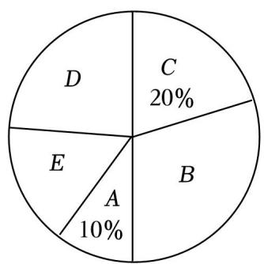

### 📐 统计调查与直方图

**第 01-02 讲 复习**

八年级数学 · 期末复习

---

### 🎯 复习目标

① 能说出统计调查的一般步骤，区分普查与抽样调查的适用场景
② 能正确判断总体、个体、样本和样本容量，用样本估算总体
③ 能根据数据绘制频数分布直方图，从统计图中读取信息并计算

---

### 📖 普查与抽样 · 数据描述

| | 普查 | 抽样调查 |
|---|---|---|
| **对象** | 全体 | 部分 |
| **优点** | 准确、全面 | 省时省力 |
| **适用** | 范围小、无破坏性 | 范围广、有破坏性 |

**简单随机抽样**：机会相等，样本要有**代表性**和**广泛性**。

| 统计图 | 优势 | 不足 |
|---|---|---|
| **条形图** | 显示每组具体数据 | 看不出变化和占比 |
| **折线图** | 反映数据变化趋势 | 看不出占比 |
| **扇形图** | 显示各部分占比 | 看不出每项数目 |

扇形图圆心角 = **360° × 百分比**

---

### 📖 总体·样本 · 频数直方图

- **总体**：全体对象；**个体**：每一个；**样本**：抽取的集合
- **样本容量**：样本中个体**数目**（纯数字，无单位）
- **估算**：总体数量 ≈ 总体总数 ×（样本比例）

- **极差** = 最大值 − 最小值；**组数** ≈ 极差 ÷ 组距
- **频数**：每组数据个数；**频率** = 频数 ÷ 数据总数
- **画直方图**：算极差 → 定组距 → 列频数表 → 画图（无间隙）

---

### 💡 统计图选用小结

| 需求 | 选用 |
|---|---|
| 比较各组具体数量 | 条形统计图 |
| 看变化趋势 | 折线统计图 |
| 看各部分占比 | 扇形统计图 |
| 看数据分布规律 | 频数分布直方图 |

**核心方法**：从图中读数据 → 算比例 → 用样本估计总体。

---

### ✏️ 例题1 调查步骤

实施"双减"政策后，为了解我县初中生每天完成家庭作业所花时间及质量情况，根据以下四个步骤完成调查：①收集数据；②分析数据；③制作并发放调查问卷；④得出结论，提出建议和整改意见．你认为这四个步骤合理的先后排序为（ ）

A．①②③④　B．①③②④　C．③①②④　D．②③④①

请一位同学给出答案并说明理由。

---

### ✏️ 例题1 解析

**答案：C**

**统计调查的一般步骤**：

制作并发放调查问卷 → 收集数据 → 分析数据 → 得出结论、提出建议

③ → ① → ② → ④

---

### ✏️ 例题2-3 调查方法与普查抽样

**例2** 万州区教师进修学院调查某校学生每日睡眠时长问题，选用下列哪种方法最恰当（ ）

A．查阅文献资料　B．对学生问卷调查　C．上网查询　D．对校领导问卷调查

**例3** 下列调查中，适宜采用普查方式的是（ ）

A．了解神舟飞船的设备零部件的质量情况　B．了解一批灯泡的使用寿命　C．了解江苏省中学生观看电影《第二十条》的情况　D．了解无锡市中小学生的课外阅读时间

请一位同学回答

---

### ✏️ 例题2-3 解析

**例2 答案：B** — 调查对象是学生，应直接向学生收集数据

**例3 答案：A**

| 选项 | 方式 | 理由 |
|---|---|---|
| A | 普查 ✓ | 安全关键，必须逐一检查 |
| B | 抽样 | 破坏性试验 |
| C | 抽样 | 涉及范围太广 |
| D | 抽样 | 涉及范围太广 |

---

### ✏️ 例题4 概念辨析

为了解我校八年级600名学生期中数学考试成绩，从中抽取了100名学生的数学成绩进行统计．下列判断正确的是（ ）

A．被抽取的100名学生的数学成绩是总体
B．样本容量是600
C．被抽取的100名学生是总体的一个样本
D．样本容量是100

**关键**：总体/样本/样本容量分别指什么？

请一位同学回答。

---

### ✏️ 例题4 解析

**答案：D**

- **总体**：八年级600名学生的数学**成绩**（不是学生）
- **个体**：每名学生的数学**成绩**
- **样本**：被抽取的100名学生的数学**成绩**（不是100名学生）
- **样本容量**：**100**（纯数字，不带单位）

---

### ✏️ 例题5 样本估算总体

某厂生产了1000只灯泡．为了解这1000只灯泡的使用寿命，从中随机抽取了50只灯泡进行检测，结果有28只灯泡的使用寿命超过了2500小时，那么估计这1000只灯泡中使用寿命超过2500小时的灯泡的数量为 ______ 只．

✏️ 请在练习本上计算

请一位同学回答并展示计算过程。

---

### ✏️ 例题5 解析

**答案：560**

样本中超过2500小时的比例：

$\dfrac{28}{50} = 0.56$

估计总体：

$1000 \times 0.56 = 560$（只）

**公式**：总体中数量 ≈ 总体总数 ×（样本比例）

---

### ✏️ 例题6 频数与频率

在一次数学测试中，将某班40名学生的成绩分为5组，第一组到第四组的频率之和为0.8，则第5组的频数是（ ）

A．7　B．8　C．9　D．10

✏️ 请在练习本上计算

---

### ✏️ 例题6 解析

**答案：B**

第5组的频率：

$1 - 0.8 = 0.2$

第5组的频数：

$40 \times 0.2 = 8$

**公式**：频率 = 频数 ÷ 总数，各组频率之和 = 1

---

### ✏️ 例题7 频数分布表

某校为了解九年级1000名学生一分钟跳绳的情况，随机抽取50名学生进行测试，数据整理如下：

| 个数 | 115~135 | 135~155 | 155~175 | 175~195 | ≥195 |
|---|---|---|---|---|---|
| 人数 | 2 | 5 | 13 | 24 | 6 |

估计九年级1000名学生中跳绳个数不低于175个的人数为 ______ 人．

✏️ 请在练习本上计算

---

### ✏️ 例题7 解析

**答案：600**

样本中不低于175个的人数：$24 + 6 = 30$

样本比例：$\dfrac{30}{50} = 0.6$

估计总体：$1000 \times 0.6 = 600$（人）

---

### ✏️ 例题8 频数直方图应用

兰州市现行居民用水量划分为三级，水价分级递增．某小区随机抽样调查了50户家庭的年用水量，并绘制了频数分布直方图．若该小区共有1000户居民，估计年用水量达到第三级标准（超出180m³）的户数为（ ）

A．30　B．45　C．60　D．90

请一位同学回答

---

### ✏️ 例题8 解析

**答案：C**

从直方图得出：样本中第三级（x > 180）有 3 户

比例：$\dfrac{3}{50} = 0.06$

估计总体：$1000 \times 0.06 = 60$（户）

---

### ✏️ 例题9 统计图综合

某校有学生3000人，准备开展学校社团活动，组建摄影社、国学社、篮球社、科技制作社四个社团．随机抽取了50名学生做问卷调查，得到了如图所示的两个不完整的统计图．

（1）本次抽样调查的样本容量是 ______；
（2）国学（B）上的具体数据是 ______；
（3）科技制作社团（D）所在扇形的圆心角度数是 ______；
（4）估计全校有多少学生报名参加篮球社团活动．

✏️ 请在练习本上完成（限时 5 分钟）

---

### ✏️ 例题9 参考答案

（1）**50**（样本容量 = 抽取人数）

（2）**10 人**（国学占20%，50 × 20% = 10）

（3）**100.8°**

科技制作占比：$1 - 24\% - 20\% - 28\% = 28\%$

圆心角：$360° \times 28\% = 100.8°$

（4）**840 人**

$3000 \times 28\% = 840$（人）

---

### 📝 当堂练习

✏️ 请在练习本上完成（限时 8 分钟）

**第10题**：为调查九年级1200学生体重，将步骤排序：①收集数据；②设计调查问卷；③用样本估计总体；④整理数据；⑤分析数据．

**第11题**：调查学生最喜欢的体育运动，在"①蛙泳，②球类，③游泳，④篮球，⑤自由泳，⑥排球"中选取四个作为问卷备选项，最合理的是（ ）

A．①②③④　B．①④⑤⑥　C．②③⑤⑥　D．②③④⑤

**第12题**：下列适宜普查的是（ ）A．调查市场上蔬菜保鲜情况　B．调查乘坐高铁旅客是否携带违禁物品　C．调查某品牌电池使用寿命　D．调查某地区初中生一天完成作业所用时间

---

### 📝 当堂练习（续）

✏️ 请在练习本上完成（限时 8 分钟）

**第13题**：下列适合抽样调查的是（ ）A．了解全班中学生每周使用手机的时间　B．对乘坐高铁的乘客进行安全检查　C．调查我校初三某班的视力情况　D．环保部门调查任河全域水质情况

**第14题**：为了解某校初二年级900名学生每天花费在数学学习上的时间，抽取了100名学生进行调查，以下说法正确的是（ ）A．样本容量是100　B．每名学生是个体　C．抽取的100名学生是样本　D．初二年级900名学生是总体

**第15题**：抽查20名学生每分钟跳绳次数：65，74，83，87，88，89，91，93，100，102，108，111，117，121，130，133，146，158，177，188．则跳绳次数在90～110这一组的频率是 ______．

---

### 📝 当堂练习 参考答案

**第10题**：②①④⑤③

**第11题**：D（选项应互不包含且具代表性）

**第12题**：B（高铁安检须全面检查）

**第13题**：D（全域水质涉及范围广）

**第14题**：A（个体是每名学生每天花在数学上的**时间**，样本是100名学生的时间数据，总体是900名学生的时间数据）

**第15题**：$0.25$（90～110有 91,93,100,102,108 共5个，5÷20=0.25）

---

### 📝 课后作业

**必做**：
- 讲义第16-20题（选择题，巩固普查/抽样/概念辨析）
- 讲义第21-24题（频数、频率、组数计算）

**选作**：
- 讲义第22题（频数直方图估算）
- 讲义第25题（直方图综合应用，含图片）

**挑战**：
- 讲义第9题全部四问独立完成，写出完整推理过程

---

### 💡 课堂小结

| 层次 | 问题 |
|---|---|
| **基础层** | 普查和抽样调查各适用于什么场景？请各举一例 |
| **中间层** | "从600名学生中抽100名调查，样本容量是100名"这句话对吗？为什么？ |
| **拓展层** | 给了频数直方图，如何用样本估计总体？请说出完整步骤 |

请一位对应层级同学回答

---

### 💡 课堂小结 参考答案

| 层次 | 要点 |
|---|---|
| **基础层** | 普查：范围小、无破坏性、要精确（如全班身高）；抽样：范围广、有破坏性（如灯泡寿命） |
| **中间层** | 不对。样本容量是**纯数字100**，不带单位"名" |
| **拓展层** | 从直方图读目标组频数 → 除以样本容量得比例 → 乘以总体总数得估算值 |
