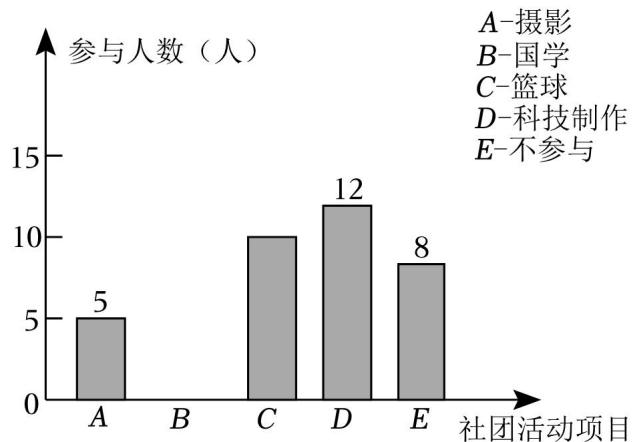
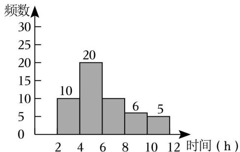
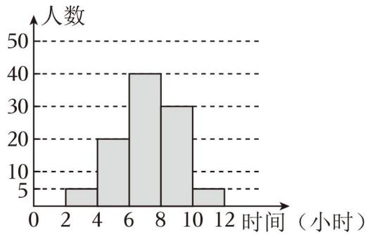

## 第 01-02 讲 统计调查与直方图

> 本讲义整合第01讲「统计调查」与第02讲「直方图」的核心内容，适用于期末复习。

---

## 知识点1 统计调查的过程与方法及全面调查与抽样调查

**1. 统计调查的一般步骤：**

（1）确定调查问题；（2）确定调查对象；（3）确定调查方法与形式；（4）展开调查；（5）统计、整理调查数据；（6）分析数据得出结论。

**2. 收集数据的方式与方法：**

方法：① 问卷调查；② 实地调查；③ 媒体调查；④ 实验法。方式：全面调查与抽样调查。

**3. 整理数据的方法：** 统计中，一般采用表格整理数据，采用"划记"的方法，写"正"字，字的每一笔代表一个数据。

**4. 描述数据的方法：** 一般用统计表与统计图描述数据。

**5. 全面调查与抽样调查：**

| 类型 | 定义 | 优点 | 缺点 | 适用场景 |
|------|------|------|------|----------|
| 全面调查（普查） | 调查全体对象 | 结果准确，数据全面 | 工作量大，耗时耗力 | 范围小、无破坏性、数据要求精确 |
| 抽样调查 | 抽取部分对象调查 | 工作量小，省时省力 | 数据不全面，结果不很准确 | 范围广、涉及面大、有破坏性 |

---

## 知识点2 数据的描述

**1. 数据的两种描述方法：** 数据的描述常利用统计表或统计图。常见的统计图有：条形统计图、折线统计图、扇形统计图。

**2. 条形统计图、折线统计图以及扇形统计图的优缺点：**

| 统计图类型 | 优点 | 缺点 |
|-----------|------|------|
| 条形统计图 | 能够清楚地表示出每一组的具体数据 | 不能表示数据在不同时间内的变化情况以及数据占总数的百分比 |
| 折线统计图 | 能够清楚地反映出数据的变化情况 | 不能表示出数据占总数的百分比 |
| 扇形统计图 | 能够清楚地表示出各部分在总体中所占的百分比 | 不能清楚地表示出每一项的数目 |

**3. 画扇形统计图的步骤：**

第一步：计算百分比——计算各部分数据占总数的百分比。第二步：求圆心角——计算各部分在圆中所对应的圆心角度数，利用公式 **360° × 百分比** 计算。第三步：画扇形——根据第二步求出的圆心角度数在圆中画出各部分的扇形。第四步：在每个扇形中标出相应的名称以及百分比。

---

## 知识点3 总体、个体、样本及样本容量

**1. 总体、个体、样本及样本容量：**

- **总体**：要考察的全体对象。
- **个体**：组成总体的每一个考察对象。
- **样本**：所有被抽取出来的个体组成一个样本。
- **样本容量**：样本中个体的数目（注意：样本容量是一个数字，没有单位）。

**2. 简单随机抽样：** 在抽取样本的过程中，总体中的每一个个体都有相等的机会被抽到，这样的抽样方法是一种简单随机抽样。抽出的样本必须具有**代表性**、**广泛性**。

**3. 用样本估算总体：** 用样本中某部分所占的比例来估计总体中该部分的数量。公式：总体中某部分数量 ≈ 总体数量 × (样本中该部分数量 ÷ 样本容量)。

---

## 知识点4 频数分布直方图

**1. 相关概念：**

- **极差**：一组数据中的最大值与最小值的差。
- **组距**：每一组数据两个端点之间的距离。
- **组数**：把数据分成若干组，分成组数的个数叫做组数。
- **频数**：对落在各个小组内的数据进行累计，得到的各个小组内的数据的个数叫做该小组的频数。
- **频率**：各个小组中频数与数据总数的百分比，即 **频率 = 频数 ÷ 数据总数**。
- **频数分布表**：把各个类别及其对应的频数用表格的形式表示出来，所得表格就是频数分布表。

**2. 画频数分布直方图的步骤：**

第一步：计算极差（最大值 − 最小值）。第二步：确定组数与组距；要求组数与组距的乘积大于极差。第三步：画频数分布表。第四步：画频数分布直方图（横轴表示数据分组，纵轴表示频数，各小长方形之间没有空隙）。

---

## 知识点5 统计图的综合应用

**1. 条形图：** 通过条形的高度来表示数据的大小，它能显示每一组的具体数据，易于比较数据之间的差别。

**2. 折线图：** 通过用数据点的连线来表示一些"连续型"数据的变化趋势，它能清楚地反映数据的变化情况。

**3. 扇形图：** 圆代表整体，图中的各部分扇形分别代表整体中的不同部分，它能反映部分占总体的百分比。

**4. 频数分布直方图：** 用于展示分组数据的频数分布情况，能直观地看出数据的集中趋势和分布规律。

**综合应用要点：** 根据问题需要选择合适的统计图；能从统计图中读取信息并进行计算；能用样本数据估计总体情况。

---

## 例题讲解

1．实施"双减"政策后，为了解我县初中生每天完成家庭作业所花时间及质量情况，根据以下四个步骤完成调查：①收集数据；②分析数据；③制作并发放调查问卷；④得出结论，提出建议和整改意见．你认为这四个步骤合理的先后排序为（ ）

A．①②③④　B．①③②④　C．③①②④　D．②③④①

**答案：** C。统计调查的一般步骤：先制作并发放调查问卷（③），再收集数据（①），然后分析数据（②），最后得出结论、提出建议（④）。

2．万州区教师进修学院为了督查国家双减政策的落实情况，现调查某校学生每日睡眠时长问题，选用下列哪种方法最恰当（ ）

A．查阅文献资料　B．对学生问卷调查　C．上网查询　D．对校领导问卷调查

**答案：** B。调查学生每日睡眠时长，应直接向学生本人收集数据，问卷调查是最合适的方式。

3．下列调查中，适宜采用普查方式的是（ ）

A．了解神舟飞船的设备零部件的质量情况　B．了解一批灯泡的使用寿命　C．了解江苏省中学生观看电影《第二十条》的情况　D．了解无锡市中小学生的课外阅读时间

**答案：** A。神舟飞船零部件质量关系到安全，必须逐一检查，适宜普查。B具有破坏性，C、D涉及范围广，适合抽样调查。

4．为了解我校八年级600名学生期中数学考试成绩，从中抽取了100名学生的数学成绩进行统计．下列判断正确的是（ ）

A．被抽取的100名学生的数学成绩是总体　B．样本容量是600　C．被抽取的100名学生是总体的一个样本　D．样本容量是100

**答案：** D。总体是八年级600名学生的数学成绩；样本是被抽取的100名学生的数学成绩（不是100名学生）；样本容量是100，是一个数字，不带单位。

5．某厂生产了1000只灯泡．为了解这1000只灯泡的使用寿命，从中随机抽取了50只灯泡进行检测，结果有28只灯泡的使用寿命超过了2500小时，那么估计这1000只灯泡中使用寿命超过2500小时的灯泡的数量为 ______ 只．

**答案：** 560。样本中超过2500小时的比例 = 28/50 = 0.56，估计总体：1000 × 0.56 = 560。

6．在一次数学测试中，将某班40名学生的成绩分为5组，第一组到第四组的频率之和为0.8，则第5组的频数是（ ）

A．7　B．8　C．9　D．10

**答案：** B。第5组的频率 = 1 − 0.8 = 0.2，第5组的频数 = 40 × 0.2 = 8。

7．某校为了解九年级1000名学生一分钟跳绳的情况，随机抽取50名学生进行一分钟跳绳测试，获得了他们跳绳的数据（单位：个），数据整理如下：

| 跳绳的个数/个 | 115≤x<135 | 135≤x<155 | 155≤x<175 | 175≤x<195 | x≥195 |
|:---:|:---:|:---:|:---:|:---:|:---:|
| 人数/人 | 2 | 5 | 13 | 24 | 6 |

根据以上数据，估计九年级1000名学生中跳绳的个数不低于175个的人数为 ______ 人．

**答案：** 600。样本中不低于175个的比例 = (24+6)/50 = 30/50 = 0.6，估计总体：1000 × 0.6 = 600。

8．兰州市现行城镇居民用水量划分为三级，水价分级递增．第一级为每户每年不超过144m³的用水量，执行现行居民用水价格；第二级为超出144m³但不超过180m³的用水量，执行现行居民用水价格的1.5倍；第三级为超出180m³的用水量，执行现行居民用水价格的3倍．某小区志愿队为了解该小区居民的用水情况，随机抽样调查了50户家庭的年用水量，并整理绘制了频数分布直方图（如图），若该小区共有1000户居民，请根据相关信息估计该小区年用水量达到第三级标准的户数（ ）

A．30　B．45　C．60　D．90

**答案：** C。从直方图中找出第三级（x>180）的户数，计算比例后乘以1000。样本中第三级有3户，比例 = 3/50 = 0.06，1000 × 0.06 = 60。

9．某校有学生3000人，准备开展学校社团活动，组建摄影社、国学社、篮球社、科技制作社四个社团．每名学生最多只能报一个社团，也可以不报．为了估计各社团人数，现在学校随机抽取了50名学生做问卷调查，得到了如图所示的两个不完整的统计图．

结合以上信息，回答下列问题：

（1）本次抽样调查的样本容量是 ______；

（2）条形统计图国学（B）上的具体数据是 ______；

（3）参与科技制作社团（D）所在扇形的圆心角度数是 ______；

（4）请你估计全校有多少学生报名参加篮球社团活动．

**答案：**（1）50；（2）由扇形图可知国学占20%，50×20%＝10（人）；（3）科技制作占1−24%−20%−28%＝28%，360°×28%＝100.8°；（4）3000×28%＝840（人）。

---

## 当堂练习

10．为了了解某校九年级1200学生的体重情况，请你运用所学的统计知识，将解决上述问题要经历的几个重要步骤进行排序．①收集数据；②设计调查问卷；③用样本估计总体；④整理数据；⑤分析数据．则正确的排序为 ______．（填序号）

**答案：** ②①④⑤③

11．某班调查学生最喜欢的体育运动，设计了如下尚不完整的调查问卷：该班准备在"①蛙泳，②球类，③游泳，④篮球，⑤自由泳，⑥排球"中选取四个作为问卷问题的备选项目，你认为最合理的是（ ）

A．①②③④　B．①④⑤⑥　C．②③⑤⑥　D．②③④⑤

**答案：** D。选项应互不包含且具有代表性，②球类、③游泳、④篮球、⑤自由泳四个选项分类合理。

12．下列调查中，适宜采用普查方式的是（ ）

A．调查市场上蔬菜保鲜的情况　B．调查乘坐高铁的旅客是否携带了违禁物品　C．调查某品牌电池的使用寿命　D．调查某地区初中生一天完成作业所用时间

**答案：** B。乘坐高铁安检需要全面检查，确保安全，适宜普查。A、C、D涉及范围广或具有破坏性，适合抽样调查。

13．下列调查中，适合采用抽样调查的是（ ）

A．了解全班中学生每周使用手机的时间　B．对乘坐高铁的乘客进行安全检查　C．调查我校初三某班的视力情况　D．环保部门调查任河全域水质情况

**答案：** D。调查全域水质涉及范围广，适合抽样调查。A、B、C范围较小，适合普查。

14．为了解某校初二年级900名学生每天花费在数学学习上的时间，抽取了100名学生进行调查，以下说法正确的是（ ）

A．样本容量是100　B．每名学生是个体　C．从中抽取的100名学生是样本　D．初二年级900名学生是总体

**答案：** A。样本容量是100（数字，无单位）。个体是每名学生每天花费在数学学习上的时间，样本是100名学生每天花费的时间，总体是900名学生每天花费的时间。

15．某班在大课间活动中抽查了20名学生每分钟跳绳次数，得到如下数据（单位：次）：65，74，83，87，88，89，91，93，100，102，108，111，117，121，130，133，146，158，177，188．则跳绳次数在90～110这一组的频率是 ______．

**答案：** 0.25。90～110之间有91、93、100、102、108共5个数据，频率 = 5 ÷ 20 = 0.25。

---

## 课后作业

16．要调查某工厂职工的收入情况，下列调查对象选取最合适的是（ ）

A．在该工厂每个车间中随机选取10名职工　B．选取该工厂的一个车间的职工　C．选取该工厂30岁以下的男职工　D．选取该工厂45岁以上的女职工

**答案：** A。分层随机抽样最具代表性，B、C、D都存在样本偏差。

17．某学校数学社团为了解本校学生每天完成家庭作业所花时间，根据以下四个步骤完成调查：①收集数据；②分析数据；③得出结论，提出建议；④制作并发放调查问卷．这四个步骤的先后顺序为（ ）

A．①②③④　B．④①②③　C．①③②④　D．④①③②

**答案：** B。先制作发放问卷（④），再收集数据（①），然后分析数据（②），最后得出结论（③）。

18．下列调查中，最适宜全面调查的是（ ）

A．检测某城市的空气质量　B．检查一枚运载火箭的各零部件　C．调查某款节能灯的使用寿命　D．调查观众对春节联欢晚会的满意度

**答案：** B。火箭零部件检查要求精确全面，且范围可控，适宜普查。A、C、D适合抽样调查。

19．邳州市今年共约有38000名考生参加体育中考，为了了解这38000名考生的体育成绩，从中抽取了1000名考生的体育成绩进行统计分析，以下说法正确的是（ ）

A．该调查方式是普查　B．每一名考生是个体　C．抽取的1000名考生的体育成绩是总体的一个样本　D．样本容量是1000名考生

**答案：** C。该调查是抽样调查；个体是每名考生的体育成绩；样本容量是1000（不带单位）。

20．某校为了解七年级14个班级学生吃零食的情况，下列做法中，比较合理的是（ ）

A．了解每一名学生吃零食情况　B．了解每一名女生吃零食情况　C．了解每一名男生吃零食情况　D．每班各抽取7男7女，了解他们吃零食情况

**答案：** D。采用分层随机抽样，兼顾男女和班级，最具代表性。

21．已知在一个样本中，40个数据分别落在4个组内，第一、二、四组数据个数分别为5、12、8，则第三组的频数为（ ）

A．0.375　B．0.6　C．15　D．25

**答案：** C。第三组的频数 = 40 − 5 − 12 − 8 = 15。

22．某校随机抽取50名学生进行每周课外阅读时间的问卷调查，将调查结果制成频数分布直方图如图所示（每组包含最大值，不包含最小值）．估计该校1800名学生中每周阅读时间多于6小时的学生共有（ ）

A．20人　B．396人　C．720人　D．1080人

**答案：** C。从直方图可知，样本中多于6小时的有20人，比例 = 20/50 = 0.4，1800 × 0.4 = 720。

23．已知样本21，21，22，23，24，25，25，25，26，26，26，27，28，29，29，30．若组距为2，那么应分得的组数是 ______．

**答案：** 5。极差 = 30 − 21 = 9，组距为2，组数约为 9÷2 = 4.5，取5组。

24．在今年的体育健康测试中，某校对800名女生的身高进行测量，身高在1.55m至1.65m这组的频率为0.4，则该组的人数为 ______ 名．

**答案：** 320。800 × 0.4 = 320。

25．为了解某区初中学生每月参加社团活动时间的情况，随机抽查了100名学生的社团活动时间进行统计，并绘制成如图所示的频数分布直方图（每组数据含最小值，不含最大值），已知该区初中生共有8000名，依此估计，该区每月参加社团活动的时间不少于8小时的学生数大约是 ______ 名．

**答案：** 2800。从直方图可知，样本中不少于8小时的有35人，比例 = 35/100 = 0.35，8000 × 0.35 = 2800。

---

## 原始数量与选用数量对比

### 一、总体对比

| 类别 | 01讲（统计调查） | 02讲（直方图） | 合计原始数量 | 选用数量 | 选用率 |
|------|:---:|:---:|:---:|:---:|:---:|
| 知识点 | 4 | 2 | 6 | 5 | 83% |
| 典例 | 6 | 5 | 11 | 9 | 82% |
| 变式 | 12 | 17 | 29 | 7 | 24% |
| 课后作业 | 20 | 20 | 40 | 10 | 25% |

### 二、知识点覆盖

| 来源 | 原始知识点 | 复习讲义知识点 | 备注 |
|------|-----------|---------------|------|
| 01讲 | 调查、收集数据的过程与方法 | 知识点1 统计调查的过程与方法及全面调查与抽样调查 | 合并 |
| 01讲 | 全面调查与抽样调查 | 知识点1 统计调查的过程与方法及全面调查与抽样调查 | 合并 |
| 01讲 | 数据的描述 | 知识点2 数据的描述 | 保留 |
| 01讲 | 总体、个体、样本及样本容量 | 知识点3 总体、个体、样本及样本容量 | 保留 |
| 02讲 | 频数分布直方图 | 知识点4 频数分布直方图 | 保留 |
| 02讲 | 统计图的综合应用 | 知识点5 统计图的综合应用 | 保留 |

### 三、题型典例与变式选用明细

| 来源 | 题型名称 | 原始典例 | 原始变式 | 选用典例 | 选用变式 | 覆盖 |
|------|---------|:---:|:---:|:---:|:---:|:---:|
| 01讲 | 统计调查的过程与方法 | 2 | 4 | 2 | 2 | 是 |
| 01讲 | 全面调查与抽样调查 | 2 | 2 | 1 | 2 | 是 |
| 01讲 | 总体、个体、样本及样本容量的理解 | 1 | 3 | 1 | 1 | 是 |
| 01讲 | 用样本估算总体 | 1 | 3 | 1 | 0 | 是 |
| 02讲 | 频数与频率的计算 | 1 | 3 | 1 | 1 | 是 |
| 02讲 | 频数分布表 | 1 | 3 | 1 | 0 | 是 |
| 02讲 | 频数分布直方图 | 1 | 3 | 1 | 1 | 是 |
| 02讲 | 统计图表的综合应用 | 1 | 5 | 1 | 0 | 是 |

---

## 题目信息总览

| 题目ID | 知识考察点 | 难度 | 入选理由 |
|--------|-----------|:---:|----------|
| 1 | 统计调查的步骤排序 | ★ | 基础考点，典例代表 |
| 2 | 调查方法的选择 | ★ | 基础考点，典例代表 |
| 3 | 普查方式的判断 | ★ | 核心概念辨析，典例代表 |
| 4 | 总体、个体、样本、样本容量的判断 | ★★ | 核心概念辨析，易错点 |
| 5 | 用样本估算总体 | ★★ | 核心方法，典例代表 |
| 6 | 频数与频率的计算 | ★★ | 频数直方图基础计算 |
| 7 | 频数分布表的应用 | ★★ | 频数表应用，典例代表 |
| 8 | 频数分布直方图的应用 | ★★ | 直方图应用，典例代表 |
| 9 | 统计图的综合应用 | ★★★ | 综合应用能力考察 |
| 10 | 统计调查步骤排序 | ★ | 即学即练，巩固步骤 |
| 11 | 调查问卷设计 | ★ | 即学即练，实践应用 |
| 12 | 普查方式的判断 | ★ | 即学即练，概念辨析 |
| 13 | 抽样调查的判断 | ★ | 即学即练，概念辨析 |
| 14 | 总体、个体、样本的判断 | ★★ | 核心概念辨析 |
| 15 | 频率的计算 | ★★ | 基础计算巩固 |
| 16 | 调查对象选取 | ★ | 抽样方法应用 |
| 17 | 调查步骤排序 | ★ | 步骤巩固 |
| 18 | 全面调查的判断 | ★ | 概念辨析 |
| 19 | 总体、个体、样本的判断 | ★★ | 核心概念辨析 |
| 20 | 抽样调查方法设计 | ★★ | 抽样方法应用 |
| 21 | 频数的计算 | ★ | 基础计算巩固 |
| 22 | 频数直方图的应用 | ★★ | 直方图应用 |
| 23 | 组数的计算 | ★ | 基础计算巩固 |
| 24 | 频率与频数的计算 | ★ | 基础计算巩固 |
| 25 | 频数直方图估算 | ★★ | 直方图应用 |