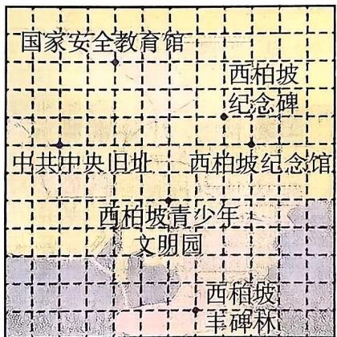
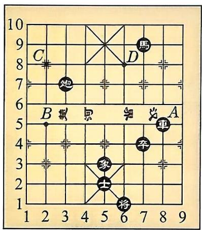
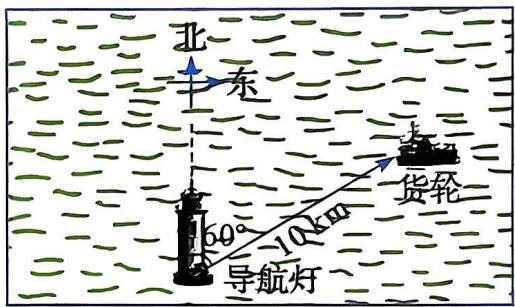
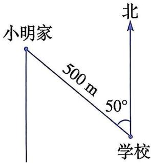
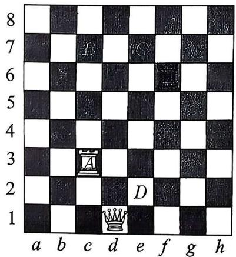
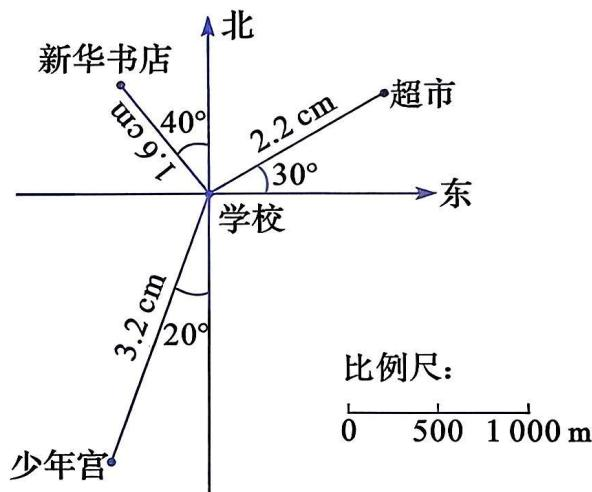
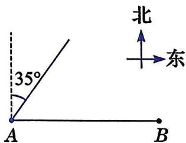

# 第十八章 平面直角坐标系

在现实生活中，对位置的确定有许多方法。例如，在乘坐高铁或飞机时，可以通过行和列来确定座位；在地图上，可以使用经纬度来确定地理位置；在数学中，我们学过数轴上的点与实数一一对应。那么，如何确定平面上点的位置呢？ 

在本章中，我们将在综合思考确定位置的多种方法的基础上，类比数轴的学习过程，学习平面直角坐标系的有关概念、平面直角坐标系的画法、图形的位置与坐标、图形的运动与坐标。 

通过本章的学习, 我们将感悟平面直角坐标系是沟通代数与几何的桥梁, 理解平面上点与坐标之间的一一对应关系, 经历通过几何建立直观、用代数进行数学表达的过程, 进一步提升几何直观、抽象能力和推理能力. 

新中国从这里走来！西柏坡是见证革命历史、领略领袖风采的著名爱国主义教育基地。你能结合西柏坡景区的景点分布图，以西柏坡纪念碑为参照点，确定各景点的位置吗？ 

# 18.1 位置的确定

现实生活中，在平面上确定位置的方法有很多。这些方法常常与两个元素有关。 

每名同学在教室里都有一个确定的座位，按照列在前、行在后的顺序，每个座位都可以用一个有序数对来表示。例如，小明在第3列第5行，可以用有序数对(3, 5)来表示他的座位位置。 

按照上面的表示方法，说一说自己在教室里的座位应该怎样表示。教室里每个座位都能用有序数对来表示吗？ 

# 做一做

图 18.1-1 是中国象棋棋盘的示意图, 部分黑棋的棋子摆在这些交叉点上, 每个交叉点的位置按照先列后行的顺序都可以用有序数对来表示. 

图18.1-1

(1) 用有序数对分别表示 “车” “马” “炮” 所在的位置. 

(2) 有序数对(5, 3)和(7, 4)分别表示哪枚棋子的位置? 

(3) 象棋规则规定: “车” 只能沿直线行走, 一次可以走任意格. 请用有序数对来描述 “车” 的行走路线: $A \rightarrow B \rightarrow C \rightarrow D$ . 

由上可知，在平面内，物体的位置可以用有序数对来表示。但在航海、航空和工程测量中，通常又用“方位角和距离”来表示物体的位置。 

从某个参照点看物体, 视线与正北(或正南)方向射线的夹角称为方位角(azimuth angle). 

# 观察与思考

如图 18.1-2，在某个时刻，一艘货轮在导航灯北偏东 $60^{\circ}$ 的方向上，且距离导航灯 $10 \mathrm{~km}$ . 

图18.1-2

(1) 如何用方位角和距离描述导航灯相对于货轮的位置? 

(2) 在同一时刻, 一艘客轮在导航灯北偏西 $30^{\circ}$ 的方向上, 且距离导航灯 $5 \mathrm{~km}$ . 请在图中标出这艘客轮的位置. 

采用 “方位角和距离” 来表示物体位置的方法, 要明确参照点. 选择不同的参照点来表示同一个物体的位置, 结果是不同的. 

在地图上，常常用经纬度来表示地理位置。例如，我国首都北京位于北纬 $39^{\circ}56'$ ，东经 $116^{\circ}20'$ ；上海位于北纬 $31^{\circ}14'$ ，东经 $121^{\circ}29'$ 。 

# 做一做

2013 年 9 月和 10 月，国家主席习近平在出访中亚和东南亚国家期间，先后提出共建 “丝绸之路经济带” 和 “21 世纪海上丝绸之路” 的重大倡议，简称共建 “一带一路” 倡议。根据 “一带一路” 走向，请依据地图，写出下列 “丝绸之路经济带” 所经过城市的大致地理位置。 

兰州、乌鲁木齐、撒马尔罕、德黑兰、伊斯坦布尔、莫斯科、杜伊斯堡。 

# 练习

1. 在办公软件电子表格的界面上, 每个单元格的位置都可以用字母和数字确定。如图, 单元格 A1, B1, C1, D1 中的内容分别为 “姓名” “演讲” “绘画” “书法”。 

(1) 请分别指出单元格 A2, B3, C4, D5 中的内容. 

(2) 请分别指出王涛的演讲成绩和张磊的书法成绩所在的单元格. 

|  | A | B | C | D |
| --- | --- | --- | --- | --- |
| 1 | 姓名 | 演讲 | 绘画 | 书法 |
| 2 | 李明 | 88 | 92 | 90 |
| 3 | 张磊 | 86 | 94 | 82 |
| 4 | 王涛 | 78 | 90 | 86 |
| 5 | 刘强 | 90 | 87 | 91 |
| 6 |  |  |  |  |

(第1题)

(第2题)

2. 如图, 如何描述小明家相对于学校的位置? 学校相对于小明家的位置又该怎样描述? 

# 习题

# A 组

1. 如图, 国际象棋棋盘由纵横各 8 格、颜色深浅交错排列的 64 个小方格组成, 棋子可以在这些方格中移动。列和行分别用字母和数字标记, 按照先列后行的顺序, “白车” 所在方格 $A$ 的位置可用 $(c, 3)$ 表示。 

(第1题)

(1) 按照上述规定, “白后” 和 “黑车” 所在方格的位置应该如何表示呢? 

(2) 如果从左到右的 8 列也分别用数字 1 到 8 标记, 那么应该如何表示 “白后” 和 “黑车” 的位置呢? 

(3) 国际象棋规则规定：“车”只能沿直线行走, 一次可以走任意格。请按(2)题中的规定, 用有序数对描述 “白车” 的行走路线: $A \rightarrow B \rightarrow C \rightarrow D$ . 

2. 如图, 以学校为参照点, 请用方位角和实际距离分别表示新华书店、少年宫和超市的位置。 

(第2题)

3. 如图, 甲船从码头 $A$ 出发, 沿北偏东 $35^{\circ}$ 的方向行驶可以直达小岛 $C$ . 码头 $B$ 在码头 $A$ 的正东方向, 当乙船与甲船分别从码头 $B$ , $A$ 同时等速出发, 并直接驶向小岛 $C$ 时, 两船可以同时到达. (水流速度忽略不计) 

(第3题)

(1) 请在图中画出小岛 C 的位置。 

(2) 如果 AC=150 km，那么应该如何用方位角和距离描述小岛 C 相对于码头 B 的位置呢？ 

# B 组

4. 某校八年级师生到郊外进行夏令营活动，关于营地驻扎的信息如下： 

1号营地在大本营北偏东 $30^{\circ}$ 的方向上，距大本营 $500 \mathrm{~m}$ 处； 

2号营地在大本营北偏西 $45^{\circ}$ 的方向上，距大本营 $600 \mathrm{~m}$ 处； 

3号营地在大本营南偏东 $60^{\circ}$ 的方向上, 距大本营 $400 \mathrm{~m}$ 处. 

根据以上信息，按 1:10 000 的比例尺画出各营地的位置图. 

5. 根据 “一带一路” 走向, “21 世纪海上丝绸之路” 以重点港口为节点, 共同建设通畅安全高效的运输大通道。请依据地图, 写出下列 “21 世纪海上丝绸之路” 所经过港口城市的大致地理位置。 

福州、广州、河内、吉隆坡、雅加达、科伦坡、加尔各答、内罗毕、雅典、威尼斯、鹿特丹.
