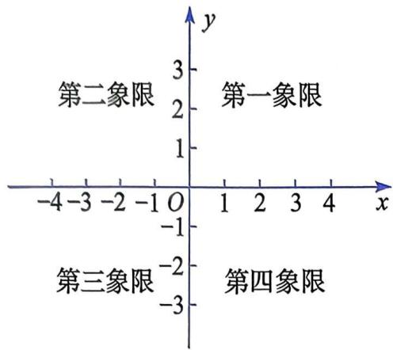
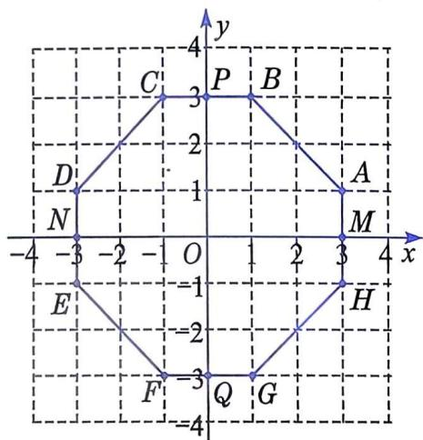
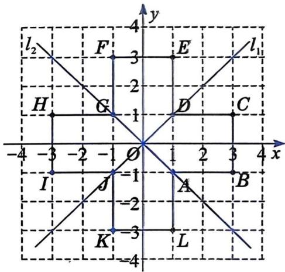

# 平面直角坐标系(2)

如图 18.2-6, 平面直角坐标系的两条坐标轴将平面分成了四个部分,从右上方的部分开始, 按逆时针方向, 各部分依次叫作第一象限、第二象限、第三象限和第四象限。坐标轴上的点不属于任何一个象限。 

图18.2-6

# 一起探究

如图18.2-7，八边形 $ABCDEFGH$ 与两条坐标轴的交点分别是 $M$ ， $N, P, Q$ 四点。 

图18.2-7

(1) 分别写出各点的坐标. 

(2) 观察各点的坐标, 你认为同一象限内点的坐标的共同特点是什么? 

(3) 指出坐标轴上点的坐标的共同特点. 

(4) 分别写出点 $B$ 关于 $x$ 轴的对称点的坐标, 关于 $y$ 轴的对称点的坐标, 关于原点的对称点的坐标. 关于 $x$ 轴、 $y$ 轴和原点对称的点的特征分别是什么? 

关于 $x$ 轴对称的两点, 横坐标相等, 纵坐标互为相反数; 关于 $y$ 轴对称的两点, 横坐标互为相反数, 纵坐标相等; 关于原点对称的两点, 横坐标和纵坐标分别互为相反数. 

例 2 在平面直角坐标系中，解决下列问题： 

(1) 描出下列各点, 并把各点依次连接成封闭图形. 

$$
A (1, - 1), B (3, - 1), C (3, 1), D (1, 1), E (1, 3),
$$

$$
F (- 1, 3), G (- 1, 1), H (- 3, 1), I (- 3, - 1),
$$

$$
J (- 1, - 1), K (- 1, - 3), L (1, - 3).
$$

(2) 观察所得的图形, 它是轴对称图形吗? 如果是轴对称图形, 画出它的对称轴. 

(3) 在(1)题的各点中, 分别写出关于 $x$ 轴、 $y$ 轴和原点对称的点. 

解：（1）描点，连线后得到的图形如图 18.2-8 所示. 

(2) 这个图形是轴对称图形, 它有四条对称轴: $x$ 轴, $y$ 轴, $l_{1}, l_{2}$ . 

(3) 关于 $x$ 轴对称的点分别是点 $A$ 和点 $D$ , 点 $B$ 和点 $C$ , 点 $E$ 和点 $L$ , 点 $F$ 和点 $K$ , 点 $G$ 和点 $J$ , 点 $H$ 和点 $I$ . 

关于 y 轴对称的点分别是点 A 和点 J，点 B 和点 I，点 C 和点 H，点 D 和点 G，点 E 和点 F，点 L 和点 K。关于原点对称的点分别是点 A 和点 G，点 B 和点 H，点 C 和点 I，点 D 和点 J，点 E 和点 K，点 F 和点 L。 

图18.2-8

# 练习

1. 点 $A(-3, 4)$ 在第 ____ 象限，其到 $x$ 轴的距离为 ____ ，到 $y$ 轴的距离为 ____ ，到原点的距离为 ____. 

2. 点 $B(3, -5)$ 在第 ____ 象限，其关于 $x$ 轴的对称点的坐标为 ____ ，关于 $y$ 轴的对称点的坐标为 ____ ，关于原点的对称点的坐 

标为____。 

3. 在平面直角坐标系中，点 $A$ 的坐标为(4, 2)。 

(1) 分别画出点 $A$ 关于 $x$ 轴、 $y$ 轴和原点的对称点 $B, C, D$ , 并分别写出点 $B, C, D$ 的坐标。 

(2) 四边形 $ABDC$ 是轴对称图形吗? 如果是轴对称图形, 请画出它的对称轴。 

# 习题

# A 组

1. 若 $P(a, -2a)$ 是第二象限内的点，则 a 的取值范围是 ____. 

2. 已知点 $P(a, b)$ 在第三象限, 那么点 $Q(a, -b)$ 在第 象限, 点 $M(-a, b)$ 在第 象限, 点 $N(-a, -b)$ 在第 象限. 

3. 在平面直角坐标系中, 已知直线 $AC$ 垂直于 $x$ 轴, 垂足为 $C$ , 点 $A$ 的坐标是 (1, 2)。求点 $C$ 的坐标。 

4. 建立平面直角坐标系，解决以下问题： 

(1) 描出下列各点，并把各点依次连接成封闭图形. 

$$
A (- 2, 3), B (2, 3), C (5, 0),
$$

$$
D (2, - 3), E (- 2, - 3), F (- 5, 0).
$$

(2) 指出上面各点所在的象限或坐标轴。 

(3) 分别写出上面各点关于 $x$ 轴、 $y$ 轴和原点对称的点. 

# B 组

5. 如果点 $M(a, b)$ 在第四象限，且到 x 轴和 y 轴的距离相等，那么 a 和 b 的关系是 ____。 

6. 如果 $M(a, b)$ ， $N(c, d)$ 是平行于 x 轴的一条直线上的两点，那么 b 与 d 的关系是 ____。 

7. 在长方形 $ABCD$ 中, 点 $A$ 的坐标为 $(-2, 3)$ , 点 $B$ 的坐标为 $(3, 3)$ , $BC = 8$ . 求点 $C$ 的坐标。
