# 18.3 图形的位置与坐标

在坐标平面中，利用图形上点的坐标可以描述图形的位置。因此，建立适当的平面直角坐标系，能够方便地解决一些问题。 

如图 18.3-1，小亮画了一个四边形，他想通过电话告诉小强，让小强也能准确地画出相同的图形。 

大家替他想想办法，如何用语言描述这个四边形. 

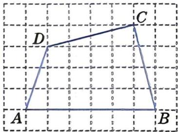
图18.3-1

# 大家谈谈

小明说：“建立平面直角坐标系，告诉这个四边形四个顶点的坐标就能画出相同的图形。” 

你认为小明的说法可行吗？说说理由。 

在实际生活中，经常需要建立适当的平面直角坐标系，通过坐标来描述某个图形的位置与形状. 

# 一起探究

已知一个边长为 4 的正方形。建立适当的平面直角坐标系，通过各顶点的坐标来描述它的位置。 

(1) 图 18.3-2(1)，(2)，(3) 分别是三名同学建立的平面直角坐标系。请分别将四边形各顶点的坐标填写在下面的表格中。 

| 平面直角坐标系 | 点A的坐标 | 点B的坐标 | 点C的坐标 | 点D的坐标 |
| --- | --- | --- | --- | --- |
| (1) |  |  |  |  |
| (2) |  |  |  |  |
| (3) |  |  |  |  |

| | | |
|:---:|:---:|:---:|
| 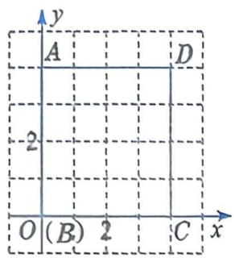 | 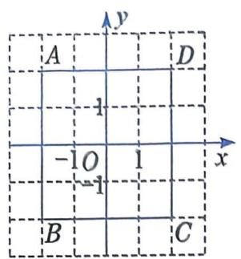 | 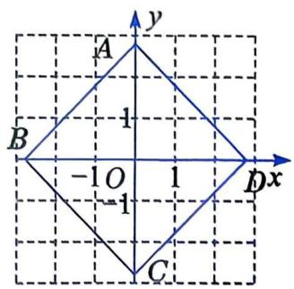 |
| (1) | (2) | (3) |

图18.3-2

(2) 这三种建立平面直角坐标系的方式各有什么优点？说说你的看法。 

(3) 你还能建立其他平面直角坐标系吗? 

建立不同的平面直角坐标系，同一个图形的顶点坐标也不同，应根据图形的特点及实际情况来建立适当的平面直角坐标系. 

# 做一做

如图 18.3-3，在等腰三角形 $ABC$ 中，底边 $BC = 4$ ，高 $AD = 6$ . 

(1) 请在网格图中建立适当的平面直角坐标系, 并写出点 $A, B, C$ 的坐标. 

(2) 说明你建立这个平面直角坐标系的理由. 

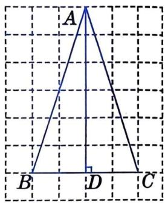
图18.3-3

# 练习

1. 选择适当的方法，将图中图形的形状告诉你的同学，以便他们能画出相同的图形。 

| | |
|:---:|:---:|
| 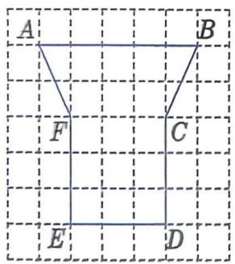 | 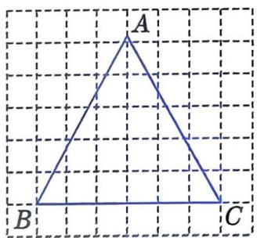 |
| (第1题) | (第2题) |

2. 如图, 已知等边三角形 $ABC$ 的边长为 6. 请建立适当的平面直角坐标系, 并写出顶点 $A, B, C$ 的坐标. 

# 习题

# A 组

1. 小敏画了一个如图所示的四边形。如果小红不看这个图形，小敏用什么方法能让小红也画出同样的图形？ 

| | |
|:---:|:---:|
| 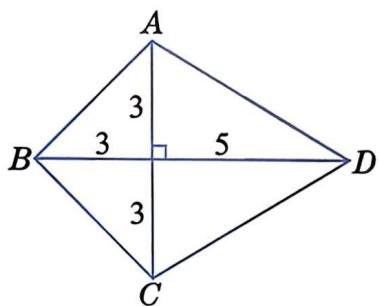 | 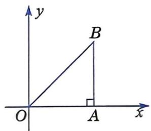 |
| (第1题) | (第2题) |

2. 如图, 在平面直角坐标系中, 等腰直角三角形 $OAB$ 的斜边 $OB$ 的长为 

4 个单位长度. 

(1) 写出点 B 的坐标. 

(2) 还可以怎样建立平面直角坐标系, 使得各顶点的坐标更为简单? 

3. 如图，请建立适当的平面直角坐标系，并用坐标表示各旅游景点的位置。 

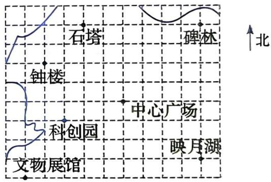
(第3题)

# B 组

4. 已知点 $A$ 的坐标为 $(0, 0)$ , 点 $B$ 的坐标为 $(4, 0)$ , 点 $C$ 在 $y$ 轴上, $\triangle ABC$ 的面积为 10. 求点 $C$ 的坐标, 并在平面直角坐标系中画出符合条件的三角形. 

5. 在一次夏令营活动中, 老师将一份行动计划藏在没有任何标记的点 $C$ 处, 只告诉大家点 $A$ 和点 $B$ 处各是一棵树, 坐标分别为 (0, 0), (30, 10), 点 $C$ 的坐标为 (20, 20). 请确定点 $C$ 的位置, 尽快找到这份行动计划. (单位: m) 

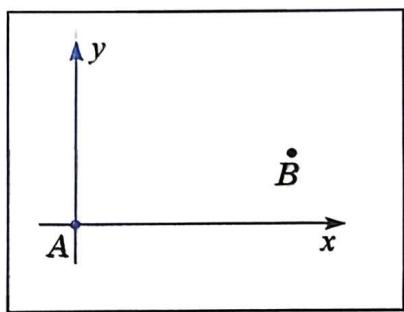
(第 5 题)
