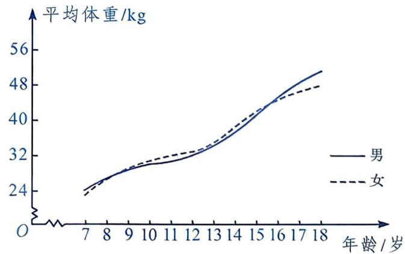
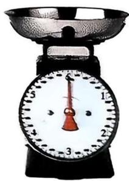
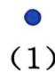
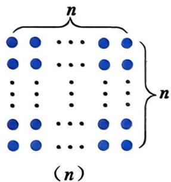

# 第十九章 函数

许多实际问题常常会涉及两个变化的量之间的关系，如人的心率会在运动过程中随时间的变化而变化，青少年的平均体重会随其年龄的变化而变化，等等。那么，如何刻画这些变化的量之间的关系呢？ 

在本章中，我们将结合丰富的实例，类比方程和不等式的学习过程，学习常量和变量、函数的有关概念及表示方法、函数的初步应用. 

通过本章的学习, 我们将认识一种新的数学模型——函数。函数刻画了一对相互依存的量之间的对应关系, 反映了事物的变化过程与变化规律。学习函数有利于提升抽象能力, 形成模型观念, 发展应用意识。 

如 图是某地区学生的平均体重（kg）随年龄（岁）变化的图象，你能从中获得哪些有价值的信息呢？ 

# 19.1 常量和变量

在描述一个事物的变化过程时，常常会涉及一些量。其中，有些量是不变的，有些量是变化的。 

我们知道，物体在匀速运动过程中，路程 $=$ 速度 $\times$ 时间。 

这里的路程、速度和时间就是三个不同的量.这些量在不同的变化过程中会有怎样的具体表现形式呢? 

# 一起探究

1. 中国标准动车组“复兴号”是由我国自主研发、具有完全自主知识产权、达到世界先进水平的新一代高速列车，也是我国科技创新的又一重大成果。已知某高速列车在一运行区间内匀速行驶，速度为 $350 \mathrm{~km} / \mathrm{h}$ 。 

(1) 填写下表: 

| 时间t/h | 0.5 | 1 | 1.5 | 2 |
| --- | --- | --- | --- | --- |
| 路程s/km |  |  |  |  |

(2) 在这个问题中, 哪些量是不变的, 哪些量是变化的? 变化的量之间存在着怎样的关系? 

2. 用一根长为 $20 \mathrm{~cm}$ 的细铁丝任意折出一个长方形。在长方形的长、宽、周长和面积这四个量中, 哪些量是不变的; 哪些量是变化的? 变化的量之间存在着怎样的关系? 

3. 类似地, 请再举出两个实际问题的例子, 并分别说明它们各含有几个不同的量, 其中哪些量是不变的, 哪些量是变化的. 

在问题 1 中，共有三个量。其中，速度 350 km/h 是不变的量，路程和 

时间都是变化的量，它们之间满足关系 s=350t. 

在问题2中，共有四个量。其中，长方形的周长 $20 \mathrm{~cm}$ 是不变的量，长方形的长、宽和面积都是变化的量。如果用 $a$ 表示折出的长方形的长，用 $S$ 表示长方形的面积，那么长方形的宽为 $\frac{20 - 2a}{2} = 10 - a$ ， $S$ 和 $a$ 之间满足关系 $S = a(10 - a)$ 。 

在一个变化过程中, 数值保持不变的量叫作常量(constant), 而可以取不同数值的量叫作变量(variable). 

# 大家谈谈

请指出你自己举出的两个例子中的常量和变量. 

# 做一做

在下列各问题中，分别有几个量？其中哪些量是常量，哪些量是变量？这些量之间具有怎样的关系？ 

(1) 每张电影票的售价为 50 元。某日共售出 $x$ 张票, 票房收入为 $y$ 元。 

(2) 一台小型台秤最大称重为 $6 \mathrm{~kg}$ , 每添加 $0.1 \mathrm{~kg}$ 重物, 指针就转动 $6^{\circ}$ 的角. 添加重物质量为 $m \mathrm{~kg}$ 时, 指针转动的角度为 $\alpha$ . 

（3）如图19.1-1，有 $n$ 个点阵图，其中第 $n$ 个点阵图中点的总个数为 $a$ . 

  
| | | | | |
|:---:|:---:|:---:|:---:|:---:|
|  |  |  |  |  |
| 图19.1-1 | | | | |

# 练习

1. 已知数 $a$ 比数 $b$ 的平方大 1。 

(1) 填写下表: 

| b | -3 | -2 | -0.5 | 0 | 1 | \(\sqrt{3}\) | 3 | 5 | 100 |
| --- | --- | --- | --- | --- | --- | --- | --- | --- | --- |
| a |  |  |  |  |  |  |  |  |  |

(2) 请指出问题中的常量和变量, 并写出 $a$ 与 $b$ 之间的关系式. 

2. 已知一个梯形的高为 10，下底长是上底长的 2 倍。设这个梯形的上底长为 $x$ ，面积为 $S$ 。请指出问题中的常量和变量，并写出 $S$ 与 $x$ 之间的关系式。 

# 习题

# A 组

1. 写出下列各问题中的常量和变量： 

(1) 购买单价为 5 元的钢笔 n 支，共花去 y 元. 

(2) 某汽车以 $60 \mathrm{~km} / \mathrm{h}$ 的速度行驶了 $t \mathrm{~h}$ , 所走的路程为 $s \mathrm{~km}$ . 

(3) 神舟飞船绕地球一周约需 90 min, t min 绕地球的周数为 N. 

2. 粮店在某一段时间内以 4.8 元/千克的价格出售同一种大米。在售米的过程中，出售大米的质量记为 $m(\mathrm{kg})$ ，获得的米款记为 $W(\text{元})$ 。其中，哪些量是常量，哪些量是变量？ 

# B 组

3. 某中学八年级(2)班的同学平均每人一学期要使用某种笔记本8本, 这种笔记本的售价是 3 元/本。 $n$ 名同学一学期买这种笔记本的总金额为 $m$ 元。请指出问题中的常量和变量, 并写出 $m$ 与 $n$ 之间的关系式。 

4. 某地某一时刻的地面温度为 $10^{\circ} \mathrm{C}$ , 高度每增加 $1 \mathrm{~km}$ , 温度下降 $4^{\circ} \mathrm{C}$ . 请指出问题中的常量和变量, 并写出该地某一高度这一时刻的温度 $y(^{\circ} \mathrm{C})$ 与高度 $x(\mathrm{km})$ 之间的关系式.
