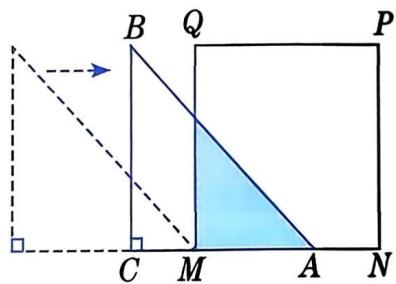

# 函数(2)

函数的自变量可以在允许的范围内取值，超出这个范围可能失去意义，这就是函数的自变量的取值范围问题。 

# 大家谈谈

在前面讲到的“自动售货机 1～6 月的每月纯收入 S(元)是月份 n 的函数”“某市某一天的气温 T(℃)是时刻 t 的函数”“报告厅内第 n 排的座位数 m 是排数 n 的函数”中，自变量分别可取哪些值？为什么？ 

实际上，在上述三个问题中，月份 n 只能取 1, 2, 3, 4, 5, 6；时刻 t 可取这一天 0 时至 24 时中的任意值；排数 n 只能取小于或等于 30 的正整数。 

例如图19.2-3，等腰直角三角形 $ABC$ 的直角边长与正方形MNPQ的边长均为 $10 \mathrm{~cm}$ ，边CA与边MN在同一条直线上，点A与点M 重合。让△ABC 沿 MN 方向运动，当点 A 与点 N 重合时停止运动。试写出运动中两个图形重叠部分的面积 $y(\mathrm{cm}^{2})$ 与 MA 的长度 $x(\mathrm{cm})$ 之间的函数关系式，并指出自变量的取值范围。 

图19.2-3

解: 因为等腰直角三角形 $ABC$ 的直角边长与正方形 $MNPQ$ 的边长均为 $10 \mathrm{~cm}$ , 所以 $AC = BC = Q M = M N$ , $\angle B A C = 45^{\circ}$ , $\angle Q M N = 90^{\circ}$ . 所以, 运动中两个图形的重叠部分也是等腰直角三角形。 

由 $MA = x$ ，得 

$$
y = \frac {1}{2} x ^ {2}, 0 \leqslant x \leqslant 1 0.
$$

函数自变量的取值范围由两个条件所确定：一是使函数表达式有意义，二是使所描述的实际问题有意义。 

# 做一做

1. 求下列函数中自变量的取值范围: 

(1) $y = 2x^{2} + 7$ ; 

(2) $y = \frac{2}{x(x + 1)}$ ; 

(3) $y = \frac{1}{\sqrt{x - 2}}$ . 

2. 某市居民用电的收费标准为 0.52 元/(千瓦·时)，求电费 y(元)与用电量 x(千瓦·时)之间的函数关系式，并指出自变量的取值范围. 

3. 已知一等腰三角形的面积为 $20 \mathrm{~cm}^{2}$ . 设它的底边长为 $x \mathrm{~cm}$ , 底边上的高为 $y \mathrm{~cm}$ , 求 $y$ 与 $x$ 之间的函数关系式, 并指出自变量的取值范围. 

# 练习

1. 求下列函数中自变量的取值范围： 

(1) $y = 2x - 5$ ; 

(2) $y = \frac{2}{x^2 - 1};$ 

(3) $y = \sqrt{2 - x}$ . 

2. 一辆长途汽车以 $60 \mathrm{~km} / \mathrm{h}$ 的平均速度从甲地驶往乙地。已知甲、乙两地之间的路程为 $270 \mathrm{~km}$ , 求汽车距乙地的路程 $s(\mathrm{km})$ 与行驶时间 $t(\mathrm{h})$ 之间的函数关系式, 并指出自变量的取值范围。 

# A 组

1. 求下列函数中自变量的取值范围： 

(1) $y = -x$ ; 

(2) $y = \frac{1}{2} x + \frac{2}{3x};$ 

(3) $y = \frac{1}{2x - 1}$ ; 

(4) $y = \sqrt{x + 4}$ . 

2. 某工厂生产某种产品, 每件产品的生产成本为 25 元, 出厂价为 50 元。在生产过程中, 平均每生产一件这种产品有 $0.5 \mathrm{~m}^{3}$ 的污水排出。为净化环境, 该厂购买了一套污水处理设备, 每处理 $1 \mathrm{~m}^{3}$ 污水所需原材料费为 2 元, 每月排污设备耗费 30000 元。 

(1) 求该厂每月的利润与产品件数之间的函数关系式. 

(2) 为保证盈利, 该厂每月至少需生产并销售这种产品多少件? 

# B 组

3. 求函数 $y=\sqrt{x-2}-\sqrt{x+3}$ 中自变量的取值范围。 

4. 某汽车以 $100 \mathrm{~km} / \mathrm{h}$ 的速度匀速行驶时的油箱剩余油量变化情况如下表: 

| 汽车行驶时间t/h | 0 | 1 | 2 | 3 | ... |
| --- | --- | --- | --- | --- | --- |
| 油箱剩余油量Q/L | 60 | 54 | 48 | 42 | ... |

(1) 根据上表中的数据, 请写出 $Q$ 与 $t$ 之间的函数关系式. 

(2) 该车行驶 $5 \mathrm{~h}$ 后, 油箱中的剩余油量是多少升? 

(3) 若在该车的油箱中加满 $60 \mathrm{~L}$ 汽油, 且使其以 $100 \mathrm{~km} / \mathrm{h}$ 的速度匀速行驶, 则该车最多能行驶多远?
