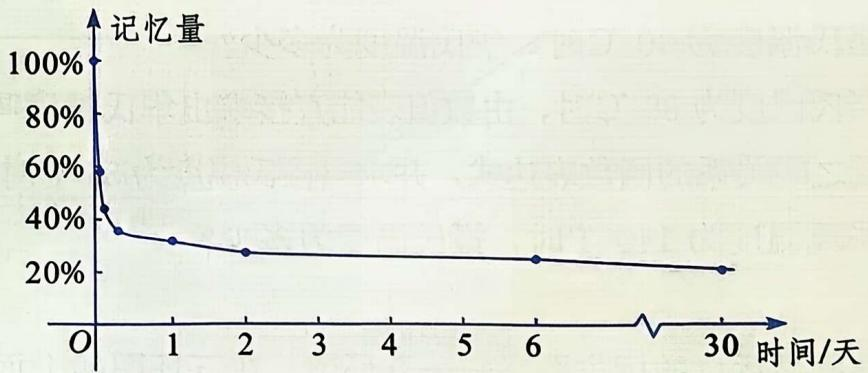
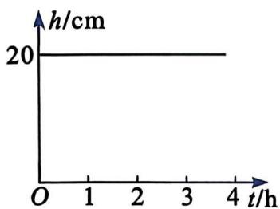
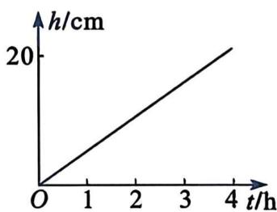
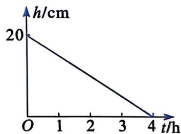
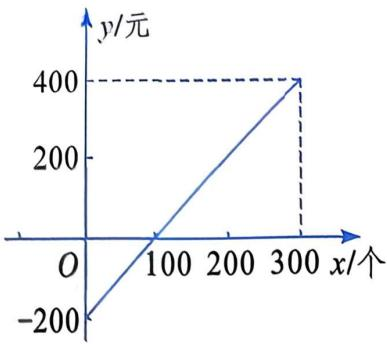
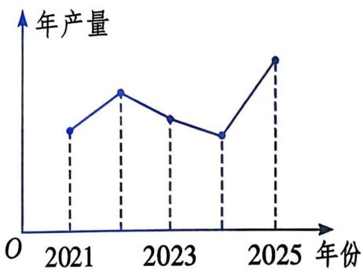
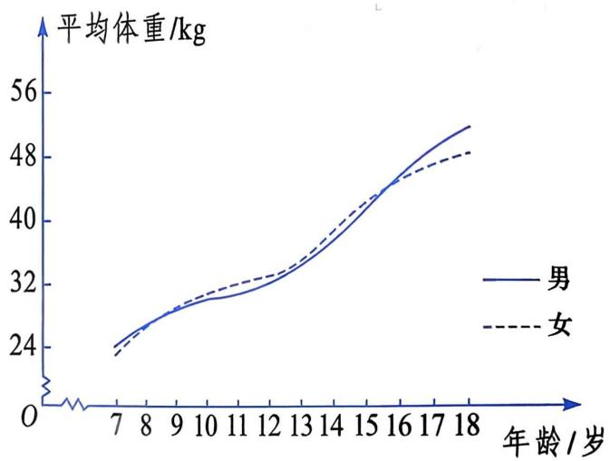
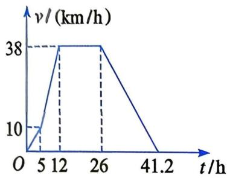

# 艾宾浩斯遗忘曲线

每个人都有这样的体验：学过的知识会遗忘。但遗忘有什么规律吗？德国著名心理学家艾宾浩斯(Hermann Ebbinghaus, 1850—1909)对此进行了系统的研究。他认为，输入的信息在认真学习后，就成为人的短时记忆。但是如果不及时复习，这些记住的东西就会被遗忘。艾宾浩斯采用了无意义的音节(例如 SUW, XIQ 等)作为记忆的材料进行试验，获得如下相关数据： 

| 时间 | 刚记忆完 | 20分钟后 | 1小时后 | 9小时后 | 1天后 | 2天后 | 6天后 | 30天后 |
| --- | --- | --- | --- | --- | --- | --- | --- | --- |
| 记忆量 | 100% | 58.2% | 44.2% | 35.8% | 33.7% | 27.8% | 25.4% | 21.1% |

并根据上表绘制了一条曲线，如下图. 

这就是著名的艾宾浩斯遗忘曲线。这条曲线告诉我们：遗忘的进程是不均衡的，但是有显著的规律，这就是先快后慢。你看，在前面几小时里遗忘的速度是多么快呀！到6天以后，遗忘的速度就变得很慢。这条曲线给我们什么启示呢？学习的知识如果不及时复习，一天后大约只能记住开始的三分之一了！因此，我们要尊重科学，及时复习，与遗忘抗争，巩固记忆。 

你不妨与小组的同学进行一次试验。你们分成甲、乙两组，同时学习同一段课文，甲组下午复习一次，乙组不复习。第二天测试，分别计算出两组平均的记忆保持量，体验一下艾宾浩斯遗忘曲线给世人的启示。 

# 19.4 函数的初步应用

很多实际问题和数学问题都表现为两个相关变量之间的函数关系。因此，学会建立函数模型，并用函数模型来解决问题，是十分重要的。 

常用的温度计量单位有两种：一种是摄氏温度(℃)，另一种是华氏温度(℉)。中央气象台天气预报中的气温，用的就是摄氏温度。 

# 一起探究

已知摄氏温度值和华氏温度值有下表所示的对应关系： 

| 摄氏温度/°C | 0 | 10 | 20 | 30 | 40 | 50 |
| --- | --- | --- | --- | --- | --- | --- |
| 华氏温度/°F | 32 | 50 | 68 | 86 | 104 | 122 |

(1) 当摄氏温度为 $30^{\circ} \mathrm{C}$ 时, 华氏温度为多少? 

(2) 当摄氏温度为 $36^{\circ} \mathrm{C}$ 时, 由数值表能直接求出华氏温度吗? 试写出这两种温度计量之间关系的函数表达式, 并求出摄氏温度为 $36^{\circ} \mathrm{C}$ 时的华氏温度. 

(3) 当华氏温度为 $140^{\circ} \mathrm{F}$ 时, 摄氏温度为多少? 

大家都熟悉奥运会的标志图案——五环图。在五环图的上面三个环中填入三个连续的偶数，在下面的两个环中填入两个连续的奇数，使得这三个连续偶数的和等于这两个连续奇数的和(如图中已经填好的2, 4, 6和5, 7)。 

# 大家谈谈

1. 请按照要求再填写两组数，并谈谈你的想法。 

2. 如果用 $2x - 2, 2x, 2x + 2$ 表示三个连续的偶数，用 $2y - 1$ 和 $2y + 1$ 表示两个连续的奇数，请写出 $y$ 与 $x$ 之间的函数关系式，并谈谈如何用这个函数关系式写出更多符合要求的数组. 

实际上，上述问题中的函数关系式为 $y = \frac{3}{2} x$ 。为保证 $x, y$ 都为整数， $x$ 必须取偶数。如当 $x = 20$ 时， $y = 30$ ，满足条件的一组数是：偶数 38，40，42；奇数 59，61。 

# 做一做

1. 一支 $20 \mathrm{~cm}$ 长的蜡烛, 点燃后, 每小时燃烧 $5 \mathrm{~cm}$ . 在图 19.4-1 中, 哪幅图象能大致刻画出这支蜡烛点燃后剩下的长度 $h(\mathrm{cm})$ 与点燃时间 $t(\mathrm{h})$ 之间的函数关系? 请说明理由. 

| | | |
|:---:|:---:|:---:|
|  |  |  |
| (1) | (2) | (3) |

图19.4-1

2. 一等腰三角形的周长为 $12 \mathrm{~cm}$ , 设其底边长为 $y \mathrm{~cm}$ , 腰长为 $x \mathrm{~cm}$ . 

(1) 写出 $y$ 与 $x$ 之间的函数关系式, 并指出自变量的取值范围. 

(2) 画出这个函数的图象. 

# 练习

1. 某人以 $4 \mathrm{~km} / \mathrm{h}$ 的速度步行。请写出他的步行路程 $s(\mathrm{km})$ 和步行时间 $t(\mathrm{h})$ 之间的函数关系式，指出自变量的取值范围，并画出函数图象。 

2. 某批发部对经销的一种电子元件调查后, 发现一天的盈利 $y$ (元)与这天的销售量 $x$ (个)之间的函数关系如图所示。请观察图象并解答下列 

问题： 

(第2题)

(1) 一天售出多少个这种电子元件时盈利最多, 最多盈利多少元? 

(2) 一天售出多少个这种电子元件时不赔不赚? 

# 习题

# A 组

1. 图中折线表示的是某工厂 2021 年至 2025 年一种产品的年产量与年份的函数关系，由此你能对生产情况作出哪些判断？ 

2. 如图是某地区学生的平均体重(kg)随年龄(岁)变化的图象。 

(第1题)

(1) 在哪个年龄段，女生的平均体重略高于男生的平均体重？ 

(2) 从哪个年龄开始, 男生的平均体重超过了女生的平均体重? 

(第2题)

3. 为改善市民的居住环境, 某市在老旧房屋改造中, 除解决原有居民的住房需求外, 还对外销售一部分楼盘。已知一栋楼共有 30 层, 从第 8 层开始, 售价 $y$ (元/平方米)与楼层 $x (8 \leqslant x \leqslant 30$ , $x$ 为整数)之间的关系如下表: 

| 楼层x | 8 | 9 | 10 | 11 | 12 | ... |
| --- | --- | --- | --- | --- | --- | --- |
| 售价y/(元/平方米) | 9 000 | 9 050 | 9 100 | 9 150 | 9 200 | ... |

求售价 $y$ 与楼层 $x$ 之间的函数关系式. 

# B 组

4. 某市规定如下用水收费标准: 当每户每月的用水量不超过 $10 \mathrm{~m}^{3}$ 时, 水费按 $a$ 元/立方米收费; 当超过 $10 \mathrm{~m}^{3}$ 时, 不超过的部分仍按 $a$ 元/立方米收费, 超过的部分按 $c$ 元/立方米 $(c > a)$ 收费。该市小明家今年 3 月份和 4 月份的用水量、水费如下表: 

| 月份 | 用水量/\(m^{3}\) | 水费/元 |
| --- | --- | --- |
| 3 | 8 | 36 |
| 4 | 12 | 58 |

(1) 求 $a, c$ 的值. 

(2) 设某户 1 个月的用水量为 $x \mathrm{~m}^{3}$ , 应交水费为 $y$ 元. 

①分别写出用水量不超过 $10 \mathrm{~m}^{3}$ 和超过 $10 \mathrm{~m}^{3}$ 时, $y$ 与 $x$ 之间的函数关系式. 

②已知一户5月份的用水量为 $14 \mathrm{~m}^{3}$ , 求该户5月份的水费。 

5. “三北”防护林工程经过建设者数十年的奋斗，在水土保持、防风固沙、农田保护等方面取得了显著的成效。某气象站观察一场沙尘暴从发生到结束的全过程如下：开始时，风速按一定的速度匀速增大；经过荒漠地时，风速增大得比较快；一段时间后，风速保持不变；经过防风林时， 风速开始逐渐减小，直至为零。如图所示是风速与时间之间关系的图象。请结合图象回答下列问题： 

(第 5 题)

(1) 沙尘暴从开始发生到结束，共经历了多长时间？ 

(2) 风速在哪一个时间段增大得比较快，每小时增大多少？ 

(3) 风速在哪一个时间段保持不变，经历了多长时间？ 

(4) 风速从开始减小直至为零, 每小时减小多少?
