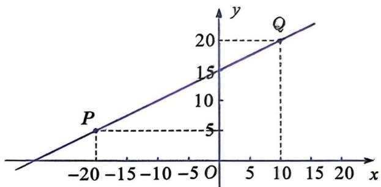
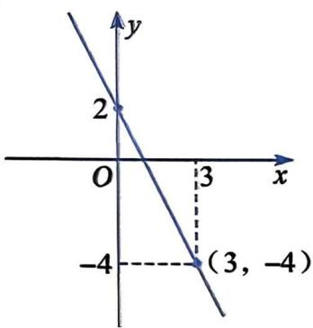
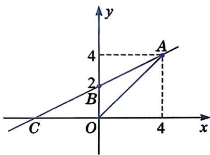

# 20.3 用待定系数法确定一次函数表达式

我们知道，两点确定一条直线。在坐标平面内，点与有序数对对应，那么两个有序数对是不是就可以确定一个一次函数表达式呢？ 

已知一次函数的图象如图20.3-1所示。其中，点 $P(-20, 5)$ ， $Q(10, 20)$ 均在直线上。怎样求这个一次函数的表达式呢？ 

图20.3-1

# 观察与思考

阅读下面小惠对此问题的解答过程，并验证小惠求得的一次函数表达式是否正确. 

小惠的解答过程如下： 

设这个一次函数的表达式为 $y=kx+b$ . 

因为 P, Q 为直线上的两点，所以这两个点的坐标都满足表达式 $y = kx + b$ ，即 

$$
\left\{ \begin{array}{l} 5 = - 2 0 k + b, \\ 2 0 = 1 0 k + b. \end{array} \right.
$$

解这个关于 $k$ 和 $b$ 的二元一次方程组，得 

$$
\left\{ \begin{array}{l} k = \frac {1}{2}, \\ b = 1 5. \end{array} \right.
$$

所以，这个一次函数的表达式为 

$$
y = \frac {1}{2} x + 1 5.
$$

像这样先设出函数的表达式，再根据已知条件确定表达式中未知的系数，从而求出函数表达式的方法，叫作待定系数法. 

1. 已知 $A(-20, 5)$ 为正比例函数 $y = kx$ 图象上的一点，求这个正比例函数的表达式。 

2. 已知一个一次函数的图象经过点 $M(0, 1)$ 和点 $N(1, 0)$ , 求这个一次函数的表达式。 

例 一辆汽车匀速行驶。当行驶了 $20 \mathrm{~km}$ 时, 油箱中剩余 $58.4 \mathrm{~L}$ 油; 当行驶了 $50 \mathrm{~km}$ 时, 油箱中剩余 $56 \mathrm{~L}$ 油。如果油箱中剩余油量 $y(\mathrm{L})$ 与汽车行驶的路程 $x(\mathrm{km})$ 之间是一次函数关系, 请求出这个一次函数的表达式, 并写出自变量 $x$ 的取值范围以及常数项的意义。 

解：设所求一次函数的表达式为 $y=kx+b$ 。根据题意，把已知的两组对应值(20, 58.4)和(50, 56)分别代入 $y=kx+b$ ，得 

$$
\left\{ \begin{array}{l} 5 8. 4 = 2 0 k + b, \\ 5 6 = 5 0 k + b. \end{array} \right.
$$

解得 

$$
\left\{ \begin{array}{l} k = - 0. 0 8, \\ b = 6 0. \end{array} \right.
$$

这个一次函数的表达式为 $y = -0.08x + 60$ . 

因为剩余油量 $y \geqslant 0$ ，所以 $-0.08x + 60 \geqslant 0$ 。解得 $x \leqslant 750$ 。 

因为路程 $x \geqslant 0$ ，所以 $0 \leqslant x \leqslant 750$ 。 

因为当 x=0 时，y=60，所以这辆汽车行驶前油箱中存油 60 L. 

# 大家谈谈

用待定系数法求一次函数表达式的步骤有哪些？与同学交流你的想法。 

用待定系数法求一次函数的表达式，一般步骤如下： 

(1) 设一次函数的表达式为 $y = kx + b$ ; 

(2) 根据已知条件, 列出关于 $k$ 和 $b$ 的二元一次方程组; 

(3) 解这个方程组, 求出 $k$ 与 $b$ 的值, 从而得到一次函数的表达式. 

# 练习

1. 一次函数的图象经过点 $A(1,2)$ 和点 $B(-2,1)$ ，求这个函数的表达式. 

2. 某市举办一场中学生羽毛球比赛, 场地和耗材需要一些费用。场地费用 $b$ (元)固定不变, 耗材费用与参赛人数 $x$ 成正比例函数关系, 这两部分的总费用为 $y$ (元)。已知当 $x = 20$ 时, $y = 1600$ ; 当 $x = 30$ 时, $y = 2000$ . 

(1) 求 $y$ 与 $x$ 之间的函数关系式. 

(2) 当支出总费用为 3200 元时, 有多少人参加了比赛? 

# 习题

# A 组

1. 如果一次函数 $y=(k+3)x-13$ 的图象上一点 P 的坐标为 $(-5,7)$ ，那么 k 的值是多少？ 

2. 求下列函数的表达式: 

(1) 正比例函数的图象经过点(2, -1). 

(2) 一次函数的图象经过点 $(-1, -2)$ 和 $\left(\frac{1}{2}, 3\right)$ . 

3. 已知一次函数的图象如图所示, 求这个函数的表达式. 

(第3题)

# B 组

4. 如图，已知直线 AB 上两点的坐标分别为 A(4, 4)，B(0, 2)，且直线 AB 与 x 轴交于点 C，连接 AO. 

(1) 求直线 $AB$ 所对应的一次函数的表达式. 

(2) 求 $\triangle AOC$ 的面积。 

(第 4 题)

# C 组

5. 为保护学生的视力, 供学生使用的课桌和椅子的高度均需按一定的关系配套设计。研究表明: 课桌高度 $y(\mathrm{cm})$ 与椅子高度 $x(\mathrm{cm})$ 之间具有一次函数关系。今有两套符合条件的课桌和椅子, 其高度如下表所示: 

| 项目 | 第一套 | 第二套 |
| --- | --- | --- |
| x/cm | 40.0 | 37.0 |
| y/cm | 75.0 | 70.2 |

(1) 试确定 $y$ 与 $x$ 之间的函数关系式. 

(2) 现有一把高为 $42.0 \mathrm{~cm}$ 的椅子和一张高为 $78.2 \mathrm{~cm}$ 的课桌, 它们是否配套? 为什么?
