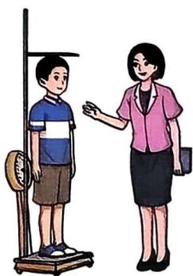
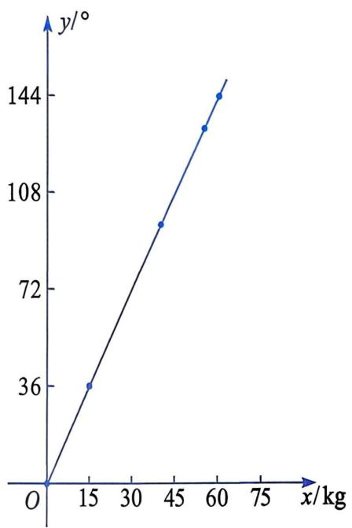
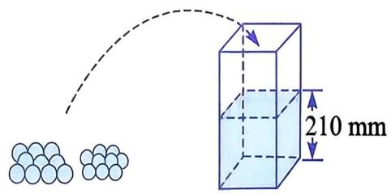

# 20.4 一次函数的应用

利用一次函数这一数学模型，可以解决许多与其相关的实际问题和数学问题。 

一辆客车, 准乘 20 人(包括一名司机和一名乘务员). 这辆客车由 A 地行驶到 B 地, 运营总成本为 180 元, 乘客票价为 25 元/人. 

# 做一做

1. 设乘客人数为 $x$ 时, 客车运营盈利 $y$ 元, 求 $y$ 与 $x$ 之间的函数关系式. 

2. 用求出的函数关系式，尝试解决下列问题： 

(1) 当客车运营盈利 120 元时, 求乘客人数. 

(2) 要想使客车运营盈利超过 170 元, 则乘客人数至少为多少? 

在上面的问题中，客车运营盈利 y 元与乘客人数 x 之间的函数关系式为 y=25x-180. 

当客车运营盈利 120 元时，有 120 = 25x - 180。解得 x = 12。 

要想使客车运营盈利超过 170 元，只要使 25x - 180 > 170 即可。解得 x > 14。所以，乘客人数至少为 15。 

# 一起探究

如图 20.4-1，某种称量体重的台秤，最大称量是 $150 \mathrm{~kg}$ 。称体重时，体重 $x(\mathrm{kg})$ 与指针按顺时针方向转过的角度 $y(^{\circ})$ 有如下对应数据： 

| x/kg | 0 | 15 | 40 | 55 | 60 |
| --- | --- | --- | --- | --- | --- |
| y/° | 0 | 36 | 96 | 132 | 144 |

图20.4-1

(1) 请在平面直角坐标系中, 分别以上表中的每对对应数值为横坐标和纵坐标, 描点连线, 画出图象. 

(2) 求 $y$ 与 $x$ 之间的函数关系式, 并指出自变量 $x$ 的取值范围. 

(3) 当体重为多少千克时, 台秤的指针恰好转到 $180^{\circ}$ 的位置? 当体重为 $50 \mathrm{~kg}$ 时, 台秤的指针转过的角度是多少度? 

由这些对应值画出的图象，如图 20.4-2 所示. 

图20.4-2

由表格给出的数据可以看出, 体重为 $0 \mathrm{~kg}$ 时, 台秤指针指向 $0^{\circ}$ , 每增加 $5 \mathrm{~kg}$ , 台秤指针按顺时针方向旋转 $12^{\circ}$ , 所以 $y$ 是 $x$ 的正比例函数。根据已知条件可得 

$$
y = \frac {1 2}{5} x (0 \leqslant x \leqslant 1 5 0).
$$

当 $y = 180$ 时， $180 = \frac{12}{5} x$ 。解得 $x = 75$ . 

当 $x = 50$ 时， $y = \frac{12}{5} \times 50 = 120$ . 

即当体重为 $75 \mathrm{~kg}$ 时, 台秤的指针恰好转到 $180^{\circ}$ 的位置; 当体重为 $50 \mathrm{~kg}$ 时, 台秤的指针转过的角度是 $120^{\circ}$ . 

# 练习

1. 某水库在春季播种前, 向下游灌溉区开闸放水. 放水量 $V(\mathrm{m}^{3})$ 与放水时间 $t(\mathrm{min})$ 之间有如下对应数据: 

| t/min | 30 | 60 | 90 | 120 | 150 |
| --- | --- | --- | --- | --- | --- |
| V/m3 | 1 500 | 3 000 | 4 500 | 6 000 | 7 500 |

(1) 求 V 与 t 之间的函数关系式. 

(2) 求放水 $24 \mathrm{~h}$ 的放水量. 

2. 某出版社出版了一种适合中学生阅读的科普书。当该书首次出版的印数不少于5千册时，该出版社投入的成本 $y$ (万元)与印数 $x$ (千册)之间为一次函数关系，并有如下对应数据： 

| x/千册 | 6 | 8 |
| --- | --- | --- |
| y/万元 | 3.1 | 3.6 |

(1) 求 $y$ 与 $x$ 之间的函数关系式, 并指出自变量的取值范围. 

(2) 当出版社投入的成本为 4.1 万元时, 能印该书多少千册? 

# 习题

# A 组

1. 一个长方形的长、宽分别为 60 和 40。现将它的宽减少 10，长增加 x。设变化后的长方形的面积为 y。 

(1) 写出 $y$ 与 $x$ 之间的函数关系式. 

(2) 当 $x$ 取何值时, 变化后长方形的面积与原来长方形的面积相等? 

(3) 当 $x$ 取哪些值时, 可以使变化后长方形的面积比原来长方形面积的 2 倍还要大? 

2. 某茶叶经销商经市场调研, 发现甲、乙两种茶叶每千克的利润分别为 100 元、150 元, 于是决定购进甲、乙两种茶叶共 $200 \mathrm{~kg}$ 进行销售。设购进甲种茶叶 $x \mathrm{~kg}$ , 这批茶叶全部销售完之后的总利润为 $y$ 元。 

(1) 写出 y 与 x 之间的函数关系式. 

(2) 若该经销商将这批茶叶全部销售完之后的总利润为 28000 元, 则购进甲、乙两种茶叶各多少千克? 

# B 组

3. 某科技公司研发出一种新型设备。该设备每台的成本为 30 万元，经过市场调研发现：当每台的售价为 40 万元时，年销售量为 680 台；当每台的售价为 45 万元时，年销售量为 640 台。假定该设备的年销售量 $y$ (台) 和销售单价 $x$ (万元) 之间是一次函数关系。 

(1) 求 y 与 x 之间的函数关系式. 

(2) 当年销售量为 600 台时, 求该设备的销售单价及获得的利润. 

# C 组

4. 如图, 水平放置的容器内有 $210 \mathrm{~mm}$ 高的水。现有若干个质地相同的两种规格的球, 需将它们逐一放入容器中。已知每放入一个大球, 水面升高 $4 \mathrm{~mm}$ ; 每放入一个小球, 水面升高 $3 \mathrm{~mm}$ 。假定放入 6 个大球后, 再开始放入小球, 且放入容器中的所有球都完全浸没在水中, 而水不溢出。设放入小球的个数为 $x$ , 水面的高度为 $y \mathrm{~mm}$ 。 

(第4题)

(1) 求 $y$ 与 $x$ 之间的函数关系式. (不必写出 $x$ 的取值范围) 

(2) 如果限定水面的高度不能超过 $260 \mathrm{~mm}$ , 那么最多能放入多少个小球?
