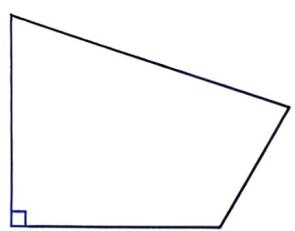
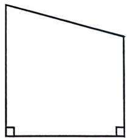
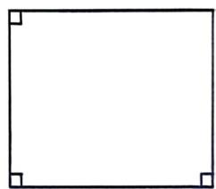
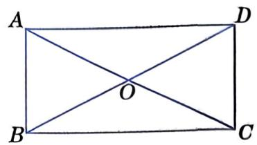
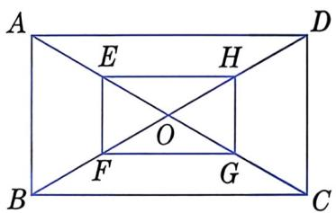
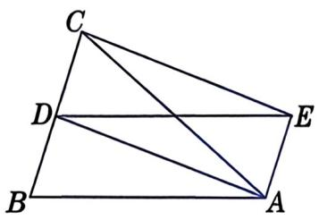
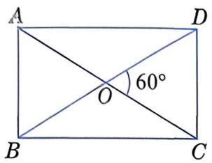
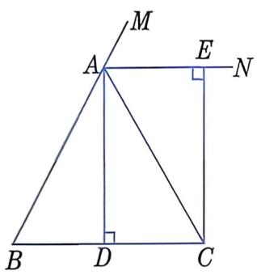
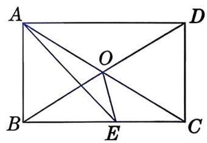

# 矩形（第二课时）

# 第二课时开始

下面我们来探究矩形的判定条件. 

# 一起探究

1. 我们已经知道, 矩形的四个角都是直角. 反过来, 一个四边形有几个角是直角, 就能判定它是矩形呢? 观察图 21.5-4, 提出你的猜想. 

图21.5-4

2. 矩形的对角线相等。那么，对角线相等的平行四边形是矩形吗？ 

通过探究，我们发现：有三个角是直角的四边形是矩形；对角线相等的平行四边形是矩形. 

# 做一做

求证：有三个角是直角的四边形是矩形. 

现在，我们来证明对角线相等的平行四边形是矩形. 

已知：如图21.5-5，在□ABCD中，AC=BD. 

求证：□ABCD 是矩形。 

证明：∵ 四边形 ABCD 是平行四边形， 
$\therefore A D \parallel B C, A D = B C.$
在 $\triangle ABD$ 和 $\triangle BAC$ 中， 
$\because A D = B C, A B = B A, B D = A C,$$\therefore \triangle A B D \cong \triangle B A C.$$\therefore \angle D A B = \angle C B A.$
又∵ AD∥BC, 
$\therefore \angle D A B + \angle C B A = 1 8 0 ^ {\circ}.$$\therefore \angle D A B = \angle C B A = 9 0 ^ {\circ}.$
∴ □ABCD 是矩形. 

图21.5-5

# 矩形的判定定理

有三个角是直角的四边形是矩形. 

对角线相等的平行四边形是矩形. 

例 2 已知: 如图 21.5-6, 在矩形 $ABCD$ 中, $E$ , $F$ , $G$ , $H$ 分别为 $OA$ , $OB$ , $OC$ , $OD$ 的中点. 

求证：四边形 EFGH 是矩形. 

图21.5-6

证明：∵ 四边形 ABCD 是矩形， 

∴ AC=BD，且 OA=OC，OB=OD。 

$\therefore OA=OC=OB=OD.$ 

又∵ E, F, G, H 分别为 OA, OB, OC, OD 的中点， 
$\therefore O E = O G = O F = O H.$
∴ 四边形 EFGH 是平行四边形. 

又∵ $EG=OE+OG=OF+OH=HF,$ 

∴ 四边形 EFGH 是矩形. 

# 大家谈谈

在例 2 中，如果四边形 ABCD 是平行四边形，那么四边形 EFGH 是平行四边形吗？说说你的理由. 

# 练习

1. 指出下列说法是否正确. 

(1) 有一个角为直角的四边形是矩形. 

(2) 两条对角线相等的四边形是矩形. 

(3) 两条对角线互相垂直的四边形是矩形. 

(4) 四个角皆为直角的四边形是矩形. 

2. 已知: 如图, $AB = AC$ , $D$ 为 $BC$ 的中点, 四边形 $AEDB$ 是平行四边形. 求证: 四边形 $AECD$ 是矩形. 

(第2题)

# 习题

# A 组

1. 已知一矩形对角线的长为 $10 \mathrm{~cm}$ , 求顺次连接该矩形四边中点所得的四边形的周长. 

2. 如图, 矩形 $ABCD$ 的两条对角线 $AC$ , $BD$ 的夹角为 $60^{\circ}$ , $AC+AB=12$ . 求 $AC$ 和 $AB$ 的长。 

(第2题)

3. 小亮想检验一块木板是不是矩形。现仅有一根足够长的细绳，你能想办法帮他进行检验吗？请说明理由。 

# B 组

4. 已知: 如图, $AB = AC$ , $AD \perp BC$ , 垂足为 $D$ , $AN$ 是 $\triangle ABC$ 的外角 $\angle CAM$ 的平分线, $CE \perp AN$ , 垂足为 $E$ . 求证: 四边形 $ADCE$ 是矩形。 

(第4题)

(第 5 题)

5. 如图, 在矩形 $ABCD$ 中, $AC$ , $BD$ 相交于点 $O$ , $AE$ 平分 $\angle BAD$ , 交 $BC$ 于点 $E$ , $\angle CAE = 15^{\circ}$ . 求 $\angle BOE$ 的度数.
