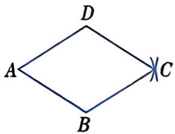
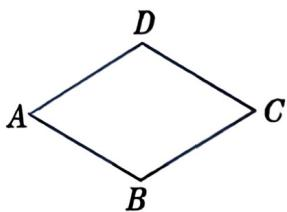
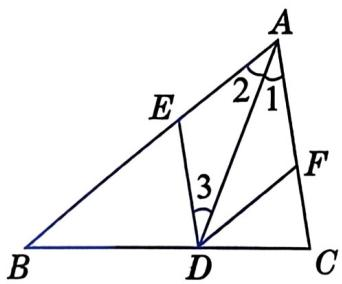
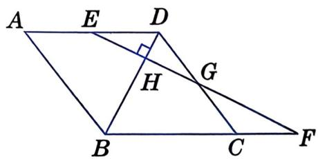
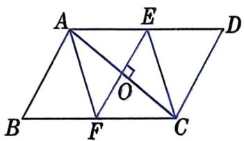
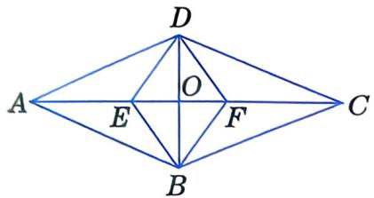
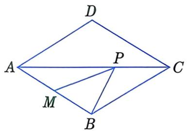

# 第二课时开始

# 一起探究

如图 21.6-6，画两条等长的线段 $AB, AD$ ，分别以点 $B, D$ 为圆心，以 $AB$ 长为半径画弧，两弧相交于点 $C$ 。连接 $BC, CD$ ，得到四边形 $ABCD$ . 

四边形 $ABCD$ 是菱形吗? 

图21.6-6

事实上，我们有：四条边相等的四边形是菱形。 

现在，我们来证明这个结论. 

已知：如图21.6-7，在四边形ABCD中， $AB = BC = CD = DA$ 

求证: 四边形 $ABCD$ 是菱形. 

证明：∵ AB=CD，且 BC=DA， 

图21.6-7

∴ 四边形 ABCD 是平行四边形、 

又∵ AB=DA， 

∴ 四边形 ABCD 是菱形. 

# 菱形的判定定理

# 四条边相等的四边形是菱形.

# 大家淡淡

如图21.6-8，□ABCD的两条对角线AC，BD互相垂直， $O$ 是这两条对角线的交点. 

(1) 你能说明图中的 Rt $\triangle ABO$ , Rt $\triangle CBO$ , Rt $\triangle CDO$ , Rt $\triangle ADO$ 都是全等的吗? 

(2) □ABCD 的四条边都相等吗? 

(3) 请证明你的猜想. 

# 菱形的判定定理

图21.6-8

"每条对角线都平分一组对角的四边形是菱形"也是正确的，同学们可以自己试着证明。 

# 两条对角线互相垂直的平行四边形是菱形.

例 2 已知: 如图 21.6-9, 在 $\triangle ABC$ 中, $AD$ 是 $\angle BAC$ 的平分线, $DE \parallel AC$ , 交 $AB$ 于点 $E$ , $DF \parallel AB$ , 交 $AC$ 于点 $F$ . 

求证: 四边形 $AEDF$ 是菱形. 

证明：∵ DE∥AC，DF∥AB， 

∴ 四边形 AEDF 是平行四边形， $\angle1=\angle3$ . 

又∵ $\angle1=\angle2,$ 
$\therefore \angle 2 = \angle 3.$

图21.6-9

$\therefore AE=DE.$ 

∴ 四边形 AEDF 是菱形. 

# 练习

1. 如图, $AB = AC$ , 画出点 $A$ 关于 $BC$ 的对称点 $A'$ , 请用两种不同的方法证明四边形 $ABA'C$ 是菱形. 
| | |
|:---:|:---:|
|  (第1题) |  (第2题) |

2. 如图, 在 $\square ABCD$ 中, $\angle D = 60^{\circ}$ , 以顶点 $A$ 为圆心、 $AB$ 长为半径画弧, 交 $BC$ 于点 $E$ , 交 $AD$ 于点 $F$ , 连接 $AE$ , $EF$ . 请指出图中的等腰三角形、平行四边形和菱形. 

# 习题

# A 组

1. 已知: 如图, $E$ 是菱形 $ABCD$ 的边 $AD$ 的中点, $EF \perp BD$ 于点 $H$ , 交 $BC$ 的延长线于点 $F$ , 交 $DC$ 于点 $G$ . 求证: $DC$ 与 $EF$ 互相平分. 
| | |
|:---:|:---:|
|  (第1题) |  (第2题) |

2. 已知: 如图, 在 $\square ABCD$ 中, $O$ 为对角线 $AC$ 的中点, 过点 $O$ 作 $AC$ 的垂线与边 $AD$ , $BC$ 分别交于点 $E$ , $F$ , 连接 $AF$ , $CE$ . 求证: 四边形 $AFCE$ 是菱形. 

3. 已知: 如图, 四边形 $ABCD$ 是菱形, 两条对角线相交于点 $O$ , $DE$ 为 $\angle ADB$ 的平分线, 交 $AC$ 于点 $E$ , $DF$ 为 $\angle CDB$ 的平分线, 交 $AC$ 于点 $F$ , 连接 $BE$ , $BF$ . 求证: 四边形 $DEBF$ 是菱形. 

(第3题)

# B 组

4. 如图, 在菱形 $ABCD$ 中, $\angle BAD = 60^{\circ}$ , $M$ 为 $AB$ 的中点, $P$ 为对角线 $AC$ 上的一个动点, $PM + PB$ 的最小值是 3. 求 $AB$ 的长. 
| | |
|:---:|:---:|
|  (第 4 题) |  (第 5 题) |

5. 如图，绿丝带下部重叠部分是什么图形？请说明理由。
