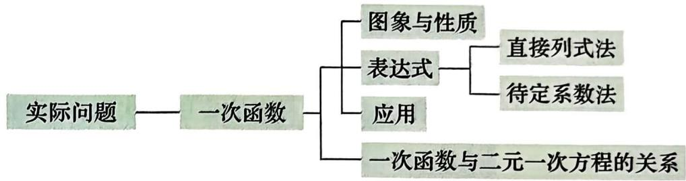
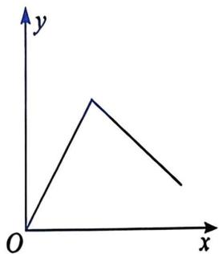
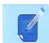
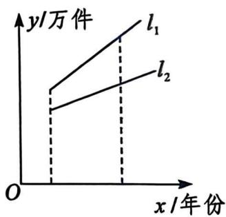
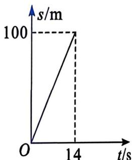
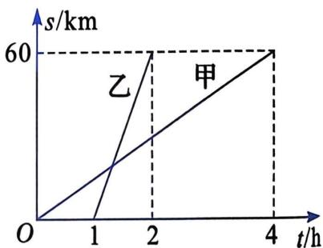
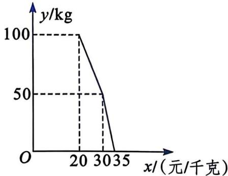
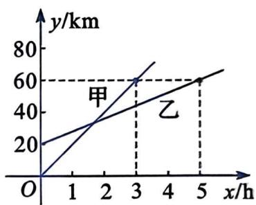
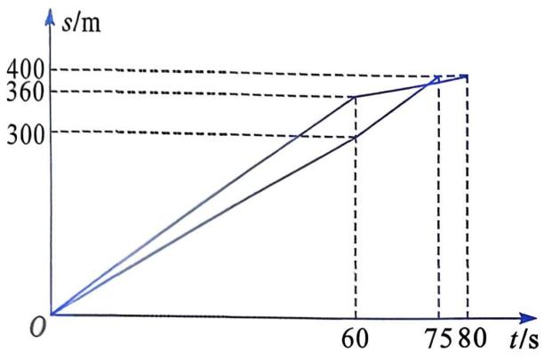

# 一、知识结构

# 二、总结与反思

由实际问题建立一次函数模型是强化“符号意识”的过程，这个过程着重体现了抽象与模型化的思想。一次函数的图象，不仅揭示了一次函数的性质，更重要的是凸显了数形结合的思想方法。 

1. 一次函数 $y = {kx} + b$ 的图象是直线,故其图象又称为直线 $y = {kx} + b$ . 

2. 一次函数 $y = kx + b$ 中的系数 $k$ 与 $b$ 决定着它的性质: 

(1) 当 $k > 0$ 时, $y$ 随 $x$ 的增大而增大, 图象从左向右是上升的. 

(2) 当 $k < 0$ 时, $y$ 随 $x$ 的增大而减小, 图象从左向右是下降的. 

(3) 当 $b = 0$ 时, 一次函数 $y = kx + b$ 化为正比例函数 $y = kx$ , 它的图象一定经过坐标原点. 

(4) 当 $b > 0$ 时, 直线 $y = {kx} + b$ 与 $y$ 轴的正半轴相交. 

(5) 当 b<0 时，直线 $y=kx+b$ 与 y 轴的负半轴相交. 

3. 求一次函数的表达式至关重要, 它是解决许多实际问题的关键环节. 求一次函数表达式的主要方法有: 

(1) 直接列式法: 由问题的实际意义直接写出. 这种方法的实质是把问题中用文字叙述的数量关系用等式表示出来. 

(2)待定系数法: 根据图象、数值表或已知条件确认两个变量成一次函数关系, 就可以将表达式设为 $y = kx + b$ , 利用两组对应值求出 $k$ 与 $b$ 的值. 

4. 正比例函数是一次函数的特例, 它们之间是特殊与一般的关系。正比例函数具备一次函数所有的性质, 它的特点在于其图象必过原点, 只需知道另一个点的坐标就可以确定其表达式。 

5. 一次函数与二元一次方程的关系体现在: 

(1) 从形式上它们之间可以相互转化. 

(2) 以二元一次方程的解为坐标的点都在与它对应的一次函数图象上; 反过来, 一次函数图象上的点的坐标都是与它对应的二元一次方程的解. 

6. 一次函数的应用有两个层次： 

(1) 若给出了一次函数的表达式, 则可直接应用一次函数的性质解决问题. 

(2) 若问题只提供了一次函数的情境(有时是隐含的表述), 则一般应先求出函数表达式, 进而利用性质解决问题. 

# 三、注意事项

1. 对于一次函数的概念, 要把握函数表达式是自变量的一次式, 而与表示自变量的字母无关。例如 $y = 3x + 1$ , $s = 2t - 5$ , $l = 2 \pi r$ 等都是一次函数。 

2. 在实际问题中, 有时会遇到两个或多个一次函数的图象组合起来的图象, 如图, 它便是由两个一次函数的图象组合而成的。对于其中的每一段, 都可以利用一次函数来解决问题。 

  

# 复习题

# A 组

1. 填空： 

(1) 直线 $y = 3 - {9x}$ 与 $x$ 轴的交点坐标为____，与 $y$ 轴的交点坐标为____。 

(2) 若 $M(a, 2)$ 为一次函数 y=2x-3 图象上的一点，则 a= ____. 

(3) 在函数 $y = x + 4$ 中, 若自变量 $x$ 的取值范围是 $-3 < x < -1$ , 则 $y$ 的取值范围为 

(4) 汽车离开 A 站 5 km 后, 又以 $40 \mathrm{~km} / \mathrm{h}$ 的速度匀速行驶了 $t \mathrm{~h}$ . 此时, 汽车离开 A 站的路程为 $s \mathrm{~km}$ . $s$ 与 $t$ 之间的函数关系式为 ____. 

(5) 一棵树现在的高度为 $2.2 \mathrm{~m}$ , 预计未来 10 年平均每年长高 $25 \mathrm{~cm}$ . 设 $x$ 年后该树的高度为 $y \mathrm{~m}$ , 则 $y$ 与 $x$ 之间的函数关系式为 ____, $y$ 是 $x$ 的 ____ 函数. 

2. 解答下列各题： 

(1) 已知四个点的坐标分别为 $(1, 2)$ , $(2, -1)$ , $(0, 3)$ , $(2, 2)$ , 其中哪些点在直线 $y = -x + 3$ 上? 

(2) 若点 $A(-5, y_1), B(-2, y_2)$ 都在直线 $y = -\frac{1}{2} x$ 上, 则 $y_1$ 与 $y_2$ 的大小具有怎样的关系? 

(3) 某纸业公司生产一种品牌的卫生纸, 近年的产销情况如图所示。直线 $l_{1}$ 和 $l_{2}$ 分别表示产量与年份、销量与年份之间的函数关系。下列说法哪些是正确的, 哪些是错误的? 试说明理由。 

[第2(3)题]

①该卫生纸产量与销量均呈直线上升的趋势，且每年的产量与销量之间的差距越来越小。 

②该卫生纸已经出现供大于求的趋势。 

③该卫生纸库存积压越来越大，应该压缩生产或设法促销。 

3. 某产品每件的成本是 120 元，试销阶段每件产品的售价 $x$ (元)与日销量 $y$ (件)之间的关系如下表所示。若日销量 $y$ (件)是售价 $x$ (元)的一次函数，且不允许亏本销售，求这个一次函数的表达式，并指出 $x$ 的取值范围。 

| x/元 | 130 | 150 | 165 |
| --- | --- | --- | --- |
| y/件 | 70 | 50 | 35 |

4. 已知某种物体的密度为 $\rho$ ，密度公式为 $\rho = \frac{m}{V}$ （其中， $m$ 为该物体的质量， $V$ 为体积）。 

(1) 导出公式 $m = \rho V$ 是一次函数吗? 若是一次函数, 则哪个量是自变量? 

(2) 导出公式 $V = \frac{m}{\rho}$ 是一次函数吗？若是一次函数，则哪个量是自变量？ 

5. 已知一次函数的图象经过点(1, 1)和(-1, -5). 

(1) 求这个一次函数的表达式. 

(2) 求这个一次函数的图象与 $x$ 轴和 $y$ 轴的交点坐标, 并求出该图象与两坐标轴围成的三角形的面积. 

6. 请在同一平面直角坐标系中, 画出一次函数 $l_{1}: y = \frac{1}{2} x - 3$ 和 $l_{2}: y = -x + 6$ 的图象。观察图象并回答下列问题: 

(1) 当 $x$ 为何值时, $l_{1}$ 与 $l_{2}$ 所对应的表达式的 $y$ 值相等? 

(2) 当 $x$ 为哪些值时, $l_{1}$ 所对应的表达式的 $y$ 值大于 $l_{2}$ 所对应的表达式的 $y$ 值? 

(3) 当 $x$ 为哪些值时, $l_{1}$ 所对应的表达式的 $y$ 值小于 $l_{2}$ 所对应的表达式的 $y$ 值? 

7. 在一次百米赛跑过程中, 小明跑过的路程 $s(\mathrm{m})$ 与所用时间 $t(\mathrm{s})$ 之间的函数关系如图所示. 

(1) s 是 t 的什么函数? 

(2) 写出 s 与 t 之间的函数关系式. 

(3) 小明在此次比赛中的速度是多少? 

(第7题)

# B 组

8. A, B两地之间的路程为 $60 \mathrm{~km}$ , 甲、乙二人分别骑自行车和摩托车沿相同路线匀速行驶,由A地到达B地。他们行驶的路程 $s(\mathrm{km})$ 与甲出发后的时间 $t(\mathrm{h})$ 之间的函数关系如图所示。 

(第8题)

(1) 乙比甲晚出发几小时? 乙比甲早到几小时? 

(2) 分别写出甲、乙行驶的路程 $s(\mathrm{km})$ 与甲出发后的时间 $t(\mathrm{h})$ 之间的函数关系式. 

(3) 乙在甲出发后几小时追上甲？追上甲的地点离 A 地有多远？ 

9. 某水产市场经营一种海产品, 其日销售量 $y(\mathrm{kg})$ 与销售单价 $x$ (元/千克)之间的函数关系如图所示. 

(1) 分别求出当 $20 \leqslant x \leqslant 30, 30 < x \leqslant 35$ 时, $y$ 与 $x$ 之间的函数关系式. 

(2) 当销售单价为 32 元/千克时, 日销售量是多少? 

(3) 当日销售量为 80 kg 时，单价是多少？ 

  
(第9题)  
  
(第 10 题)

10. A, B, C 三地位于一条南北走向的公路上 (A, B, C 依次由南往北), B 与 A 之间的路程为 $20 \mathrm{~km}$ , C 与 B 之间的路程为 $40 \mathrm{~km}$ 。甲骑自行车, 乙步行, 分别由 A, B 两地同时出发, 向 C 地行驶, 他们离 A 地的路程 $y(\mathrm{km})$ 是行驶时间 $x(\mathrm{h})$ 的一次函数, 其图象如图所示。 

(1) 出发后多长时间甲追上乙？此时离 C 地多远？ 

(2) 当出发后 2.5 h 时，谁在前面？此时他超过另一人多少千米？ 

# C 组

11. 有 36 名分别了多年的老同学约定到某个地方故地重游, 他们决定租用汽车前往。可租用的汽车有两种: 甲种每辆可以乘 8 人, 乙种每辆可以乘 4 人。他们不愿意让车子留出空位, 但也不能超载。(乘坐人数不包含司机) 

(1) 你能想出几种租车的方案? 

(2) 已知甲种汽车每天的租金为 300 元, 乙种汽车每天的租金为 200 元. 请帮助他们选择一个最便宜的租车方案. 

12. 李虹和张惠平时的耐力与速度相差无几。来口阵目味上，老师设计了一个400 m 的赛跑方案，让李虹从起跑就全速前进，而让张惠留着后劲儿，待到剩下最后 100 m 时再加速，并跟踪记录了赛跑的全过程。赛跑的全过程如图所示。 

(第 12 题)

(1) 你从这幅图中读出了哪些信息？ 

(2) 老师设计这个方案的目的是什么?
