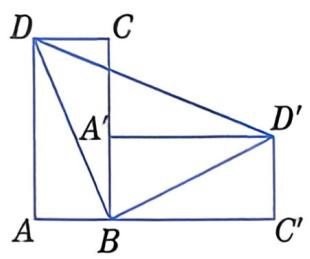
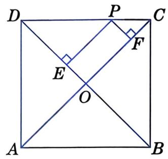
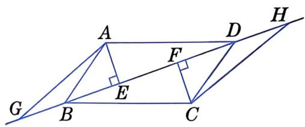
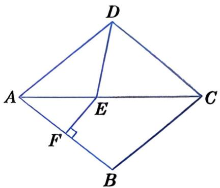
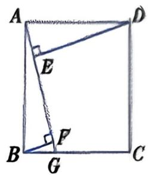
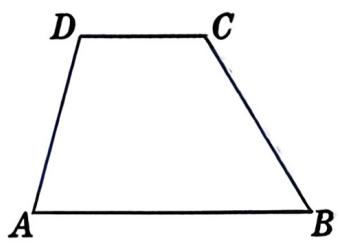
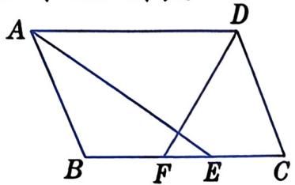
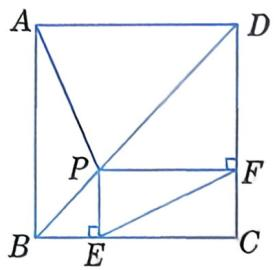
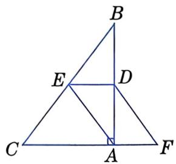

# 4. 平行四边形与矩形、菱形、正方形之间是一般与特殊的关系.

当平行四边形有一个角是直角时，此平行四边形是矩形；当平行四边形有一组邻边相等时，此平行四边形是菱形；当矩形中有一组邻边相等或菱形中有一个角是直角时，就得到了正方形。 

研究平行四边形的性质时, 利用全等三角形的性质, 能得到平行四边形的边、角、对角线具有的性质. 特殊的平行四边形除了具有平行四边形的一般性质外, 还具有更特殊的性质. 例如, 矩形的对角线互相平分且相等, 菱形的对角线互相垂直平分, 正方形的对角线互相垂直平分且相等. 

# 5. 特殊四边形的判定.

(1) 判定方法的探索, 往往是对图形的性质逆向思考得来的. 请总结平行四边形、矩形、菱形、正方形的判定定理与性质定理的关系. 

(2) 矩形和菱形的判定可分成两类: 一类以四边形为起点, 另一类以平行四边形为起点. 请总结这两类判定方法之间的区别和联系. 

(3) 正方形的判定一般分成两个步骤: 可以先判定是矩形, 再判定是菱形; 也可以先判定是菱形, 再判定是矩形. 

(4) 平行四边形、矩形、菱形、正方形和梯形的定义既是性质, 也是对其进行判定的依据. 

# 三、注意事项

1. 对图形的认识, 应先从整体把握, 再到局部具体掌握。因此, 理解和掌握平行四边形中每对成中心对称的三角形, 箍形和菱形中每对成中心对称的三角形和每对成轴对称的三角形, 是掌握并运用这些图形性质的基础。 

2. 在解决有关图形的问题时, 往往需要把较为复杂的图形转化为简单的图形, 例如常把特殊的四边形的特征转化为三角形之间的关系, 把梯形转化为平行四边形和三角形, 等. 这些都体现了转化与化归的思想。 

# 复习题

# A 组

9. 如图, 如果将矩形 $ABCD$ 绕点 $B$ 按顺时针方向旋转 $90^{\circ}$ 到矩形 $A'BC'D'$ 的位置, 那么 $\triangle DBD'$ 是什么三角形? 请证明你的猜想. 
| | |
|:---:|:---:|
|  |  |
| (第9题) | (第 10 题) |

10. 如图, 正方形 $ABCD$ 的对角线相交于点 $O$ , 点 $P$ 在 $CD$ 上, 且 $PE \perp DB$ , $PF \perp CA$ , 垂足分别为 $E$ , $F$ . 试猜想 $PE + PF$ 与正方形的边长有怎样的数量关系, 并证明你的猜想. 

11. 如图, 四边形 $ABCD$ 为平行四边形, $AE \perp BD$ , $CF \perp BD$ , 垂足分别为 $E$ , $F$ , 点 $G$ 在 $DB$ 的延长线上, 点 $H$ 在 $BD$ 的延长线上, 且 $BG = DH$ . 

(1) 请写出图中所有的全等三角形. 

(2) 请选出一对全等三角形( $\triangle ABD \cong \triangle CDB$ 除外), 并给出证明. 

(第 11 题)

12. 如图, 在菱形 $ABCD$ 中, $\angle BAD = 80^{\circ}$ , $AB$ 的垂直平分线交对角线 $AC$ 于点 $E$ , 交 $AB$ 于点 $F$ , 连接 $DE$ . 求 $\angle CDE$ 的度数. 
| | |
|:---:|:---:|
|  |  |
| (第 12 题) | (第13题) |

13. 已知: 如图, 四边形 $ABCD$ 是正方形, $G$ 是边 $BC$ 上的一点, $DE \perp AG$ , $BF \perp AG$ , 垂足分别为 $E$ , $F$ . 求证: $AF = BF + EF$ . 

14. 如图, 在梯形 $ABCD$ 中, $AB \parallel CD$ , 且 $\angle D = 2\angle B$ , $AB = 16$ , $AD = 9$ . 求 $CD$ 的长. 

(第 14 题)

# B 组

15. 小刚在计算一个多边形的内角和时, 求得的结果为 $900^{\circ}$ 。老师指出他的计算结果不对, 小刚重新检查, 发现多数了一条边。你知道这个多边形是几边形吗? 为什么? 

16. 如图, 在 $\square ABCD$ 中, $AB = 5$ , $AD = 8$ , $\angle BAD$ , $\angle ADC$ 的平分线分别交 $BC$ 于点 $E$ , $F$ . 求 $EF$ 的长. 

(第 16 题)

17. 如图, 在正方形 $ABCD$ 中, 点 $P$ 在对角线 $BD$ 上, $PE \perp BC$ , $PF \perp CD$ , 垂足分别为 $E$ , $F$ . 请猜想 $EF$ 与 $AP$ 的数量关系, 并证明你的猜想. 
| | |
|:---:|:---:|
|  |  |
| (第 17 题) | (第 18 题) |

18. 如图, $\angle BAC = 90^{\circ}$ , $D$ , $E$ 分别为 $AB$ , $BC$ 的中点, 点 $F$ 在 $CA$ 的延长线上, $\angle FDA = \angle B$ . 

(1) $AF$ 与 $DE$ 有怎样的位置关系和数量关系? 请证明你的猜想. 

(2) 若 $AC = 6$ , $BC = 10$ , 求四边形 $AFDE$ 的周长.
