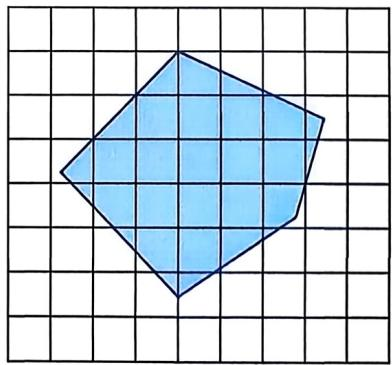
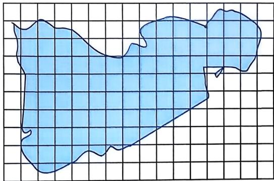

# 体育健身运动时的心率与年龄的关系

# 一、问题背景

《全民健身计划(2021-2025年)》是一项由国家倡议、社会支持、全民参与的体育健身计划，是提高全民的健康水平、促进人的全面发展、展示国家文化软实力的重要举措，是与实现社会主义现代化目标相配套的社会系统工程，是我们国家面向21世纪的体育发展战略规划。 

科学研究发现，人们在进行体育健身运动时，心率的变化直接反映出运动者的运动强度。所以，对运动者心率的监测不仅能有效监控与衡量其身体状况，也能确保运动者不会运动过度或不足，从而使每一次的体育健身运动都能达到较好的效果。那么，在进行体育健身运动时，心率为多少才是合理的运动强度？运动强度与年龄又有怎样的关系呢？ 

# 二、活动任务与建议

1. 独立思考，完成下列任务： 

(1) 通过调查, 查阅资料, 走访相关学科的教师 (如体育老师、生物老师等), 获得在体育健身运动的过程中, 心率变化范围与年龄之间关系的相关信息, 以及体育健身运动相关的标准和要求. 

(2) 针对某一特定的人群进行体育健身运动(如有效运动、无效运动或过激运动等)调查或走访, 了解运动者的年龄、性别以及运动时的心率. 

(3) 在平面直角坐标系中, 表示出每个人在运动时的心率与年龄的关系, 并借助一次函数来描述不同年龄运动者的心率范围. 

2. 在小组内交流各自的探究成果，通过共同讨论、比较和归纳，结合在研究过程中发现的某些规律、在体育健身运动中需要注意的问题等，选择一项内容进行专题研究。 

三、完成探究报告，分享交流 

# 如何近似计算湖面的面积

# 一、问题背景

湖泊与湿地是重要的生态资源。人们常用蓄水量和湖泊水面面积来描述一个湖泊的大小。如图所示的是位于西藏的我国第三大咸水湖——纳木错，湖面面积约为2015平方千米，蓄水量约为864亿立方米(注：数据出自中华人民共和国生态环境部官方网站)。 

(卫星照片)

一般地，湖面轮廓构成的平面图形大多是不规则的，那么，如何近似计算（或估算）湖面的面积呢？ 

# 二、活动任务与建议

1. 独立思考，完成下列任务： 

(1) 在方格纸上任意画出一个不规则的多边形(如图 1), 用适当的方法近似计算多边形的面积. 

(2) 思考如何提高估算精度. 

2. 将纳木错湖面轮廓视为图 2 网格(每个小方格的边长均为 $5 \mathrm{~km}$ )中的图形, 在小组内交流各自近似计算湖面面积的方案, 通过共同讨论、比较和归纳, 提出计算不规则图形面积的方法和提高估算精度的方法. 

|                                                              |                                                              |
| :----------------------------------------------------------: | :----------------------------------------------------------: |
|  图1 |  图2 |

# 三、完成探究报告，分享交流

# 八年级学生视力情况调查

# 一、问题背景

国家高度重视青少年近视防控工作。2021年5月，国务院教育督导委员会办公室印发的《关于组织责任督学进行“五项管理”督导的通知》中提到，要严格落实《综合防控儿童青少年近视实施方案》要求。 

我们发现，随着年级的增高，戴眼镜的同学逐渐增多，近视的度数也相应增加。因此，有必要切实了解八年级同学近视情况的现状，并提出合理化建议。 

# 二、活动任务与建议

1. 独立思考，完成下列任务： 

(1) 请围绕近视这一问题, 搜集有关资料, 确定研究主题. 

(2) 独立设计一个解决主题问题的初步方案. 

2. 在小组内交流各自的初步方案, 研讨探究活动步骤: 设计问卷、收集数据、整理数据、描述数据、分析数据、作出决策。提出解决八年级同学近视情况的有关建议。 

三、完成探究报告，分享交流
